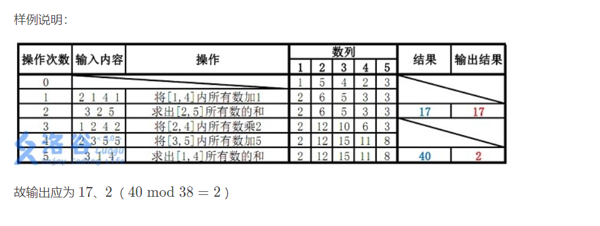

# 线段树基础

**线段树是一种用来维护区间信息以及对数时间内处理区间信息的数据结构，其主要支持区间修改，区间查询，单点查询，单点修改的操作**

<!-- more-->

## 线段树的结构以及理论

**线段树的基本结构是一颗完全二叉树，通过分治来管理区间信息,其叶子节点存储的是要管理区间的元素**

首先我们先定义一下要维护的数据信息：

* 设要维护的元素为有序集合$\{val_i\}(0<=i<=SIZE)$，i也代表元素的顺序
* 区间处理分两部分$在区间(rig,lef)操作$
  * 在该有序集合中我们需要支持区间查询的运算为$\bigodot(lef,rig)$
  * 支持的区间修改操作为$\bigoplus(lef,rig,{k})$,k为修改时需要用到的信息`(注意k不一定为一个数,也可以为一个向量,下面我们会有所提及)`
* 单点操作即是上面区间操作的特殊情况即$lef==rig$,所以这里就不重复定义了

有了上面需要维护的目标信息后,就可以定义相应线段树数据结构了,既然线段树是一颗完全二叉树,那么我们首先需要定义树节点

* 树节点

  * val:用于储存其对应管理的区间信息
  * lazyTag:懒惰修改标记,到后面的懒惰修改部分会重点结束

* 存储形式有两种选择

  * 堆式存储--前提是存储的树为完全二叉树
  * 建真正意义上的节点树--一般的树均可

  **但是既然线段树本身就是一颗完全二叉树,所以采用堆式存储是较好的,一方面便于维护,一方面便于建立和释放空间**

  * 堆式存储(为了避免读者不了解堆而导致阅读无法继续,下面会简约介绍堆的结构)
    * 堆的本质是用一个数组来装要维护的数组,且要维护的元素是本身需要本作为完全二叉树存储的
    * 完全二叉树就是可以按顺序编号的二叉树(具体可以查阅:https://zh.wikipedia.org/wiki/%E4%BA%8C%E5%8F%89%E6%A0%91)
    * 其中完全二叉树的一个很重要的特性就是可以通过其父节点的编号,来计算得到其子结点的编号
      * 即父节点p--左节点为2*p,且右节点为2*p+1
      * 编号即可以作为其在数组中的下标,注意其编号最好由1开始,即1为根结点编号,否则2*0==0,就无法统一操作
    * 所以在一个数组中以其树的结点编号为下标存储,就可以逻辑上的存储一棵完全二叉树,而要遍历时也需要按照下标的关系去遍历

* 线段树父节点和子节点的关系

  * 存储上参考上面`堆式存储`
  * 逻辑上:父节点是子节点$\bigodot(左,右)$的结构(注意:因为整个定义,所以我们要求$\bigodot运算必须符号结合律$;
  * 父节点是管理子节点的信息,而子节点也可能是另外一个子树的根节点,所以就通过分治一层一层的关系下方的节点信息,直到叶子节点,所以既然是分治关系,所以运算顺序可能会改变,所以运算必须符号结合律
  * 而为什么父节点处理子节点的信息是通过$\bigodot$运算呢?
    * 答案很显然,我们的目标就是要维护最下层元素的$\bigodot$运算结果,而如果需要选定区间,那么分治的优势也出来了,即分治是将原始元素区间分为很多部分,而每个结点会对应的关系一段区间的信息,而我们仅仅需要找可以管理我们要求区间的若干结点即可(因为是二分管理,所以有些区间是好几个结点管理的区间的并集)

* 浅谈修改

  * 上面父子结点关系阐述了区间查询的原理,而区间修改操作即会比较麻烦,因为我们如果修改了其中一个元素,那么我们就从该叶子节点往上到根节点一整条路的元素都需要更改,开销极大,也导致线段树失去了它原有的优势了,所以一般的实现都是采用一种叫做'懒惰修改'的策略,以及减低开销

* 懒惰策略

  * 即将修改和查询结合,一开始我们要进行区间修改,那么我们就需要找到那几个管理对应区间的节点的值,先修改他们的值即node.val$\bigoplus$($\bigoplus(k)*(ed-st+1)$),即[st,ed]为node管理的区间,等修好好,就在当前节点设置一个lazyTag=k,其k就是向下传递的信息,该标准不会堆该节点其作用,但会和下面的节点起作用,同样也会对子节点的值以及lazyTag其作用,因为子节点的lazyTag是对其子子节点的,所以如果下面的子节点右lazyTag值不是$\bigoplus运算幺元$,就证明其子子节点还没有修改没有完成,所以新加的修改需要和旧的修改相叠加,这种将标志向下传递的,和下面的标志相结合的操作,我们叫做pushdown;

* 好了,我们这里再来重新提一下他们各自的要求点:

  * 要维护的区间查询运算必须符合结合律
  * 标志的修改行为定义:pushdown以及递归的终止条件
  * 需要对标志和子节点值结合定义行为
  * 需要对标志定义单位元,一般在无效修改时,有合理的值存在

讲了这么久,还没看见代码,确实不是代码人的风格,现在久可以看看下面的两道模板题,加深理解

## 模板题

###  P3372 【模板】线段树 1

题目


思路分析:

因为是模板题,所以就直接上代码,

**注意:该题的数据范围,需要防止溢出**

代码

```c++
#include<iostream>//头文件不需要这么多,不够为了方便就全部都写上去了,也可用万能头文件
#include<vector>
#include<climits>
#include<cmath>
#include<stack>
#include<queue>
#include<string>
#include<algorithm>
#include<cstring>
#include<unordered_set>
#include<iomanip>
using namespace std;

int n = 0,m = 0;
//int sum = 0;

//线段树很重要的一点就是需要给每个结点编号：且规定编号的结点管辖原数组的那些位置

//建树
//注意：线段树的叶子结点的个数就是原数组的位数
//所以线段树大于原数组
void build(vector<long long>& nums, vector<long long>& tree, int lef, int rig,int p) {
	if (lef == rig) {
		tree[p] = nums[lef];
		return;
	}
	//分治建树
	int mid = lef + ((rig - lef) >> 1);
	//注意：我们默认规定中间结点mid归于左边
	build(nums, tree, lef, mid,2*p);
	build(nums, tree, mid + 1, rig,2*p+1);
	//只有等下面的树建好，我们才能对建好的树的父子结点进行处理；
	tree[p] = tree[2 * p] + tree[2 * p + 1];
}
//更新：其需要需要的范围以及当前编号结点的管辖范围
//t为懒惰标志数组,tree为线段树,[lef,rig]为需要更新的区间,[st,ed]为编号p节点的管理区间的范围
void update(vector<long long>& t, vector<long long>& tree, int lef, int rig, int val,int st,int ed,int p) {
	//更新和建树不同，建树的终止条件是只有一个位置的时候，而更新的话，
	//如果当前编号结点管辖的元素均处于需要更新的范围，那么就以该结点为根结点的整个子树均需要更新
	if (lef <= st && ed <= rig) {
		tree[p] += (ed - st + 1) * val;
		t[p] += val;
		return;
	}
	int mid = st + ((ed - st) >> 1);
	//延迟更新,即pushdown操作,lazyTag仅对子节点的值以及懒惰标志其作用
	if (t[p] && st < ed) {
        //对值
		tree[2 * p] += (mid - st + 1) * t[p];
		tree[2 * p + 1] += (ed - mid) * t[p];
        //对标志
		t[p * 2] += t[p];
		t[p * 2 + 1] += t[p];
        //将标志恢复为单位元,因为该标志已经发挥作用了
		t[p] = 0;
	}
	//分治，注意我们默认将mid结点归为左边的
	if (lef<= mid) update(t, tree, lef, rig,val, st, mid,p*2);
	if (rig >mid)	update(t, tree, lef, rig, val, mid + 1, ed,p*2 + 1);
    //整个位子节点合并位父节点,有查询运算决定
	tree[p] = tree[2 * p] + tree[2 * p + 1];
	return;
}

//求和，和跟新的思路类似
long long getSum(vector<long long>& t, vector<long long>& tree, int lef, int rig, int st, int ed, int p) {
	if (lef <= st && ed <= rig) {
		return tree[p];
	}
	int mid = st + ((ed - st) >> 1);
    //pushdown运算,其在更新和查询节点都要出现,且其不可作用与叶子节点
	if (t[p]&&st<ed) {
		tree[2 * p] += (mid - st+1) * t[p];
		tree[2 * p + 1] += (ed - mid) * t[p];
		t[p * 2] += t[p];
		t[p * 2 + 1] += t[p];
		t[p] = 0;
	}
    //下面的+是由其求和查询运算决定的
	long long sum = 0;
	if (lef <= mid)	sum = getSum(t, tree, lef, rig, st, mid, p * 2);
	if (mid < rig)	sum += getSum(t, tree, lef, rig, mid + 1, ed, p * 2 + 1);
	return sum;
}


int main() {
	cin >> n >> m;
	vector<long long>nums(n, 0);//原数组
	vector<long long>treeNums(4 * n, 0);//线段树
	vector<long long>t(4 * n, 0);//延迟更新的记录
	for (int i = 0;i < nums.size();i += 1)	cin >> nums[i];
    //建树
	build(nums, treeNums, 0, nums.size() - 1, 1);
	long long ind = 0;
	long long lef = 0, rig = 0;
	long long val = 0;
	for (int i = 0;i < m;i += 1) {
		if (cin >> ind && ind == 1) {
			cin >> lef >> rig >> val;
			update(t, treeNums, lef-1, rig-1, val, 0, nums.size()-1, 1);
		}
		else {
			cin >> lef >> rig;
			cout << getSum(t, treeNums, lef - 1, rig - 1, 0, nums.size()-1, 1) << endl;;
		}
	}
}
```

上面的该模板题没有什么好说的了,因为参考注释,就可轻易看懂

### P3373 【模板】线段树 2

题目



思路分析:

对于这道题,和前面第一道题不一样的就是,它不仅仅只有一个修改运算,而是由两个,当然以后也可能会遇到更多中的,

因为这道题比较容易让人模糊,我们就重申一下前面我们的提到的要注意的点:

* 要维护的区间查询运算必须符合结合律--求和运算符合
* 标志的修改行为定义:即标志结合--?
* 需要对标志和子节点值结合定义行为--?
* 需要对标志定义单位元,一般在无效修改时,有合理的值存在--乘法为1,加法为1

你会发现对于上面的4点,第2和3点难以去定义,因为现在不像前面那样只有一个懒惰标志lazyTag,所以我们在进行设计pushdown以及递归终止条件时一时间可能不太会进行定义

**首先要注意的就是:标志修改行为的定义和标志和子节点值结合两者不是独立的，而是一个一旦确定，另一个也随着确定**

设当前节点为p,值为val(v),即mulTag(mt),addTag(at)分别为乘法,加法标志:

现在我们`标志和子子节点的结合`有两种方案：

* 先加后乘:$(v+at)*mt=v*mt+at*mt$
* 先乘后加:$v*mt+at$

现在我们分析一下:

在pushdown的情况下，一般是标志和标志的结合：另子节点的旧标志为$\{mt_1,dt_1\}$,新标志$\{mt_2,at_2\}$

* 对于子节点的实质影响：

  * 旧标志：$(v+at)*mt$

  * 先加后乘：那么

    * $$
      ((v+at_1)*mt_1)+a_2)*mt_2=v*mt_1*mt_2+at_1*mt_1*mt_2+at_2*mt_2=v*mt_1*mt_2+(at_1*mt_1+at_2)*mt_2
      $$

    * $$
      化为先加后乘的形式：v*mt_1*mt_2+(at_1*mt_1+at_2)*mt_2=(v+\frac{(at_1*mt_1+at_2)*mt_2}{mt_1*mt_2})
      $$

    * 显然有上式子就知道如果采取这种方案，那么at的维护需要用到除法，除法开销大，且损失也大，所以除法没有方案了，否则这种方案就不可；

  * 先乘后加：

    * $$
      (((v*mt_1)+at_1)*mt_2)+at_2=v*mt_1*mt_2+(at_1*mt_1+at_2)
      $$

    * 其上面去括号也还是先乘后加的形式，且没有除法，都是一些正常开销，以及没有损失的运算，所以对于在pushdown下，先乘后加，显然更好

在递归终止条件中：

* 即$(v+at)*mt+\bigtriangleup at$与$(v*mt)+at+\bigtriangleup at$的化简对比
* $(v+at)*mt*\bigtriangleup mt$与$((v*mt)+at)*\bigtriangleup mt$的对比
* 上面分别化为先加后乘（前）以及先乘后加（后）的形式，会发现两种都可。

综上就可以得到：方案为先乘后加

```c++
#include<iostream>
#include<vector>
#include<climits>
#include<cmath>
#include<stack>
#include<queue>
#include<string>
#include<algorithm>
#include<cstring>
#include<unordered_set>
#include<iomanip>
using namespace std;
//在写线段树之前，需要先考虑一下考虑线段树能用来做什么，可以做什么
//先乘后加；定义个
int n = 0, m = 0, t_p = 0;

class node {
public:
	long long val;//值
	long long addTag;//add的lazyTag
	long long mulTag;//mul的lazyTag
	node(int v1, int a1, int m1) {
		val = v1;
		addTag = a1;
		mulTag = m1;
	}
};
void pushdowm(vector<node>& segtree, int st, int ed, int p);
//取模的add和mul
int mul(long long n1, long long n2) {
	return (n1 * n2) % t_p;
}

int add(long long n1, long long n2) {
	return (n1 + n2) % t_p;
}
//建树
void build(vector<node>&segtree, vector<int>&nums,int lef,int rig,int p) {
	if (lef>=rig) {
		segtree[p].val = nums[lef];
		return;
	}
	int mid = lef + ((rig - lef) >> 1);
	build(segtree, nums, lef, mid,2*p);
	build(segtree, nums, mid + 1, rig,2*p+1);
	segtree[p].val =add( segtree[2 * p].val, segtree[2 * p + 1].val);
	return;
}

void mul(vector<node>& segtree, int lef, int rig, int val, int st, int ed, int p) {
    //递归终止条件，逻辑就是上面推导的公式
	if (lef <= st && ed <= rig) {
		segtree[p].val =mul(segtree[p].val,val);
		segtree[p].mulTag = mul(segtree[p].mulTag,val);
		segtree[p].addTag =mul(segtree[p].addTag, val);
		return;
	}

	if (st < ed) {
		pushdowm(segtree, st, ed, p);
	}
    //分治
	int mid = st + ((ed - st) >> 1);
	if (lef <= mid)	mul(segtree, lef, rig, val, st, mid, p * 2);
	if (mid < rig)mul(segtree, lef, rig, val, mid + 1, ed, p * 2 + 1);
	segtree[p].val = add(segtree[2 * p].val , segtree[2 * p + 1].val);
}

void add(vector<node>& segtree, int lef, int rig, int val, int st, int ed, int p) {
	if (lef <= st && ed <= rig) {
		segtree[p].val = add(segtree[p].val , val*(ed-st+1));
		segtree[p].addTag = add(segtree[p].addTag, val);
		return;
	}

	if (st < ed) {
		pushdowm(segtree, st, ed, p);
	}
	int mid = st + ((ed - st) >> 1);
	if (lef <= mid)	add(segtree, lef, rig, val, st, mid, p * 2);
	if (mid < rig)add(segtree, lef, rig, val, mid + 1, ed, p * 2 + 1);
	segtree[p].val =add( segtree[2 * p].val , segtree[2 * p + 1].val);
}

void pushdowm(vector<node>& segtree, int st, int ed, int p) {
	if (st >= ed) {
		return;
	}

	int mid = st + ((ed - st) >> 1);
	//标志和标志的结合，父节点标志和子节点的结合
	segtree[2 * p].val = add(mul(segtree[2 * p].val, segtree[p].mulTag), segtree[p].addTag*(mid-st+1));
	segtree[2 * p].mulTag = mul(segtree[2 * p].mulTag, segtree[p].mulTag);
	segtree[2 * p].addTag = add(mul(segtree[2 * p].addTag, segtree[p].mulTag), segtree[p].addTag);


	segtree[2 * p+1].val = add(mul(segtree[2 * p+1].val, segtree[p].mulTag), segtree[p].addTag*(ed-mid));
	segtree[2 * p+1].mulTag = mul(segtree[2 * p+1].mulTag, segtree[p].mulTag);
	segtree[2 * p+1].addTag = add(mul(segtree[2 * p+1].addTag, segtree[p].mulTag), segtree[p].addTag);


	//单位元的定义
	segtree[p].addTag = 0;
	segtree[p].mulTag = 1;
}
//求和
long long getSum(vector<node>& segtree, int lef, int rig,int st, int ed, int p) {
	if (lef <= st && ed <= rig) {
		return segtree[p].val;
	}
	//如果不是子节点，就pushdown
	if (st < ed) {
		pushdowm(segtree, st, ed, p);
	}
	int mid = st + ((ed - st) >> 1);
	long long sum = 0;
	if (lef <= mid) sum = getSum(segtree, lef, rig, st, mid, p * 2);
	if (mid < rig)sum =add(sum, getSum(segtree, lef, rig, mid + 1, ed, p * 2 + 1));
	return sum;
}

int main() {
	cin >> n >> m >> t_p;
	vector<int>nums(n, 0);
	vector<node>segtree(4*n, node(0,0,1));
	for (int i = 0;i < n;i += 1)	cin >> nums[i];
	build(segtree, nums, 0, n-1, 1);
	int x = 0, y = 0, k = 0,ind=0;
	for (int i = 0;i < m;i += 1) {
		cin >> ind;
		//mul
		cin >> x >> y;
		if (ind == 1) {
			cin >> k;
			mul(segtree, x-1, y-1, k, 0, nums.size()-1,1);
		}
		//add
		else if (ind == 2) {
			cin >> k;
			add(segtree, x - 1, y - 1, k, 0, nums.size()-1, 1);
		}
		//getSum
		else {
			cout << getSum(segtree, x-1, y-1, 0, nums.size()-1, 1) << endl;;
		}
	}
}
```

