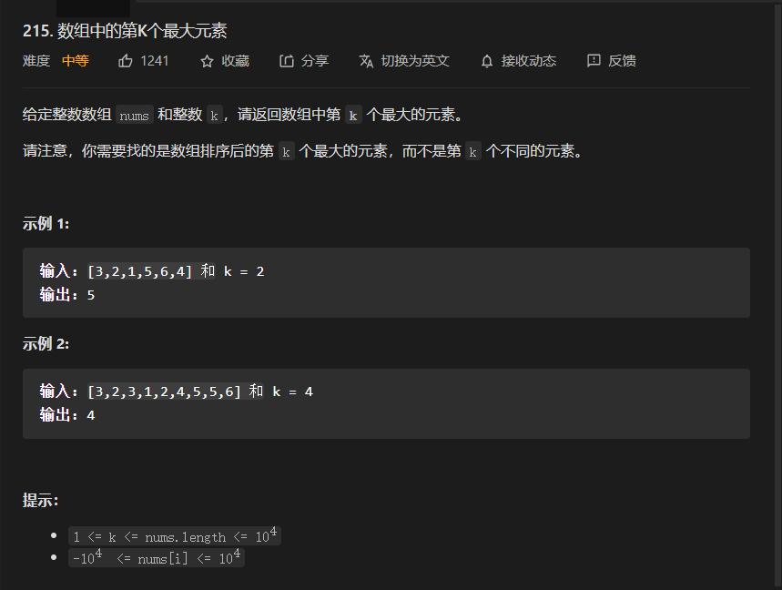
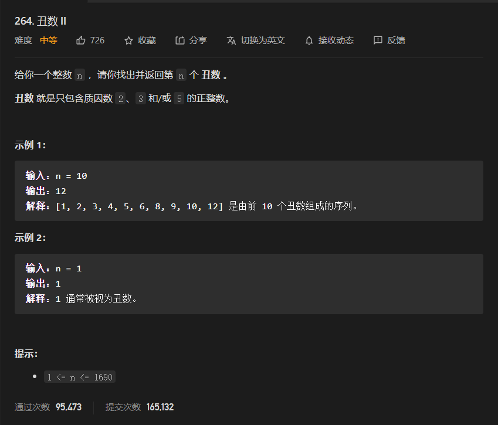
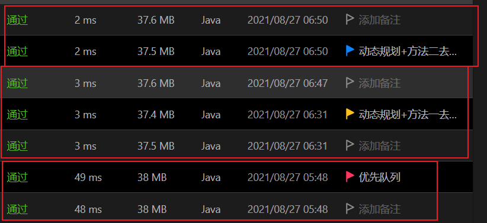
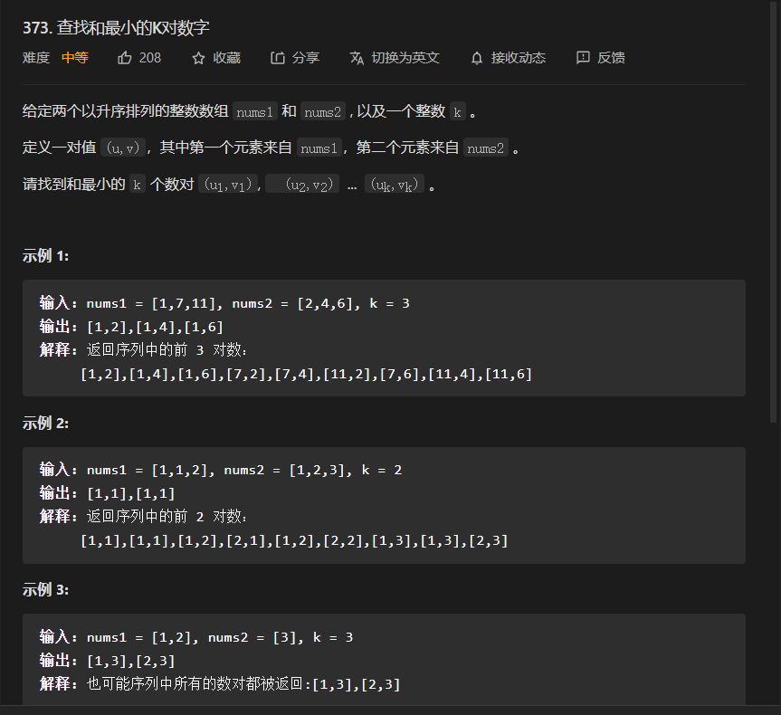
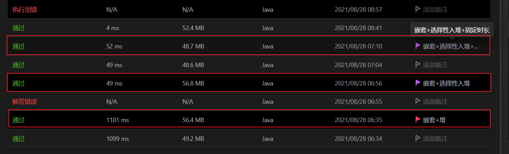
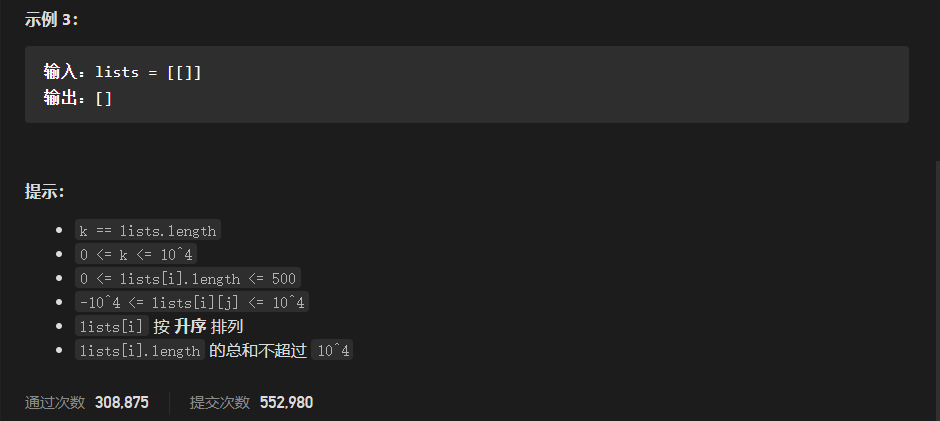

# 中等题

## 215. 数组中的第k个最大元素

题目



思路一：对于局部排序取值的题目，最通常的办法就是用堆排序，因为起排序可以自动的让你决定要排到第几个元素，所以我们可以利用自建堆排序，而可以用前面简单题的第一题的做法，下面为堆排序代码

```java
//因为在简单题中已经写了很多次堆了，因此就没有自己再写一下
//下面代码出自力扣官方题解，其在建堆和排序过程，均仅仅需要下沉操作
class Solution {
    public int findKthLargest(int[] nums, int k) {
        int heapSize = nums.length;
        buildMaxHeap(nums, heapSize);
        for (int i = nums.length - 1; i >= nums.length - k + 1; --i) {
            swap(nums, 0, i);
            --heapSize;
            maxHeapify(nums, 0, heapSize);
        }
        return nums[0];
    }

    public void buildMaxHeap(int[] a, int heapSize) {
        for (int i = heapSize / 2; i >= 0; --i) {
            maxHeapify(a, i, heapSize);
        } 
    }
//下沉操作
    public void maxHeapify(int[] a, int i, int heapSize) {
        int l = i * 2 + 1, r = i * 2 + 2, largest = i;
        if (l < heapSize && a[l] > a[largest]) {
            largest = l;
        } 
        if (r < heapSize && a[r] > a[largest]) {
            largest = r;
        }
        if (largest != i) {
            swap(a, i, largest);
            maxHeapify(a, largest, heapSize);
        }
    }

    public void swap(int[] a, int i, int j) {
        int temp = a[i];
        a[i] = a[j];
        a[j] = temp;
    }
}

```

时间复杂度：O()=O((n))+O(k*logn)=建堆+删除操作

空间复杂度：该写法有递归级O(logn);一般可以写为O(1);

思路二：快速选择

对于该题，我们还是可以采取简单题中的`剑指offer 40.最小的k个数`的思路二思想

因为快排其本质为分治，且每次调整元素位置后都可以确定至少一个元素的最终位置，如果我们在进行某次位置调换后，其最终位置可以恰好为k,那么其就是我们要找的元素，而我们就无需再进行排序，因为其他元素是否有序和结果无关

代码

```java
class Solution {
    //记录边界信息的类
    private class NodeRange {
        int lef;
        int rig;
        int mid;

        public NodeRange(int lef, int rig, int mid) {
            this.lef = lef;
            this.rig = rig;
            this.mid = mid;
        }

        @Override
        public String toString() {
            return "NodeRange{" +
                    "lef=" + lef +
                    ", rig=" + rig +
                    ", mid=" + mid +
                    '}';
        }
    }
	//问题的主函数
    public int findKthLargest(int[] nums, int k) {
        newQuickSort(nums, 0, nums.length - 1, k);
        return nums[k - 1];
    }
	//快速选择函数(改变的快排)
    void newQuickSort(int[] nums, int left, int right, int k) {
        if (right < left) {
            return;
        }
    //注意:下面这个判断千万不能加上去，因为下个判断要先没有错误，就必须有区间【left,right】的元素均在最终位置了，但很明显，这个不可能，所以这个判断千万不能加
//        if (right - left+1== k) {
//            return;
//        }
        //下面为如果区间变得很小还没找到元素，就为了避免进行太多次递归，就可以切换到插入排序，但在力扣的测试集中，加入该优化后，其性能反而变得很低
        if (right - left < 4) {
            insertSort(nums);
            return;
        }
        //因为我们采用三切划分，就在进行位置调换后，其结果有这个区间，即
        //[left,lef]-->小于这次确定最终位置的元素的元素集合
        //(lef,mid]-->等于这次确定最终位置的元素的元素集合
        //(mid,right]-->大于这次确定最终位置的元素的元素集合
        //注意按下面partion函数的写法结果：rig=mid+1;
        NodeRange pos = partion(nums, left, right);
        //已经确定位置的区间
        if (pos.lef - left + 1 < k && pos.mid - left + 1 >= k) {
            return;
            //下面就继续进行选择
        } else if (pos.lef - left + 1 >= k) {
            newQuickSort(nums, left, pos.lef, k);
        } else {
            newQuickSort(nums, pos.rig, right, k - (pos.mid - left + 1));
        }
    }
//加入随机因素优化快速选择，其优化效果明显
    void randomDo(int[] nums, int left, int right) {
        int pos = new Random().nextInt(right - left + 1) + left;
        swap(nums, left, pos);
    }
//位置调换，采用三切划分的方式
    NodeRange partion(int[] nums, int left, int right) {
        int por = nums[left];
        int index = left + 1;
        while (index <= right) {
            if (por < nums[index]) {
                swap(nums, index++, left++);
            } else if (por > nums[index]) {
                swap(nums, index, right--);
            } else {
                index++;
            }
        }
        return new NodeRange(left - 1, right + 1, index - 1);
    }
//插入排序
    public static void insertSort(int[] nums) {
        for (int i = 1; i < nums.length; i++) {
            int temp = nums[i];
            int j = 0;
            for (j = i - 1; j >= 0; j--) {
                if (temp < nums[j]) {
                    break;
                }
                nums[j + 1] = nums[j];
            }
            //注意这一句一定要有且在内循环外，因为内循环的作用就是找到可以放置该元素的位置
            nums[j + 1] = temp;
        }
    }

    void swap(int[] nums, int left, int right) {
        int temp = nums[left];
        nums[left] = nums[right];
        nums[right] = temp;
    }
}
```

时间复杂度：O(n),必须要有随机步骤优化才有这个结果，证明参考`算法导论`或是`算法第4版`；

空间复杂度：O(logn):递归

性能对比


### 拓展：快排位置调换的另外三种写法

交换法：对于交换法要注意的一点就是其必须是与选择的基准元素相对的指针先移动

如：nums[left]为基准元素，即必须right指针先移动，因为其要确保最后left,right两个共同指向的元素其移动能放在基准元素的位置上

```java
class Solution 
{
    public int findKthLargest(int[] nums, int k) 
    {
        int n = nums.length;
        int l = 0;
        int r = n - 1;
        while (true)
        {
            int idx = partition(nums, l, r);
            if (idx == k - 1)
                return nums[idx];
            else if (idx < k - 1)
                l = idx + 1;
            else    
                r = idx - 1;
        }

    }

    //----左右交换
    public int partition(int [] nums, int l, int r)
    {   
        int pivot = nums[l];
        int begin = l;
        while (l < r)
        {
            while (l < r && nums[r] <= pivot)
                r --;
            while (l < r && nums[l] >= pivot)
                l ++ ;
            if (l < r)
            {
                int tmp = nums[l];
                nums[l] = nums[r];
                nums[r] = tmp;
            }
        }
        
        int tmp = nums[begin];
        nums[begin] = nums[l];
        nums[l] = tmp;
        return l;
    }
}

//原作者：Hanxin_Hanxin
//链接：https://leetcode-cn.com/problems/kth-largest-element-in-an-array/solution/cpython3java-1da-gen-dui-diao-ku-2shou-l-tqqm/
```


挖坑法：即先保存基准元素，然后基准元素的位置就是一个坑，然后两个指针分别间歇的持有该坑，然后分别填入符合的元素

```java
class Solution 
{
    public int findKthLargest(int[] nums, int k) 
    {
        int n = nums.length;
        int l = 0;
        int r = n - 1;
        while (true)
        {
            int idx = partition(nums, l, r);
            if (idx == k - 1)
                return nums[idx];
            else if (idx < k - 1)
                l = idx + 1;
            else    
                r = idx - 1;
        }

    }

    //----左右挖坑互填
    public int partition(int [] nums, int l, int r)
    {   
        int pivot = nums[l];
        while (l < r)
        {
            while (l < r && nums[r] <= pivot)
                r --;
            nums[l] = nums[r];
            while (l < r && nums[l] >= pivot)
                l ++;
            nums[r] = nums[l];
        }
        nums[l] = pivot;
        return l;
    }
}

//原作者：Hanxin_Hanxin
//链接：https://leetcode-cn.com/problems/kth-largest-element-in-an-array/solution/cpython3java-1da-gen-dui-diao-ku-2shou-l-tqqm/
```


单向调整：即用两个指针一个left,和i,left指向的位置为可以交换的位置，其将区间分为两段大于和小于最后区间的指向就是基准元素的最终位置

```java
class Solution 
{
    public int findKthLargest(int[] nums, int k) 
    {
        int n = nums.length;
        int l = 0;
        int r = n - 1;
        while (true)
        {
            int idx = partition(nums, l, r);
            if (idx == k - 1)
                return nums[idx];
            else if (idx < k - 1)
                l = idx + 1;
            else    
                r = idx - 1;
        }

    }

    //----左右挖坑互填
    public int partition(int [] nums, int l, int r)
    {   
        int pivot = nums[l];
        int idx = l;
        for (int i = l + 1; i < r + 1; i ++)
        {
            if (nums[i] >= pivot)
            {
                idx ++;
                int tmp = nums[idx];
                nums[idx] = nums[i];
                nums[i] = tmp;
            }
        }
        int tmp = nums[l];
        nums[l] = nums[idx];
        nums[idx] = tmp;
        return idx;
    }
}

//原作者：Hanxin_Hanxin
//链接：https://leetcode-cn.com/problems/kth-largest-element-in-an-array/solution/cpython3java-1da-gen-dui-diao-ku-2shou-l-tqqm/
```


## 264.  丑数||

题目



思路分析：解决这道题的关键在于理解丑数，丑数它的所有质数因子必须在{2，3，5}里面，可数不定；所以我们可以用1，2*x,3*x,4*x，来表示丑数x取任意不小于1的整数，但你会发现按这个x的递增，其得到的序列不仅不是递增，而且还会重复，

比如：`2*4`=`4*2`-->即且`2*2`<`4*1`,所以我们在计算丑数时就面临去重和排序的问题

解决方案

1. 优先队列+hashSet;

即利用哈希表对得到的数进行检查，如果数不足set中就加入set和队列中，否则就跳过，而优先队列就负责排列，而且为了保证我们不漏的将数给计算出来，所以我们每次就选已有数的最小值出来，并进行计算得到新数，然后重复上述操作，直到我们可以取得n个数，此时取得数就是答案

```java
//对于这道题，我们需要注意的就是溢出问题，即因为我们会产生很多很大的中间值，尽管这些中间值对结果的求出过程没有什么作用，但如果其溢出时，就会变为父值，那么就会直接变成堆顶元素，影响结果
class Solution {
    public int nthUglyNumber(int n) {
        //排序
        PriorityQueue<Long>pq=new PriorityQueue<>();
        //去重
        HashSet<Long>set=new HashSet<>();
        Long[]nums={2L,3L,5L};
        pq.add(1L);
        set.add(1L);
        int result=0;
        for(int i=0;i<n;i++ ){
            //取出已知数的最小值
            result=pq.poll().intValue();
            for (Long one:nums) {
                long temp=one*result;
                if(set.add(temp)){
                    pq.add(temp);
                }
            }
        }
        return   result;
    }
}
```


2. 动态规划

对于前面的解决方法1，我们可以发现我们会计算很多没有用的数，且这些数会加入堆中，导致在维护堆时，会发现其用了O(KlongN)去维护没有用的元素，且哈希表的维护开销大，且维护了很大没有用的数，对称我们可以换一种思路

用dp[i]表示第i个丑数，这样我们就不必维护很多没有用的开销

初始化：dp[1]=1;-->dp[0]没有用；

递推公式：对于元素的推导因为要排序的问题，所以就需要三个指针，其分别来维护乘以2，3，5三数的没有在dp[i]中的最小值；

dp[i]=min(min(dp[p2] * 2,dp[p3] * 3),dp[p5]*5);然后检查其dp[i]是否等于这三个结果，如果等于，就将其对应的指针，加一；

回顾一下我们在思路分析中提到的两 个难点

* 排序：因为我们都是取最小值来跟新dp数组，而三个临时结果也只能越变越大，所以就可以保证数组的元素是有序的且因为是按丑数的定义去计算，所以得到的数组一定是有序的丑数数组
* 去重：因为三个临时结果都只能越变越大，且最小的会变为dp数组的元素，因为如果有出现重复，那么将会是在同一个时刻出现，即三个结果只可能在同一个时间段相同且等于数组的元素

代码：两种去重的写法

方法一去重

```java
class Solution {
    public int nthUglyNumber(int n) {
        int[]dp=new int[n+1];
        dp[1]=1;
        int p2,p3,p5;
        p2=p3=p5=1;
        int temp2,temp3,temp5;
        temp2=2;temp3=3;temp5=5;
        for (int i = 2; i <=n ; ) {
            dp[i]=Math.min(Math.min(temp2,temp3),temp5);
            if(dp[i]==temp2){
                p2++;
                temp2=dp[p2]*2;
            }else if(dp[i]==temp3){
                p3++;
                temp3=dp[p3]*3;
            }else{
                p5++;
                temp5=dp[p5]*5;
            }
            //去重代码
            if(dp[i]==dp[i-1]){
                continue;
            }
            i++;
        }
        return dp[n];
    }
}
```

方法二去重

```java
class Solution {
    public int nthUglyNumber(int n) {
        int[]dp=new int[n+1];
        dp[1]=1;
        int p2,p3,p5;
        p2=p3=p5=1;
        int temp2,temp3,temp5;
        temp2=2; temp3=3;temp5=5;
        for (int i = 2; i <=n ; i++) {
            dp[i]=Math.min(Math.min(temp2,temp3),temp5);
            //多重判断去重
            if(dp[i]==temp2){
                p2++;
                temp2=dp[p2]*2;
            }
            if(dp[i]==temp3){
                p3++;
                temp3=dp[p3]*3;
            }
            if(dp[i]==temp5){
                p5++;
                temp5=dp[p5]*5;
            }   
        }
        return dp[n];
    }
}
```

性能对比



## 313.超级丑数

题目


思路分析：其实这道题和`丑数||`的思路一模一样，只是将上道题的3个数，换位k个数

解决方案

1. 动态规划，其找最小值是通过循环直接去找的，所以我们可以尝试维护一个关于k个临时结果的小根堆，但是如果数组的长度过小，那么这个操作就不能提高性能，甚至会降低性能

* 循环写法

```java
class Solution {
    public int nthSuperUglyNumber(int n, int[] primes) {
        int[]dp=new int[n+1];
        int[]indexs=new int[primes.length];
        int[]temps=new int[primes.length];
        dp[1]=1;
        for (int i=0;i<primes.length;i++) {
            indexs[i]=1;
            temps[i]=primes[i];
        }
        for (int i = 2; i <= n; i++) {
            int res=temps[0];
            for (int j = 1; j < temps.length; j++) {
                if(res>temps[j]){
                    res=temps[j];
                }
            }
            dp[i]=res;
            for (int j = 0; j < temps.length; j++) {
                if(res==temps[j]){
                    indexs[j]++;
                    temps[j]=dp[indexs[j]]*primes[j];
                }
            }
        }
        return dp[n];
    }
}

```

* 动态规划+小根堆写法

```java
class Solution {
    public static void main(String[] args) {
        Solution a1 = new Solution();
        int[] nums = {2, 7, 13, 19};
        a1.nthSuperUglyNumber(12, nums);
    }

    class TemRse implements Comparable<TemRse> {
        int res;
        int index;
        int p;

        public TemRse(int res, int index, int p) {
            this.res = res;
            this.index = index;
            this.p = p;
        }

        @Override
        public int compareTo(TemRse o) {
            return res - o.res;
        }
    }

    public int nthSuperUglyNumber(int n, int[] primes) {
        int[] dp = new int[n + 1];
        dp[1] = 1;
        PriorityQueue<TemRse> pq = new PriorityQueue<>();
        for (int i = 0; i < primes.length; i++) {
            pq.add(new TemRse(primes[i], i, 1));
        }

        for (int i = 2; i <= n; i++) {
            dp[i] = pq.peek().res;
            while (pq.peek().res == dp[i]) {
                TemRse temp = pq.poll();
                temp.p++;
                temp.res = dp[temp.p] * primes[temp.index];
                pq.add(temp);
            }
        }
        // Tool.showInt(dp);
        return dp[n];
    }
}

```

2. 纯小根堆方法，即就`264. 丑数||`的解决方法一是一模一样的，注意这个和上面的`动态规划+小根堆`写法是完全不太的，这里的小根堆会转很多的元素，包括很多没有用的元素，而上面的永远只会装primes.length个元素

性能比较


## 347.前K个高频元素

题目


思路分析：对于这道题和前面几道题的思路基本相同，这道题笔记麻烦的一点，就是但使用哈希表记录元素的频数后，我们需要对哈希表进行转化，让其变成一个数组去排序或是变成一个优先队列，在里面的开销很大，但目前暂时没有解决方案，只能硬转

解题方法

* 快速选择排列频数+哈希记录频数

代码

```java
class Solution {
    //位置调换后需要记录的信息，因为该题的位置调换用来三切划分，所以就需要记录这些，如果是前面拓展的那几种写法，就无需记录这三个数据，仅需要返回确定位置的元素即可
    class NodeRange {
        int lef;
        int mid;
        int rig;

        public NodeRange(int lef, int mid, int rig) {
            this.lef = lef;
            this.mid = mid;
            this.rig = rig;
        }
    }
	//建立起元素值和频数的关系
    class NodeK implements Comparable<NodeK> {
        int frequent;
        int value;

        public NodeK(int frequent, int value) {
            this.frequent = frequent;
            this.value = value;
        }

        @Override
        public int compareTo(NodeK o) {
            return frequent - o.frequent;
        }

        @Override
        public String toString() {
            return "NodeK{" +
                    "frequent=" + frequent +
                    ", value=" + value +
                    '}';
        }
    }

    public int[] topKFrequent(int[] nums, int k) {
        //哈希表记录频数
        HashMap<Integer, NodeK> map = new HashMap<>();
        for (int i = 0; i < nums.length; i++) {
            if (!map.containsKey(nums[i])) {
                map.put(nums[i], new NodeK(0, nums[i]));
            }
            map.get(nums[i]).frequent += 1;
        }
        //将哈希表转化为数组
        NodeK[] nodes = new NodeK[map.size()];
        Set<Integer> temp = map.keySet();
        int count = 0;
        for (Integer one : temp) {
            nodes[count] = map.get(one);
            count++;
        }
        //快速选择，相对排序数组；
        quickSelect(nodes,0,nodes.length-1,k);
        //获得结果数组
        int[]result=new int[k];
        for(int i=0;i<k;i++){
            result[i]=nodes[i].value;
        }
        // Tool.showS(nodes,100);
        return result;
    }
	//下面代码和上面集体的快速选择代码基本相同，即不做解释
    void quickSelect(NodeK[]nums,int left,int right,int k){
        if(right<left){
            return;
        }
        NodeRange pos=partion(nums,left,right);
        if(pos.lef-left+1>k&& pos.mid-left+1<=k){
            return;
        }else if(pos.lef-left+1>=k){
            quickSelect(nums,left,pos.lef,k);
        }else{
            quickSelect(nums, pos.rig,right,k-(pos.mid-left+1) );
        }
    }
    NodeRange partion(NodeK[] nums, int left, int right) {

        randomDo(nums, left, right);
        NodeK por = nums[left];
        int index = left + 1;
        while (index <= right) {
            if (por.compareTo(nums[index]) > 0) {
                swap(nums, index, right--);
            } else if (por.compareTo(nums[index]) < 0) {
                swap(nums, left++, index++);
            } else {
                index++;
            }
        }
        return new NodeRange(left - 1, index - 1, right + 1);
    }

    void randomDo(NodeK[] nums, int left, int right) {
        int pos = new Random().nextInt(right - left + 1) + left;
        swap(nums, pos, left);
    }

    void swap(NodeK[] nums, int left, int right) {
        NodeK temp = nums[left];
        nums[left] = nums[right];
        nums[right] = temp;
    }

}
```

* 优先队列

思路：即在用哈希表记录数组的元素和频数的对应关系后，用小根堆解释哈希表的数据，且维持小根堆的数据在k个元素的基础上；具体思路和简单题的`703.数据流中的第k大元素`一样，这里不做解释，详细请查询简单题笔记的相应部分。


## 373.查找和最小的K对数字

题目



思路一：对于这道题，一个最直接的思路就是暴力法，即通过嵌套循环，计算出所以的和，然后借助堆得到前K小的结果

优化1:因为两个数组都是有序的，所以很明显我们的可行解一般都会集中在前面的几个，嵌套循环得到的数很大对结果是没有用的，且如果将这些数加入堆中，那么对堆的维护会产生很大的开销，所以分析嵌套循环中数的规律是很有必要的：在嵌套循环中，我们是固定一个数组的数，然后再遍历其另一个数组计算其和，所以一定我们发现已经满K个值的大根堆堆的堆顶元素小于当前内循环的和时，就表明这个循环没有用了，可以直接跳出，因为后面的数一定会更大；

优化2：在我们的循环中，我们知道第一次的组合一定为nums1[0]+nums2[0];第二次：对两个数组的索引一定在2以下，所以我们可以限制，其每次循环的次数一定会大于其所需的索引，以减少不必要的循环

思路一的最终代码：嵌套循环+选择性入堆+maxIndex优化；

```java
class Solution {
    public List<List<Integer>> kSmallestPairs(int[] nums1, int[] nums2, int k) {
        //用比较器构造堆
        PriorityQueue<List<Integer>>pq=new PriorityQueue<>((n1,n2)->{
            int result1=n1.get(0)+n1.get(1);
            int result2=n2.get(0)+n2.get(1);
            return result2-result1;
        });
        //maxIndex优化
        int MaxIndex=1;
        final int COU_SIZE=4;
        //嵌套循环
        for (int i = 0; i<nums1.length&&i < MaxIndex&&i<k; i++) {
            for (int j = 0; j<nums2.length&&j < MaxIndex&&j<k; j++) {
                //选择性入堆
                if(pq.size()>=k){
                    List<Integer> temp=pq.peek();
                    if(nums1[i]+nums2[j]>temp.get(0)+temp.get(1)){
                        break;
                    }
                }
                //加入堆
                pq.add(Arrays.asList(nums1[i],nums2[j]));
                //将大根堆的元素数目维持在K
                if(pq.size()>k){
                    pq.poll();
                }
                //更新
                MaxIndex++;
            }
        }
        //构造结果数组
        List<List<Integer>>result=new ArrayList<List<Integer>>(k);
        for (List<Integer>one:pq) {
            result.add(one);
        }
        return result;
    }
}
```


思路二：对于前面我们发现，我们每次都会做很多无谓的检查，虽然在优化后会将无谓的检查降到很小，但因为是嵌套循环，所以元素不会是单调计算出来入堆的，且最重要的就是需要维持堆，以保证我们可以记录前面遍历的数目的信息；且我们最后还需要遍历堆，并转化为数组，这个开销也是不可忽视的

为了解决上面的开销：我们可以利用前面`超级丑数`的思路，即创建一个indexs[]数组，其记录nums1的元素在nums2走得多远，其数学意义即nums1数组的元素在除了已经加入结果的数为，其现在的最小值为多少，且这样我们每次只要找到在目前遍历的情况下，两个数组的笛卡尔乘积的元组和最小的元素是哪两个元素的和，需要我们就可以在一次循环中得到可行解，就可以顺便加入结果数组中

优化1：就目前的思路而言，其虽然减少了堆的维护，但其因为我们都要遍历其中的一个数组，但我们就是花O(K*N)的时间，其效率和前面思路一的最终优化结果不相上下；但就思路一中的优化二的启发，我们可以设置一个maxIndex优化，因为我们每次迭代所需要遍历的元素就仅仅是前j个，j为已经迭代的次数；一个很好理解的例子，就是每次数组的最大索引的最小值就是nums1[j]+nums2[0];而如果这个和为可行解，那么其前面的j-1个和就一定为可行解，所以其最大的索引元素就一定不大于已经有的可行解的个数+1；

优化2：在优化一的基础上，我们是否可以在进行优化呢？可以的，前面优化一有分析`就是每次数组的最大索引的最小值就是nums1[j]+nums2[0];而如果这个和为可行解，那么其前面的j-1个和就一定为可行解`，所以如果我们的已经确定的可行解的索引的最大值还没到达现在已经记录的最大值，那么maxIndex就没有必要再更新了，因为其后面的数值肯定比前面的未加入可行解的某个组合小

优化3：我们可以让短数组作为遍历的数组

最终代码

```java
class Solution {
    public List<List<Integer>> kSmallestPairs(int[] nums1, int[] nums2, int k) {
        //结果集合，预先定好空间
        List<List<Integer>> result=new ArrayList<>(k);
        //索引数组，存放一个数组在另一个数组的步数
        int[]indexs=new int[nums1.length];
        int maxIndex=1;
        for (int i = 0; i < Math.min(k,nums1.length*nums2.length); i++) {
            int min=Integer.MAX_VALUE;
            int minIndex=-1;
            int temp=0;
            //遍历求未知解的最小值，注意这里如果用堆的花，开销会更大，因为其只能通过一步步增加元素来求得最大值O(KlogK)，但如果可以直接由一个数组建堆那么开销也仅仅只是持平O(K)
            for (int j = 0; j < maxIndex; j++) {
                //避免索引另一个数组
                if(indexs[j]>=nums2.length){
                    continue;
                }
                temp=nums1[j]+nums2[indexs[j]];
                if(min>temp){
                    min=temp;
                    minIndex=j;
                }
            }
            //加入结果集合，并更新对于索引/指针
            result.add(Arrays.asList(nums1[minIndex],nums2[indexs[minIndex]]));
            indexs[minIndex]++;
            //优化2的选择性更新maxIndex优化
            if(minIndex==maxIndex-1)
            maxIndex=Math.min(nums1.length,maxIndex+1);
        }
        return result;
    }
}
```


###### 性能对比




## 378.有序矩阵中第K个小的元素

题目


思路一：对于这道题，我们可以借助之前超级丑数的思路来进行计算，得到结果，但这个在求每个的最大值时都必须遍历一下；其中最直接的优化可能就是借助堆来加快取得最小值；但这样都仅仅只是利用其的一个性质而已，所以肯定不是最优解

代码(未优化)

```java
class Solution {
    public int kthSmallest(int[][] matrix, int k) {
        //索引数组
        int[] indexs=new int[matrix.length];
        int maxIndex=1;
        int result=0;
        for (int count = 0; count <k ; count++) {
            int min=Integer.MAX_VALUE;
            int minIndex=-1;
            for(int i=0;i<maxIndex;i++){
                if(indexs[i]>=matrix[i].length){
                    continue;
                }
                if(min>matrix[i][indexs[i]]){
                    min=matrix[i][indexs[i]];
                    minIndex=i;
                }  
            }
            result=min;
            // System.out.println("count="+count+"\tres="+result);
            ++indexs[minIndex];
            if(minIndex==maxIndex-1){
                maxIndex=Math.min(maxIndex+1,matrix.length);
            }
        }
        return result;
        
    }
}

```


思路二：对于这道题，因为其每行每列都是递增序列，所以矩阵中任意一个元素的左上角元素均小于该元素，右下角元素均大于该元素，而我们要找第K个数，那么就是其小于等于该元素的数未k-1;那么我们就可以得到答案，所以我们可以迭代去一个中间数，然后计算数的不大于的元素的数目，然后不断缩小距离，直到找到那个数

既然是有序序列，那么我们就可以使用二分查找思想，接下来要思考下面几个问题

* 问题1.我们要如何计算得到中间数，而要保证可行解就在中间数之中，且中间数的规律要遵循二分查找的规律

  * 用矩阵中的数来充当中间数，可以保证可行解一定在，但其要如何得到符合二分查找中间数规律的矩阵数是一个很大的问题
  * 那直接用矩阵的最大数和最小数去计算中间数，且中间数不一定中矩阵中，即mid=left+(right-left)/2;但这样可以保证可行解一定在吗？

  在这里我们重申一下二分查找的本质就是：近似

  即假设存在一个中间数数不在矩阵中，但满足结果条件时，就表明其前面k个数都小于该中间数，一定不会等于，因为其不做矩阵中，所以就一定存在一个在数小于该中间数，且满足结果，所以我们只要找到满足答案的最小的解就一定在矩阵中，因为一旦小于，就不可能在包括直接的情况下有k个不大于自己的元素。

即不断的二分，划去不满足结果的已经满足结果但不是最小的数，最后得到的就一定为答案了

代码

```java
class Solution {
    public int kthSmallest(int[][] matrix, int k) {
        int row=matrix.length;
        int column=matrix[0].length;
        //分别求得最小数和最大数
        int left=matrix[0][0];
        int right=matrix[row-1][column-1];
        //二分查找满足结果的最小的中间数
        while(left<=right){
            int mid=left+((right-left)/2);
            if(check(matrix,mid,k)){
                right=mid-1;
            }else{
                left=mid+1;
            }
        }
        //为什么返回left?
        //因为对于该二分查找我们是有中间数的不大于该中间数的元素的数目小于k,就更新left,而不大于k就更新right
        //且跟新后的right一定不会为答案，因为上面的下方注定，其right最好肯定比结构小于1,因为即使其到达正确结果期也会更新改变，但在此之后就不会改变，而是一值更新，直到大于right,就恰好得到结果了
        //那有没有可能left小到达答案，或是直接越过答案，很明显，其要么预先到达答案就不会更新了，要么就到最好才到达答案
      	//因为更新left的前提就是count<k，而如果结果直接计算处理是count>=k那么就不会更新left,就不会更新left,索引left永远不会越过答案
        return left;
    }
    
    boolean check(int[][]matrix,int mid,int k){
        int count=0;
        for(int j=0,i=matrix.length-1;i>=0&&j<matrix[0].length;){
            if(matrix[i][j]<=mid){
                count+=(i+1);
                j++;
            }else{
                i--;
            }
        }
        return count>=k;
    }
}
```


性能对比


## 23.K

题目



背景：（在可以改变原数组的前提下）对于这个因为其是链表的合并，所以完全可以通过改变指针指向已经指针转移来思想O(1)的空间开销

思路一：利用堆结构，因为其数组集合中的每个数组均为升序，所以就可以利用堆来查找在某个时刻，所以数组的未加入可行解元素的最小值是多少，然后poll弹出当前最小值，然后再更新堆元素。

代码

```java
class Solution {
    public ListNode mergeKLists(ListNode[] lists) {
        PriorityQueue<ListNode>pq=new PriorityQueue<>((n1,n2)-> n1.val- n2.val);
        //初始化堆，且确保null不能加入数组中
        for (int i = 0; i < lists.length; i++) {
            if(lists[i]==null){
                continue;
            }
            pq.add(lists[i]);
        }
        //条件哨兵节点，减少分类讨论
        ListNode result=new ListNode(0);
        //跟踪结果链表的最末元素
        ListNode flag=result;
        while(!pq.isEmpty()){
            //得到最小值，且更新堆元素
            ListNode temp=pq.poll();
            flag.next=temp;
            flag=flag.next;
            //确保null不进堆中
            if(temp.next==null){
                continue;
            }
            pq.add(temp.next);
        }
        //除去哨兵节点
        return result.next;
    }
}

```

思路二：对于上面的思路，其没有充分利用链表数据的优势，因为如果我们已经确保只剩下一个数组，那么我们就可以进行直接将剩下的加入到结果数组中，为了扩大这个优势，就可以利用分支合并，即数组向由上到下分治，然后向上合并，就可以再每次合并中都利用这个优势，且分治本身就可以提高效率

代码

```java
class Solution {
    //主调用函数
    public ListNode mergeKLists(ListNode[] lists) {
        return mergeKLists(lists, 0, lists.length - 1);
    }
	//合并k数组函数的分治表示，作用：合并left-right的数组
    public ListNode mergeKLists(ListNode[] lists, int left, int right) {
        //递归出口：相等就是到最下了
        if (left == right) {
            return lists[left];
        }
        //一般不会到这里，但可以预防
        if (left > right) {
            return null;
        }
        int mid = left + (right - left) / 2;
        //合并其划分的两个数组
        return twoMerge(mergeKLists(lists, left, mid), mergeKLists(lists, mid + 1, right));
    }
	//合并两个两表数组
    ListNode twoMerge(ListNode nums, ListNode ones) {
        //直接返回另一个数组，而无需管另一个数组是否为空，因为无论怎样都是可以达到目的
        if (nums == null) {
            return ones;
        } else if (ones == null) {
            return nums;
        }
        //哨兵节点
        ListNode result = new ListNode(0);
        ListNode flag = result;
        //合并数组
        while (nums != null && ones != null) {
            if (nums.val < ones.val) {
                flag.next = nums;
                nums = nums.next;

            } else {
                flag.next = ones;
                ones = ones.next;
            }
            flag = flag.next;
        }
        //直接接上剩下数组的全部
        if (nums != null) {
            flag.next = nums;
        } else {
            flag.next = ones;
        }
        return result.next;
    }
}
```

性能优化


