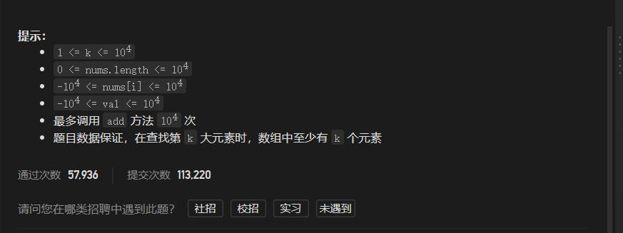
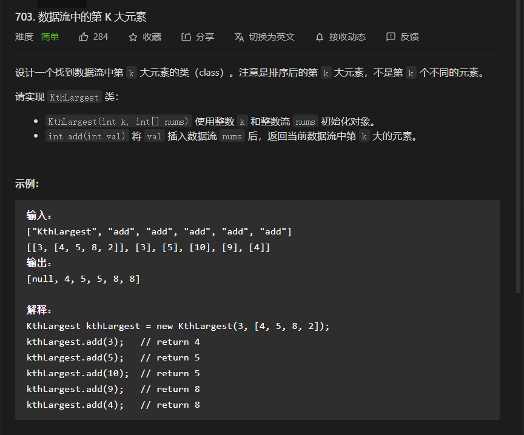
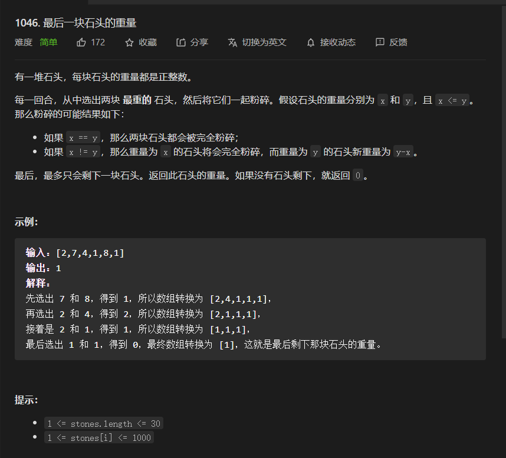
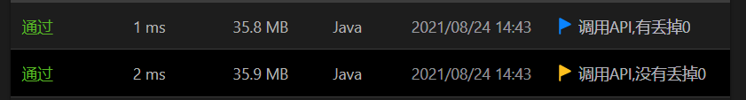
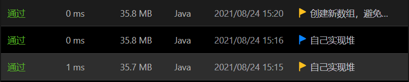
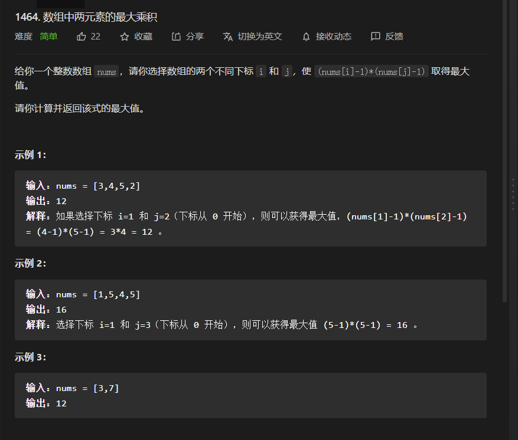
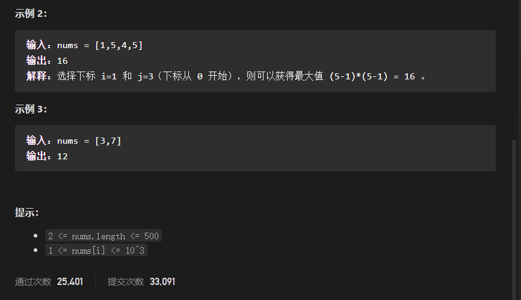
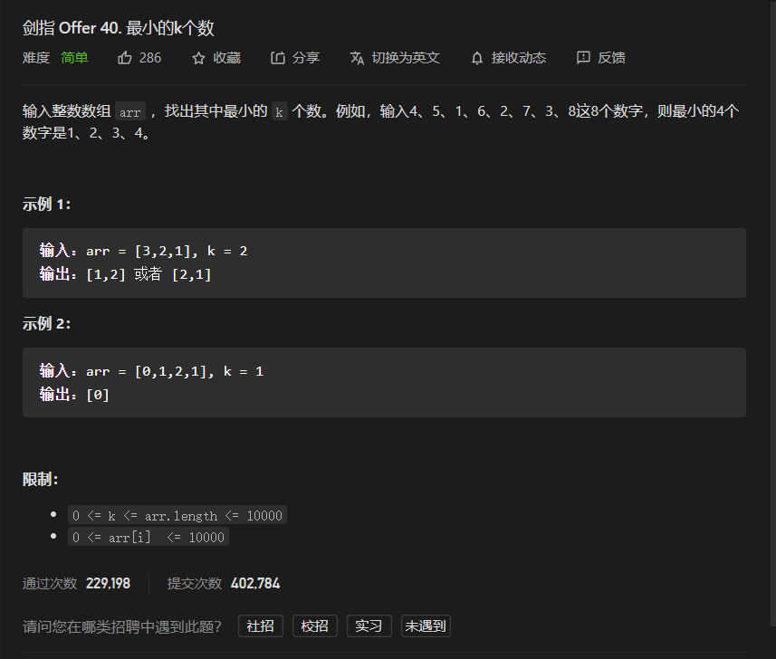
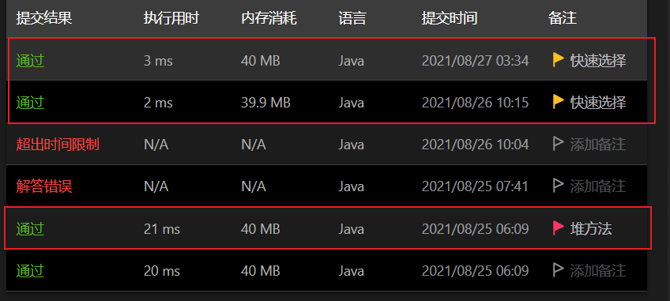

# 简单题

## 703.数据流中的第k大元素

题目



思路一:因为其是要求我们找到第k大的元素，那么我们就就无需对整个数组均进行排列，因为后面的元素就无需用到，那么找局部最大值的数据结构就是--优先队列(堆);

按平时我们使用优先队列均是用遭到一组数的最大值或最小值，但对于这道题来讲，如果我们需要找到一组数的第k大值，那么我们如何转化呢？

解决：既然优先队列只能找到最大值或最小值，而我们要找第k大值，那么我们就可以维护一个数目不大于k的小根堆

为什么是小根堆呢？

* 因为小根堆的堆元素是堆的最小值，而我们不需要的就恰恰为任何第R大的的数，R>k,因为这个就一定不会被使用到，而我们维护小根堆，每次排排除的都是堆的大于K，剩下的就是前k大的元素，而小根堆能用O(1)时间复杂度得到其最小值就是第K大的元素

代码

```java
class KthLargest {
        PriorityQueue<Integer>pq=new PriorityQueue<>();
        int k=0;
    public KthLargest(int k, int[] nums) {
        this.k=k;
        for (int i = 0; i < nums.length; i++) {
            add(nums[i]);
        }
    }
    //添加元素
    public int add(int val) {
        int result=0;
        //注意：标准API中offer和add的效果是一样的
        //无论何时都现将元素加入，用于更新堆元素的位置
        pq.offer(val);
        //维护堆的数目不大于k
        if(pq.size()>k){
            pq.remove();
        }
        //返回堆的最小值
        return pq.peek();
    }
}
/**
 * Your KthLargest object will be instantiated and called as such:
 * KthLargest obj = new KthLargest(k, nums);
 * int param_1 = obj.add(val);
 */
```


## 1046.最后一块石头的重量

题目



思路一：因为这道题是需要局部排列的，因为我们每次仅仅就需要最大的那两个数可以，而且每次取完数后，就会加入新的元素，即就有可能改变数的大小情况，所以排序就不可行，那么考虑到局部排列就是`优先队列`效率最高

javaAPI实现

```java
class Solution {
    public int lastStoneWeight(int[] stones) {
        int result = 0;
        PriorityQueue<Integer> pq = new PriorityQueue<>((n1,n2)->(n2-n1));
        //建堆
        for (int i = 0; i < stones.length; i++) {
            pq.add(stones[i]);
        }
        //确保经进入循环时，至少有两个元素，以便在循环中需要再判断是否有元素可以取
        while (pq.size() > 1) {
            //取两个最大值
            Integer left = pq.remove();
            Integer right=pq.remove();
            result=Math.abs(right-left);
            //如果大小为零，就需要丢掉，当然不丢掉也是可以的，但会因此多进行几次迭代，不过如果要丢掉也会即每次循环都需要判断开销
            if(result==0){
                continue;
            }
            //加入新石头
            pq.offer(result);
        }
        //即如果有丢掉零就需要分类讨论，如果不丢，就可以不用，因为最后肯定会剩下一个元素再堆中
        return pq.size()==1?pq.peek():result;
    }
}
```



#### 自己实现int堆，避免基本数据的装箱和拆箱，提高效率

```java
class Solution {
    //堆元素的数目
    int size = 0;

    public int lastStoneWeight(int[] stones) {
        int[]nums=new int[stones.length];//创建新数组做为堆，避免修改原数组
        //建堆
        for (int i = 0; i < stones.length; i++) {
            add(stones[i], nums);
        }
        // Arrays.stream(stones).forEach(n1-> System.out.print(n1+"\t"));
        // System.out.println();
        //中间处理，思路见上面题解
        while (size > 1) {
            int left = remove(nums);
            int right = remove(nums);
            add(Math.abs(right - left), nums);
            // Arrays.stream(stones).limit(size).forEach(n1-> System.out.print(n1+"\t"));
            // System.out.println();
        }
        return nums[0];
    }
    //返回堆顶元素
    int peek(int[] nums) {
        return nums[0];
    }
    //添加元素
    void add(int one, int[] nums) {
        nums[size] = one;
        sink(nums, size);
        size++;
    }
    //移除堆顶元素
    int remove(int[] nums) {
        int temp = nums[0];
        nums[0]=nums[size-1];
        swim(nums, 0);
        size--;
        return temp;
    }
    //上浮，思路同下面下沉
    void sink(int[] nums, int index) {
        int pare = (index - 1) / 2;
        while (pare >= 0) {
            if (nums[pare] >= nums[index]) {
                break;
            }
            swap(pare, index, nums);
            index = pare;
            pare = (index - 1) / 2;
        }
    }
    //下沉
    void swim(int[] nums, int index) {
        int son = index * 2 + 1;
        //确保至少有一个孩子节点再堆中
        while (son < size) {
            //取较大的孩子节点
            if (son + 1 < size && nums[son] < nums[son + 1]) {
                son++;
            }
            //如果有到达一个节点，此时堆约束满足，那么就可以结束迭代
            if (nums[index] > nums[son]) {
                break;
            }
            //元素下沉，下标更新
            swap(index, son, nums);
            index = son;
            son = index * 2 + 1;

        }
    }

    void swap(int n1, int n2, int[] nums) {
        int temp = nums[n1];
        nums[n1] = nums[n2];
        nums[n2] = temp;
    }

}
```



非排序法https://leetcode-cn.com/problems/last-stone-weight/solution/fei-pai-xu-fa-by-death-6a-unhi/

## 1464.数组中两元素的最大乘积

题目



思路一：因为我们要寻找让乘积最大的值，因为nums[i]-1一定大于零，那么就证明我们只要找到数组中的最大值和次大值就可以了

###### 优先队列

```java
class Solution {
    int[] pq;
    int size = 0;

    public int maxProduct(int[] nums) {
        pq = new int[nums.length];
        // pq=nums;
        for (int i = 0; i < nums.length; i++) {
            add(nums[i]);
        }
        // System.out.println("$%^&*(");
        int left = remove();
        int right = remove();
        return  (left-1)*(right-1);
    }

    int peek() {
        if (size <= 0) {
            throw new ArrayIndexOutOfBoundsException();
        }
        return pq[0];
    }

    int remove() {
        int temp = pq[0];
        pq[0] = pq[size - 1];
        size--;
        down(0);
        return temp;
    }

    void add(int val) {
        if (size > pq.length) {
            throw new IndexOutOfBoundsException("长度不够，数据溢出");
        }
        pq[size] = val;
        sink(size);

        size++;
    }

    void down(int index) {
        int son = index * 2 + 1;
        while (son < size) {
            if (son + 1 < size && pq[son + 1] > pq[son]) {
                son++;
            }
            if (pq[son] < pq[index]) {
                break;
            }
            swap(son, index);
            index = son;
            son = index * 2 + 1;
        }
    }

    void sink(int index) {
        int pare = (index - 1) / 2;
        while (pare >= 0&&index>0) {
            if (pq[pare] > pq[index]) {
                break;
            }
            // System.out.println("pare="+pare);

            swap(pare, index);
            index = pare;
            pare = (index - 1) / 2;
        }
    }

    void swap(int n1, int n2) {
        int temp = pq[n1];
        pq[n1] = pq[n2];
        pq[n2] = temp;
    }
}
```

思路二：对于优先队列，我们一般用于求其前k个最值，比较有效率，因为其需要建堆，而对于这道题，我们仅仅需要前两个，那么就我们可以用两个变量维护数组的最大值和次大值

代码

```java
class Solution {
    public int maxProduct(int[] nums) {
        //注意下面算法可以用于一般的数组求最大值和最小值，但如果是明确nums[i]一定大于某个数，就可以将前面的初始化合并到for循环中
        int max=0;
        int more=0;
        //初始化
        if(nums[0]>nums[1]){
            max=nums[0];
            more=nums[1];
        }else{
            max=nums[1];
            more=nums[0];
        }
        for(int i=2;i<nums.length;i++){
            if(max<nums[i]){
                more=max;
                max=nums[i];
            }else if(more<nums[i]){
                more=nums[i];
            }
        }
        return (max-1)*(more-1);
    }
}
```


剑指offer 40.最小的k个数

题目



这道题目的解题思路和本比较的第一题`703.数据流中的第k大元素`是一样的，不够本题是维护一个大顶堆，因为要保留所以的k小值，所以就需要大根堆，以便将大值去掉

优先队列

```java
class Solution {
    public int[] getLeastNumbers(int[] arr, int k) {
        PriorityQueue<Integer>pq=new PriorityQueue<>((n1,n2)->n2-n1);
        for (int i = 0; i < arr.length; i++) {
            add(pq,arr[i],k);
        }
        return pq.stream().mapToInt(n1->n1).toArray();
    }
    void add(PriorityQueue<Integer>pq,int val,int k){
        pq.add(val);
        if(pq.size()>k){
            pq.remove();
        }
    }
}
```

但只要写的效率很低，因为其需要拆箱和装箱，这两个占了算法的大部分数据，但思路是对的，可以通过数组int型的堆来提高效率

思路二：快速选择

对于该题对结果没有要求有序，那么我们就可以通过快速排序分支的思想进行解决

对于快速排序，其在每次位置调换后，都可以最终确定一个元素的最终位置，且其前面的恒小于或等于给元素，后面恒大于或等于该元素，所以如果在一次调换后，其位置恰好为k,那么就证明前面的元素就是符合的，就可以结束排序，但如果小于，就在前面区间递归，后面区间无需管他，如果大于，就可以在后面的区间，递归，但此时递归就仅仅需要遭到除了前面元素外的其他元素了

代码

```java
class Solution {
    public int[] getLeastNumbers(int[] arr, int k) {
        getLeastNumbers(arr,k,0,arr.length-1);
        //得到结果数组
        int[]nums=new int[k];
        for (int i = 0; i < k; i++) {
            nums[i]=arr[i];
        }
        return nums;
    }
    //快速选择函数
    public void getLeastNumbers(int[] arr, int k,int left,int right) {
        if(right<left){
            return ;
        }
        if(right-left+1==k){
            return;
        }
        //位置调整：三切划分
        int pos=partion(arr,left,right);
        int temp=pos-left+1;
        //分情况继续递归
        //但下面的分情况性能不是最优，可以参考中等题的`215. 数组中的第k个最大元素`；其效果就有所优化，但前提必须是以三且划分为位置调换函数
        if(temp<k){
            getLeastNumbers(arr,k-temp,pos+1,right);
        }else if(temp>k){
            getLeastNumbers(arr,k,left,pos-1);
        }else{
            return ;
        }
    }
//加入随机优化
    void randomDo(int[]nums,int left,int right){
        int pos=(int)((Math.random()*(right-left+1))+left);
        swap(nums,left,pos);
    }
    //位置调整：三切划分
    int partion(int[]nums,int left,int right){
        if(left>=right){
            return left;
        }
        randomDo(nums,left,right);
        int temp=nums[left];
        int index=left+1;
        while(index<=right){
            if(nums[index]<temp){
                swap(nums,index,left);
                index++;left++;
            }else if(nums[index]>temp){
                swap(nums,index,right);
                right--;
            }else{
                index++;
            }
        }
        index--;
        return index;
    }
    void swap(int[]nums,int n1,int n2){
        int temp=nums[n1];
        nums[n1]=nums[n2];
        nums[n2]=temp;
    }
}
```

其快排位置调换的多种写法可以参考中等题中的`215. 数组中的第k个最大元素`的拓展部分；

###### 性能对比



