# 位运算中等题

## 137.只出现一次的数字||

题目

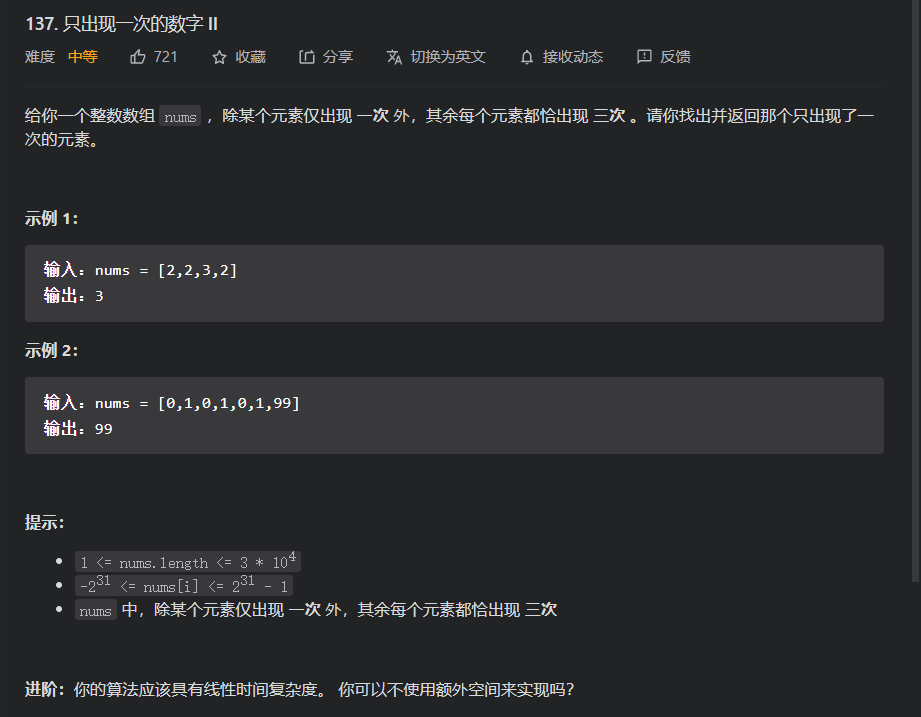

思路分析：

对于这道题和简单题的`136.只出现一次的数字`的外形基本相同，其通用方法也依然适用，即哈希表+遍历，但这样肯定不是最优，所以我们就可以需要寻找更高效的办法，以便可以充分利用题目给的信息。

* 观察一:题目中已经有点明只有一个元素出现1次，而其他的均出现3次，那么我们就可以向`136题`一样考虑一下位运算，但是这次我们就不能仅仅依靠异或操作去计算了，而是应该去找另外的特性

* 特性：对于整数的二进制表示而言，其每个位不是1就是0,而因为位他们的成3出现的(出来一个元素外)，所以如果我们将他们的每一位的1出现的次数记录下来，32位就有32个记录，而如果我们的目标元素(仅出现一次的)的二进制表示中有1存在，那么其对应位的最后记录肯定不能被3整除，且余数必为1；而那些它不在的，就可以被整除，余数为0；所以我们可以通过这个方法去计算得到目标元素的1的位置，其他位置就是0了，那么该元素就可以确定了

  ```java
  class Solution {
      public int singleNumber(int[] nums) {
          //整数32位
          int bitCount=32;
          int result=0;
          for (int i = 0; i < bitCount; i++) {
              int count=0;
              //要得到每一位的记录，就需要遍历整个数组去记录
              for (int j = 0; j < nums.length; j++) {
                  count+=nums[j]&1;
                  nums[j]>>>=1;
              }
              //将不能被3整除的位置就设置为1
              result|=((count%3)<<i);
          }
          return result;
      }
  }
  ```

* 显然对于上面我们已经完成了题目的要求O(32n)时间开销和O(1)空间开销，但我们每次都需要重复遍历数组，且遍历的时候，我们没每个位的信息都是可以被获得的，所以我们需要寻找一个可以遍历一个元素时，就记录所有位，然后仅需要遍历一次数组即可的方案。

  * 我们的主要问题就是我们没有办法用一个位去表明3种情况，因为我们在遍历的过程中，每个位mod3后可能位0，1，2，当然到最后就只能为0，1；所以我们就考虑再引入一个位，即用2个位表达3种情况，而因为如果我们想要32位的记录，所以就需要64位，我们有两种方案：

    * 用long类型：

    * 用两个int类型

      我们最后是选择第二个方案，因为我们要面对对上面提到的三种情况进行维护，已经他们之间的转化，即一个情况如何转到另外一种情况，而两个int类型操作起来更方便，且如果我们要long类型，最后我们也还需要转回int类型。

  * 接下来即来表述我们的3种情况`00，01，10`（以下讨论即位对于一个位而言，但是多个位道理一样）

    * 而如果我们遍历到一个数时，当前位为1，就需要转化状态，如果为零就不需要变化；

    * 那现在我们来看一下其递推的递推公式的推导

      ```java
      if two =0:
      	if n=1:one=~one;
      	if n=0:one=one;
      if(two=1):one=0;
      -->进一步合并(时刻注意其取值只有1和0)
      if two=0:
      	one=one^n;//其中one^0==one,而对于只有0，1取值的one,则one^1=~one;
      if two=1:
      	one=1;
      -->合并
      one=one^n&(~two);
      //而two的状态变化有推算可知，变化和one一样，所以递推公式也一样，则two^=n&(~one)
      ```

      最后代码

      ```java
      class Solution {
          public int singleNumber(int[] nums) {
              int ones=0;
              int twos=0;
              for (int i = 0; i < nums.length; i++) {
                  ones=ones^nums[i]^(~twos);
                  twos=twos^nums[i]^(~ones);
              }
              return ones;
          }
      }
      ```

      `参考题解:`https://leetcode-cn.com/problems/single-number-ii/solution/single-number-ii-mo-ni-san-jin-zhi-fa-by-jin407891/

性能pk


拓展思路


代码

```python
class Solution:
    def singleNumber(self, nums: List[int]) -> int:
        n=len(nums)
        l,r=0,n-1
        while l<r:
            k=randint(l,r)
            nums[r],nums[k]=nums[k],nums[r]
            i,j=l,r-1
            while i<=j:
                while i<r and nums[i]<=nums[r]:
                    i+=1
                while j>=l and nums[j]>nums[r]:
                    j-=1
                if i<j:
                    nums[i],nums[j]=nums[j],nums[i]
                    i+=1
                    j-=1
            nums[i],nums[r]=nums[r],nums[i]
            if (i-l+1)%3!=0:
                r=i
            else:
                l=i+1
        return nums[l]

#作者：atoi-2
#链接：https://leetcode-cn.com/problems/single-number-ii/solution/python3-kuai-su-xuan-ze-fen-zhi-suan-fa-prk3u/
```

## 260.只出现一次的数组|||

题目

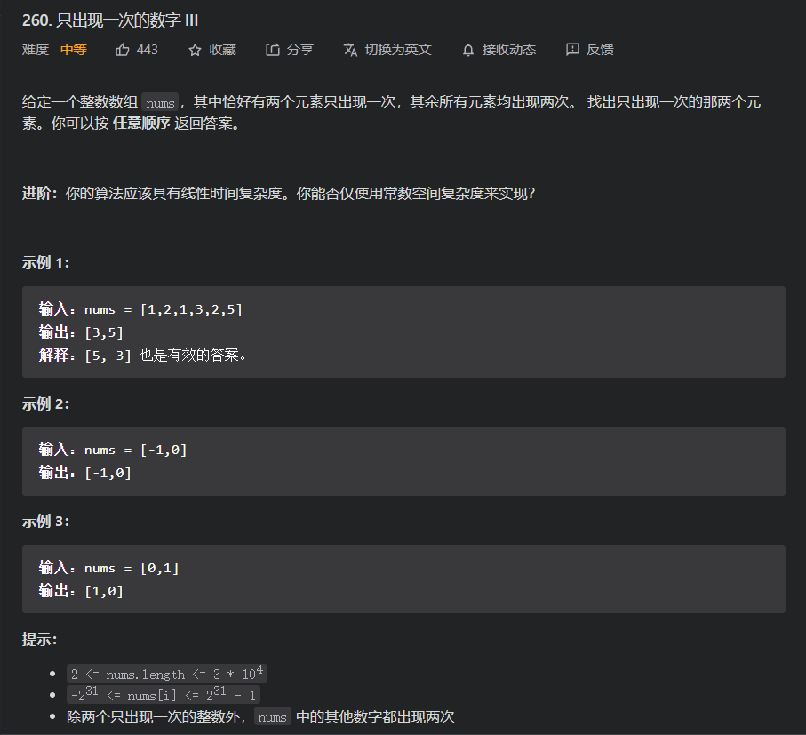

思路分析：

对于这道题，我们依旧可以将其与前面的第一第二版本做对比，而因为我们这道题是偶数次的出现，那么可以重点关注一下异或操作；但是我们这道题是有两个不同的元素仅出现一次，那么就如果我们可以对原数组进行分组，然后将那两个仅出现一次的元素分到不同的组，而相同的元素被分到同一组，而那么这样对两个子数组进行异或操作就可以得出结果

问题：我们然后去划分元素？

* 我们首先对所有元素进行异或操作，最后就剩下了两个不同的仅出现 一次的元素的异或的结果，而我们观察期结果的二进制表示，即如果位为1，即证明两个元素在这个位置不同，如果位0，则相反，所以我们就可以任选一个位位1的，然后按照这个位的取值进行分组，另外因为相等元素的每个位都相等，所以就可以保证被分到同一组，就可以满足我们上述的分组要求

代码

```java
class Solution {
    public int[] singleNumber(int[] nums) {
        int res=0;
        //全员异或
        for (int i = 0; i <nums.length ; i++) {
            res^=nums[i];
        }
        //取结果的最后一个位1出来，可以参考简单题的’计算位为1的个数‘
        res&=(-res);
        //两个元素
        int either=0;
        int other=0;
        //分组异或
        for (int i = 0; i <nums.length ; i++) {
            if((nums[i]&res)==1){
                either^=nums[i];
            }else{
                other^=nums[i];
            }
        }
        return new int[]{either,other};
    }
}
```

## 287.寻找重复数

题目

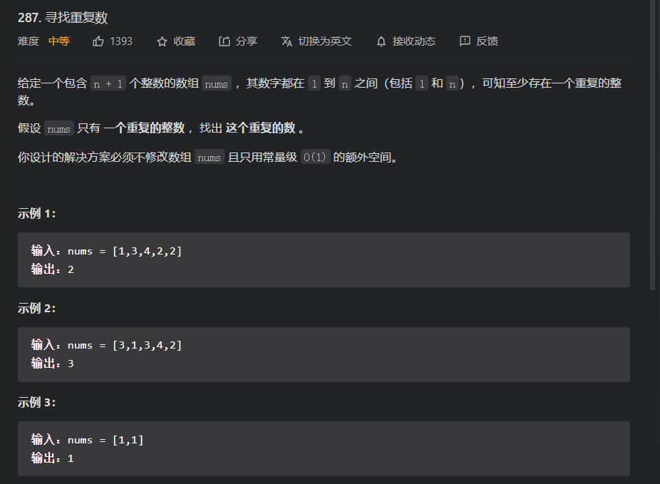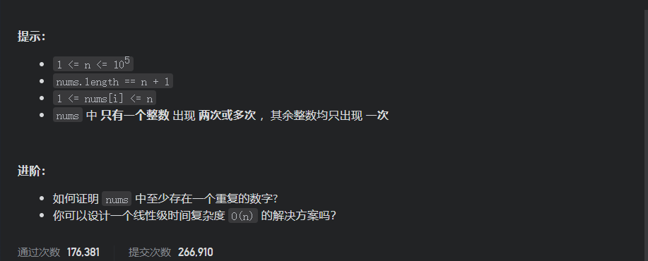

思路分析：

对于这道题和前面的计数问题有点类似，都可以用通用方法哈希表来进行解答，但其需要用到额外的空间以及哈希函数的开销；而为了避免额外空间的开销以及尽量实现线性时间复杂度，我们需要寻找更好的方法，而对于一道题目而言，其寻找好的方法的关键在于能否充分利用其所给我们的所有信息；我们再来重申一下我们所拥有的信息：

* 数组中的数目的大小在【1,nums.length-1】之间
* 数组中仅有一个重复的数字，而重复次数不定
  * 第2个性质是由第一个推出来的

为了方便后面讨论，我们假设重复数为target,其对应索引为index[target]:

##### 方法一：二分查找

我们假设cnt[i]表示小于或等于i的数组元素个数；观察这两个性质，我们可以发现cnt[i]在这个情景下会有不一样的性质

* i<index[target]：cnt[i]<=i

  * 如果target重复一次，那么就证明target没有替换1-(len-1)的连续数中的数，因为如果有，那么就不止一个重复数了，因此就证明cnt[i]==i
  * 但如果当target重复不止一次且其替换的元素j<=i;那么就证明[1,i]区间少了一个数，所以cnt[i]<i;但如果是替换在i后面就没有影响

* i>=index[target]:cnt[i]>i

  * 如果重复一次，那么[1,i]之间的数均在，且因为i>index[target]，所以还会格外多一个在区间[1,i]的数所以cnt[i]>i;
  * 如果重复n次，而如果替换在i之前的元素，那么就证明[1,i]之间的连续数扫了(n-1)个，但因为重复了n次,所以就其小于等于i的元素个数cnt[i]依然会比i大1即cnt[i]>i;而如果替换发生在i之后，那么就是i>=index[target]的第一种情况

  而我们会发现target就是第一个使得cnt[i]>i的元素，由因为cnt[i]是单调的(因为如果j<i,那么cnt[j]<=cnt[i],`如果不理解返回前面查看cnt[i]的定义`);那么我们就可以使用二分查找，寻找第一个满足cnt[i]>i对应的元素

  代码

  ```java
  class Solution {
      public int findDuplicate(int[] nums) {
          int left=0,right=nums.length-1;
          int result=0;
          while(left<=right){
              //mid即解说中的i;
              int mid=left+(right-left)/2;
              //即cnt[i];
              int cnt=0;
              for (int i = 0; i < nums.length; i++) {
                  if(nums[i]<=mid){
                      cnt+=1;
                  }
              }
              if(cnt<=mid){
                  left=mid+1;
              }else{
                  right=mid-1;
                  //因为result是第一个cnt[i]>i对应的元素，所以只有在cnt[i]>i时才有可能是result;
                  result=mid;
              }
          }
          return result;
      }
  }
  ```

  时间复杂度：O(NlogN)

  空间复杂度：O(1)

##### 方法二：位运算

对于上面我们还有无法将其优化到线性开销，但是其已经有重复利用其所有信息；所以如果想要在优化方法就需要从另一个角度去思考问题。

和前面的计数问题一样，这道题也可以从位运算的角度出发

我们思考上面的两条信息和位运算的关系，而我们就从上面的信息可以知道，我们主要关注的是原始[1,len-1]连续数以及数组nums的关系；所以我们可以观察两者在位运算角度的联系

* 对于两者的位信息：我们发现对于重复数出现1的那个位，`原始[1,len-1]连续数的那个位出现1的总数小于nums那个位出现1的总数，所以我们就可以分别记录原数组和连续数位出现1的次数，如果前者次数大于连续数，那么就证明其那个位为1`；原因见下面分析

  * 如果target如果仅仅重复一次，那么就证明原数组至少有连续数存在，而因为还有一个数重复出现，所以如果其中有位取值位1，那么最后的记录可能对多1个
  * 如果其不仅仅重复一次，那么如果target在某个位出现1，那么无论其被替换的那个数组是否出现1(如果出现1，就是第一种情况一样，因为会被抵消，而如果不为1，那就更满足后面不等式)，其位1的数均大于连续数的记录；而如果target在某个为不出现1，那么如果替换的元素那个位取值为1，那么就证明次数：原数组<连续数；而如果替换的元素取值不为1，那么就证明次数：原数组<连续数；

  代码

  ```java
  class Solution {
      public int findDuplicate(int[] nums) {
          int mask=1;
          int bitCount=32;
          int result=0;
          int tempMask=1<<31;
          //优化：让下面的嵌套循环仅仅去遍历那些有效位即可
          while((tempMask&(nums.length-1))==0){
              bitCount-=1;
              tempMask>>=1;
          }
          for (int i = 0; i < bitCount; i++) {
              int allCount=0;
              int numsCount=0;
              allCount=(mask&nums[0])!=0?allCount:allCount+1;
              mask<<=1;
              //连续数和原数组一起更新
              for (int j = 1; j < nums.length; j++) {
                  if((mask&nums[j])!=0){
                      allCount+=1;
                  }
                  if((j&mask)!=0){
                      numsCount+=1;
                  }
              }
              //如果大于，就对应位设置位1
              if(allCount>numsCount){
                  result|=mask;
              }
              //更新掩码
              mask<<=1;
          }
          return result;
      }
  }
  ```

  时间复杂度：O(32N)-->O(N)-->但是其效率其实比上面的方法一还低的，因为上面的方法一虽然有一个logN，但是其增长是很慢的，且其除非数据量为2^32不然是不可能遍历32遍的

  空间复杂度：O(N)

  

##### 方法三：快慢指针

我们观察这道题会发现就是因为我们的数组元素的取值被限定在了[1,len-1]的范围中，即数组的所有元素都可以被当成指向对应下标的指针，即next指针，则对应原数组的每个元素其本身的标识符可以看为数组下标，next指针就是其对应的元素，所以我们就可以用数组构建一个链表(即逻辑上的链表)；而如果数组都仅仅是转那个没有重复的连续数元素那么除了0外，其他地址有且仅有一个指向其的其他元素的next指针，所以就可以构建一个逻辑上的链表；但是如果出现重复数，那么就证明有一个地址出现两个指向其的指针，那么到时就会出现环状结构；且环的入口就是重复元素 ，如

| 下标 | 0    | 1    | 2    | 3    | 4    |
| ---- | :--- | ---- | ---- | ---- | ---- |
| 元素 | 2    | 4    | 1    | 2    | 3    |

遍历顺序：0->2->1->(4->3->2->1)->(4->3->2->1)->4....即已经成环，且2为环的入口；所以问题就转化为如何寻找一个有环的链表的环入口。

对于这个经典问题：

* 判断链表是否成环？

  对于这个问题，我们一般是采用快慢指针；即一个指针走两步(快指针)，另一个指针走一步(慢指针)；然后逐步通过next指针去遍历，而如果其没有环，就会有终止的地方即next为null,否则因为快指针走两步慢指针走一步，即每次的路程差为1，假设一圈的路程为C，即C可以整除1，虽然我们入环时间不同，但快指针是每次比慢指针距离拉大一格，即假设如何时两个的路程差为D,那么D除以1肯定可以整除，即快指针一定可以在第一次就追上它而不会跳过他，这也是为什么快指针要走两步，而不是3,4步的原因你，因为3，4步我们不能保证一定可以在第一次不会跳过，当然其肯定也是可以一起遇到的。

  * 为什么2，3，4步最后都可以相遇？
    * 减少快指针为K步，假设其可以相遇，而相遇时，慢指针走了n步，那么快指针就比慢指针多走了（K-1）*n步，但因为其最终位置一样，所以其满足(K-1)*n%C==0；如果有可以满足的n取值，那么就证明其可以相遇，下面的寻找环入口的思路，可以根据这个进行扩展

* 寻找一个有环的链表的环入口

  前面有提到，我们假设c为环周长，n为慢指针最终走的步数，快指针为2n步，且(2n-n)%C==0即n%C==0;又由慢指针在环中走的步数为n-m;又由n%C==0;即慢指针再再走m步，那么其在环中走的步数就是n,就变成n%c==0，那么此时慢指针就恰好在环的入口处；

  * 我们如何计算那个m(m就是除环为的链表长度)？

    我们不需要直接去计算出来，我们仅需要在设置一个慢指针，让其从原表头出发，然后按next遍历，当其到达环的入口时，其走了m步，如果在这个期间之前的慢指针也跟着走就会在此时遇见

代码

```java
class Solution {
    public int findDuplicate(int[] nums) {
        int fast=0,slow=0;
        do{
            fast=nums[nums[fast]];
            slow=nums[slow];
        }while(fast!=slow);
        int finder=0;
        while(finder!=slow){
            finder=nums[finder];
            slow=nums[slow];
        }
        return slow;
    }
}

```

时间：O(n)

空间:O(1);

性能pk


拓展：如何计数有环的链表的环的长度？

即在相遇时，记录当前节点的唯一标识符，再继续遍历直到再次遇见这个结点，所走的路程就是环的长度

## 89.格雷编码

题目

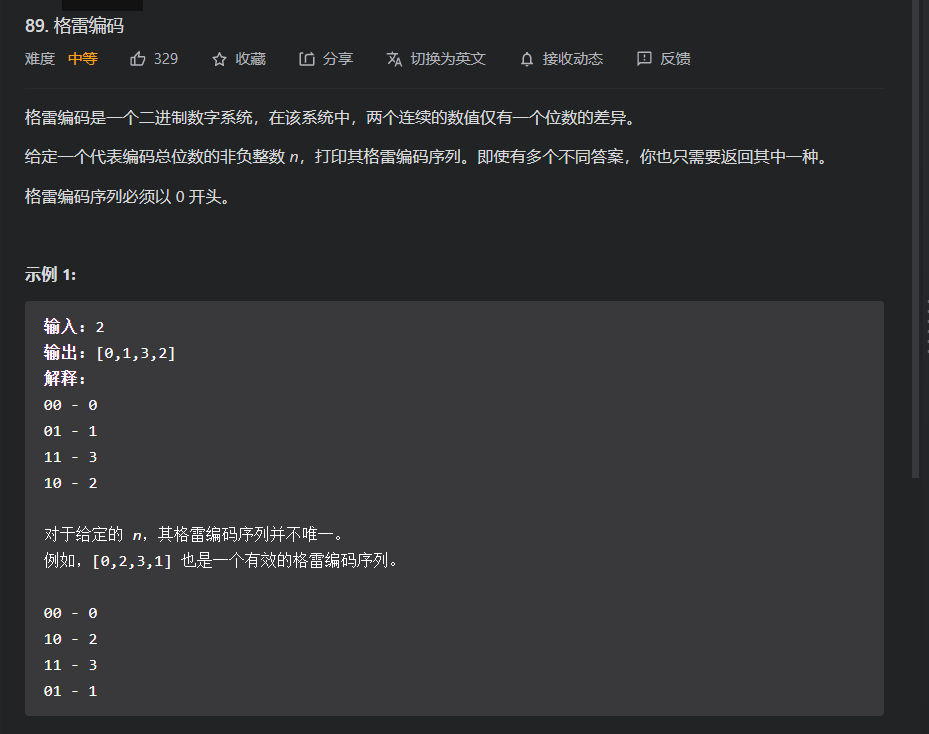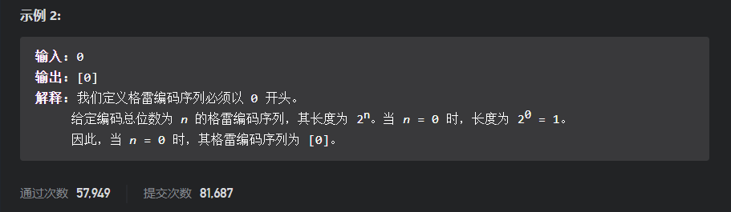

思路分析：

对于这道题我们需要的就是尽可能的寻找规律，因为这种题有点类似数学题，因为我们是需要按照特定的规律去寻求数的；

方法一：对于这道题，我们直接去算可能会比较，那么麻烦，因为我们要避免后面得到的编码不能和上面的重复了，所以我们可以考虑利用前面的信息来计算后面的即动态规划

下面举例说明

```java
比如2解;
00;
01;
11;
10;
上面就是2阶的，那么我们可以如何去将2阶转化为3阶那，注意格雷编码已经将前面的所有情况都计算完成了，所以我们想要添加1位，就仅仅在其前面或是后面添加一位，取值位0或1，在中间可以取位吗？可以但是那样因为如果我们取位不规律的话，那么就就很难取保证编码的不可重复性以及完整性；
    下面我们假设都是在最前面添加一位;
一开始可以添加一位0,在不改变其他上面的情况下其是符合格雷编码的；而如果为1，那是否可以随意照抄添加即可呢？答案为不能，如：;
000;
001;
011;
010;
-------;
100;-->已经发生错误;
我们发现最后一行，如果加1：110是符合的，那么我们只要下面保存第一位还是为1，后辍就是我们倒序前面的编码即可，如;
110;
111;
101;
100;
```

代码

```java
class Solution {
    public List<Integer> grayCode(int n) {
        List<Integer>result=new ArrayList<>();
        result.add(0);
        int mask=1;
        for (int i = 0; i < n; i++) {
            for (int j = result.size()-1; j >=0 ; j++) {
                result.add(result.get(j)|mask);
            }
            mask<<=1;
        }
        return result;
    }
}
```


方法二：过于注重编码，就没有写笔记可参考题解：https://leetcode-cn.com/problems/gray-code/solution/xiang-xi-tong-su-de-si-lu-fen-xi-duo-jie-fa-by--12/

## 371.两整数之和


题目

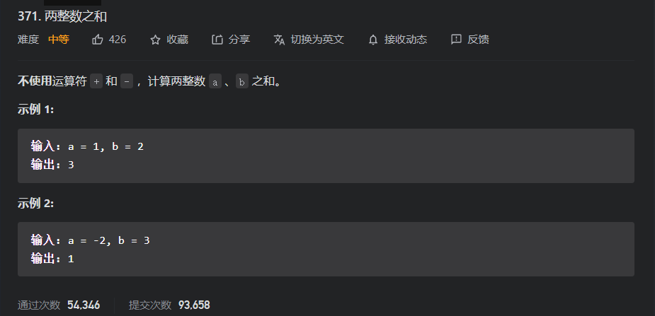

思路分析：

对于这道题就是经典的位技巧题目即：

首先我们思考下`异或`操作:其相同为置0，不同位置1，即不进位相加；

接着思考`与`操作其都为1，就置为1，其它为零，其不就是在告诉我们进位的位置吗？那么我们就将这些位置左移(因为这些位置表明有两个1相加，所以就可以向下一个位进一)所以就可以用这个进位结果再和前面的不进位相加结果进行异或操作因为其还有可能需要进位，所以进还需要重复进行上面两个步骤，知道没有进位，即进位数为0

代码

```java
class Solution {
    public int getSum(int a, int b) {
        int result=a^b;
        int carry=a&b;
        int temp=0;
        while(carry!=0){
            temp=result;
            result^=carry;
            carry&=temp;
        }
        return result;
    }
}
```

拓展：mid=left+((right-left)>>2)=(left&right)+((left^right)>>1)=((left&right)<<1+(left^right))>>1;


## 421.数组中两个数的最大异或值

题目

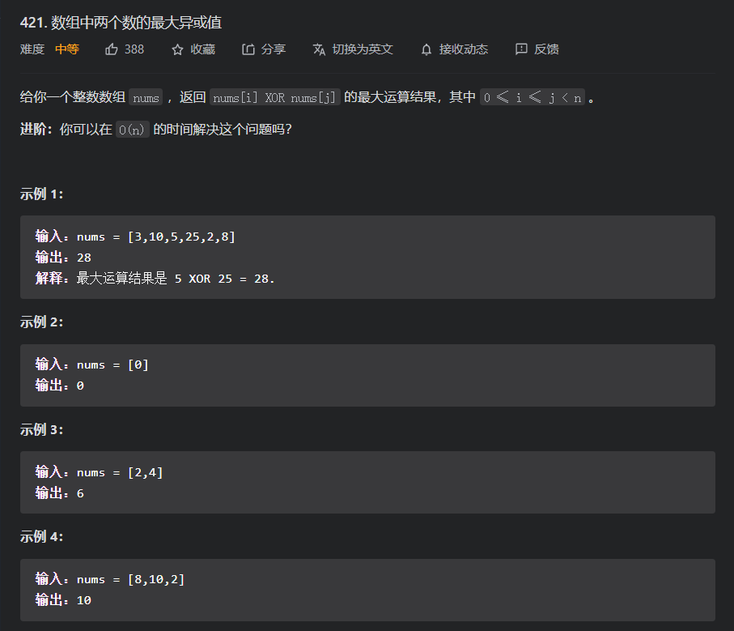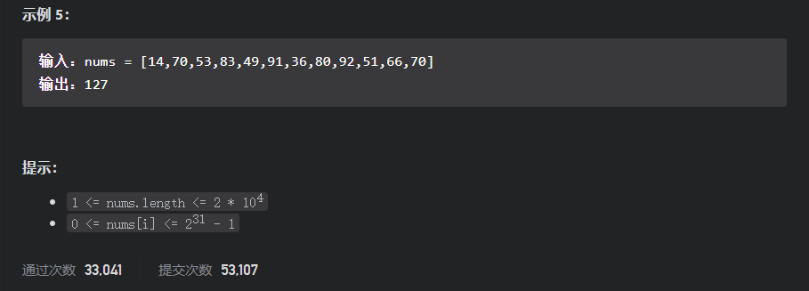

思路分析：

对于这道题如果在不限制时间复杂度的情况下，就可以用暴力枚举来进行解答，但因为题意指明要用O(n)时间复杂度来解答，所以就需要另寻方法(注意：O(n)是省略了系数，但其实际效率不一定会比O(nlogn)高)。

对于该题，因为其是要求异或的结果，而异或是二进制的常见运算，所以我们可以从位的角度去思考题目

在这里我们重新强调一下异或操作:单个位，相同为0，不同为1，位串则按位进行单个位的异或运算；

所以我们就要找到两个数，其二进制表示的位的位置尽可能的不同，且因为要最大，所以就必须是高位不同优先，所以现在的问题就转变为如何寻找两个数其是高位不同的；

对于高位，我们就可以想到前缀，即即前缀如果异或最大的话，那么那些小的就可以不考虑了，接着就继续逐渐增加位，比较那些高位异或相等的数组合；但是这个虽然可以但是因为是枚举异或，所以其时间复杂度肯定是比前面暴力还高，且其组合的情况也很多，所以也难以写出合适的代码，那么还有什么可以来优化的吗？

在这里我们就可以提起异或的一条性质：即`a=b^c`-->`b=a^c`-->`c=a^b`;

所以为了不进行过多的枚举，就可以用枚举结果，去和数组中的数做异或，如果结果存在在数组中，那么就证明这个结果可以被得到；

那么我们如何枚举结果呢？

* 因为是位角度，所以我们就可以刚才枚举每个位，且是由高位枚举到地位，又因为其是要两个数的所有位的异或，所以在枚举时，其前面已经确定的枚举就也是需要继续和数组中的每个数字进行枚举；
* 而判断是否在数组中就可以采用哈希表优化

文字描述可能不太到位，参考下面代码

```java
class Solution {
    public int findMaximumXOR(int[] nums) {
        int result = 0;
        //最大移位数
        int MAX_BIT = 31;
        for (int i = MAX_BIT; i >= 0; i--) {
            //结果是否存在在数组中
            boolean founded = false;
            //哈希表存放数组中所有元素的前缀
            Set<Integer> set = new HashSet<>();
            for (int j = 0; j < nums.length; j++) {
                set.add(nums[j] >> i);
            }
            //即对result增加一位，首先置为1，如果异或结果均不存在就可以改位0，即减1
            result = result * 2 + 1;
            for (int one : set) {
                if (set.contains(one ^ result)) {
                    founded = true;
                    break;
                }
            }
            if (founded == false) {
                result -= 1;
            }
        }
        return result;
    }
}
```


时间复杂度：O(32n)~O(nlogn)

空间复杂度：O(n)


思路二：前缀树

如果仅仅是对于上面，我们会感到很不舒服，因为我们要重复建哈希表，而建立哈希表的原因就是为了保存前缀，所以我们就可以利用前缀树来优化；(注意：具体的前缀树知识点参考刷题笔记的前缀树模块)

就用前缀树，由根结点依次由高位记录到低位，而因为每个位的取值就只有0和1，所以我们的前缀树就是二叉树

核心思路：即每次都根据传入的树，其找路径，如果当前位为1，那么就往代表0的方向结点去，如果结点为空，那么就只能往另一个结点，因为我们是高位优先，所以找到的肯定是最大值，且因为传入的树肯定在树中，所以我们最差的结果就是走到代表自己这个数的路径，而不会在状态遇到无法继续往下走的情况

```java
class Solution {
    //前缀树结点
    class Trie {
        static final int MAX_BIT = 31;
        Trie left;
        Trie right;

        public Trie(Trie left, Trie right) {
            this.left = left;
            this.right = right;
        }

        public Trie() {
        }
        //插入一个新数
        void insert(int one) {
            Trie cur = this;
            for (int i = MAX_BIT; i >= 0; i--) {
                if (((one >> i) & 1) == 1) {
                    if (cur.left == null) {
                        cur.left = new Trie();
                    }
                    cur = cur.left;
                } else {
                    if (cur.right == null) {
                        cur.right = new Trie();
                    }
                    cur = cur.right;
                }
            }
        }
        //判断树中是否存在这个数
        boolean isExit(int one) {
            Trie cur = this;
            for (int i = MAX_BIT; i >= 0; i -= 1) {
                int bit = (one >> i) & 1;
                if (bit == 1) {
                    if (cur.left == null) {
                        return false;
                    } else {
                        cur = cur.left;
                    }
                } else {
                    if (cur.right == null) {
                        return false;
                    } else {
                        cur = cur.right;
                    }
                }
            }
            return true;
        }
        //传入一个数，然后计算其与树中的数的异或的最大值
        int getMax(int one) {
            Trie cur = this;
            int result = 0;
            for (int i = MAX_BIT; i >= 0; i--) {
                result = result * 2 + 1;
                if (((one >> i) & 1) == 1) {
                    if (cur.right == null) {
                        result -= 1;
                        cur = cur.left;
                    } else {
                        cur = cur.right;
                    }
                } else {
                    if (cur.left == null) {
                        result -= 1;
                        cur = cur.right;
                    } else {
                        cur = cur.left;
                    }

                }
            }
            return result;
        }


    }

    public int findMaximumXOR(int[] nums) {
        Trie root = new Trie();
        //加入数组的数到树中
        for (int num : nums) {
            System.out.println(root.isExit(num));
            root.insert(num);
            System.out.println(root.isExit(num));
        }
        int result = 0;
        //依次遍历数组元素，维护最大值
        for (int num : nums) {
            result = Math.max(result, root.getMax(num));
        }
        return result;
    }
}


```

时间复杂度：O(n+nlogn)~O(nlogn)

空间复杂度：O(n)

##### 性能pk


## 397.整数替换

题目

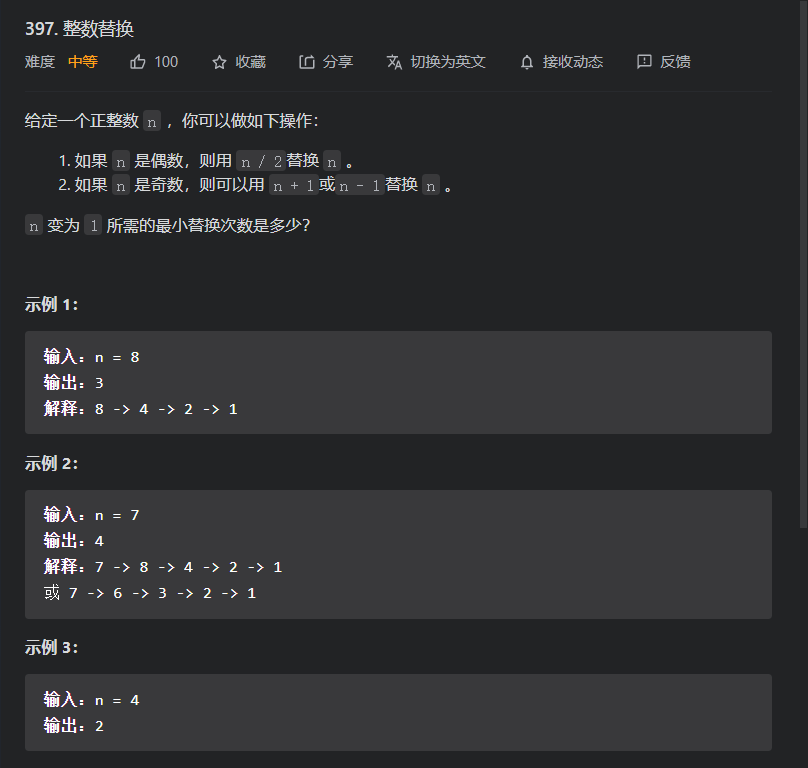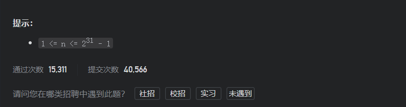

思路分析：

对于这道题有位运算技巧和其他的一些技巧，但位运算技巧不会很常用，所以会重点讲其他的几种思路

方法一：动态规划

对于这道题，其是要我们求的是一个结果，而并非将其变化的路程计算出来，所以可以借助动态规划，而对于状态的设定，就可以是dp[i]-->值为i时的最小变化数；

* 状态转移
  * 如果值为偶数，那么其dp[i]=dp[i>>1]+1;
  * 如果为奇数，那么dp[i]=min{dp[i-1],dp[(i+1)>>1]+1}+1;

最后返回dp[n]；

```java
class Solution {
    public int integerReplacement(int n) {
        int[] dp = new int[n + 1];
        dp[0] = 0;
        dp[1] = 0;
        for (int i = 0; i <= n; i++) {
            if ((n & 1) == 0) {
                dp[i] = dp[i - 1] + 1;
            } else {
                dp[i] = Math.min(dp[i - 1] + 1, dp[(i + 1) >> 2] + 1);
            }
        }
        return dp[n];
    }
}
```

但是对于这道题来讲，用动态规划的开销太大了，无论从时间或是空间；因为其必须从0-->n;而当数是偶数时，就可以缩短一半，且为了得到最后的结果会有大量的计算。

所以为了解决这个问题，我们就可以退而求其次，用它的好伙伴`记忆化搜索`；

方法二：记忆化搜索(哈希表+递归)

因为前面一步一步的状态转移太慢，所以我们可以通过递归的求其n及其小于其的数的值，而我们就仅仅需要计算我们所需要的状态的值，而因为递归会产生重复计算，那么就可以用哈希表来进行记忆化搜索

```java
class Solution {
    //记忆化搜索用的哈希表
    HashMap<Integer, Integer> map = new HashMap<>();

    public int integerReplacement(int n) {
        //结束递归标准
        if (n == 1) {
            return 0;
        }
        if (n == Integer.MAX_VALUE) {
            return 32;
        }
        //如果哈希表中有就返回即可
        if (map.containsKey(n)) {
            return map.get(n);
        }
        int number = 0;
        //如果是偶数我们就再次计算n/2的值就好
        if ((n & 1) == 0) {
            number = integerReplacement(n >> 1) + 1;
        } else {
            //奇数情况
            number = Math.min(integerReplacement(n - 1), integerReplacement(n + 1)) + 1;
        }
        //加入哈希表
        map.put(n, number);
        return number;
    }
}
```

记忆化搜索恰恰是规避了动态规划大量无效计算的特点，然后通过哈希表使得时间开销和递归基本相同

方法三：位运算

对于这道题，我们可以从位运算的角度来看

```java
class Solution1 {
    public int integerReplacement(int n) {
        int result = 0;
        while (n != 1) {
            if ((n & 1) == 0) {
                n >>>= 1;
            } else {
                int temp = (n & 3);
                if (temp == 3 && n != 3) {
                    n += 1;
                } else {
                    n -= 1;
                }

            }
            result += 1;
        }
        return result;
    }
}
```

