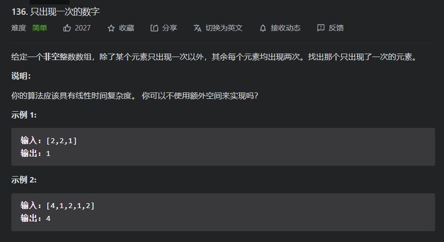
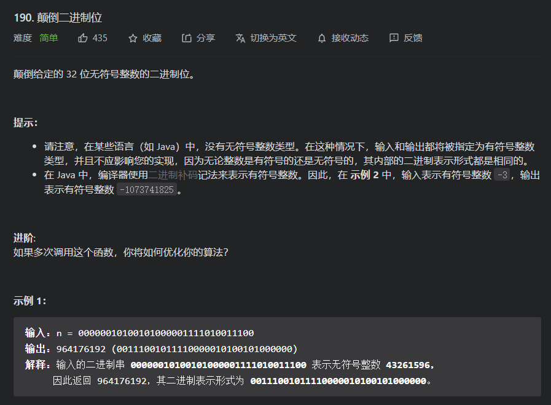
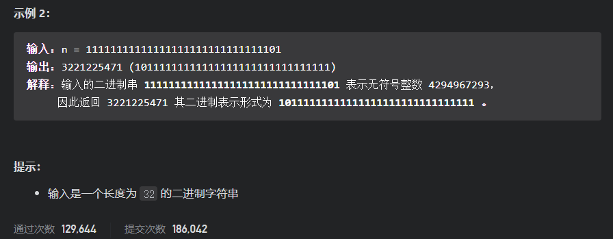
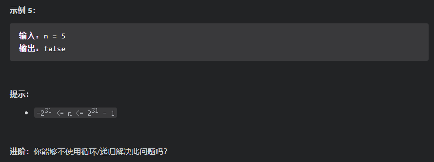
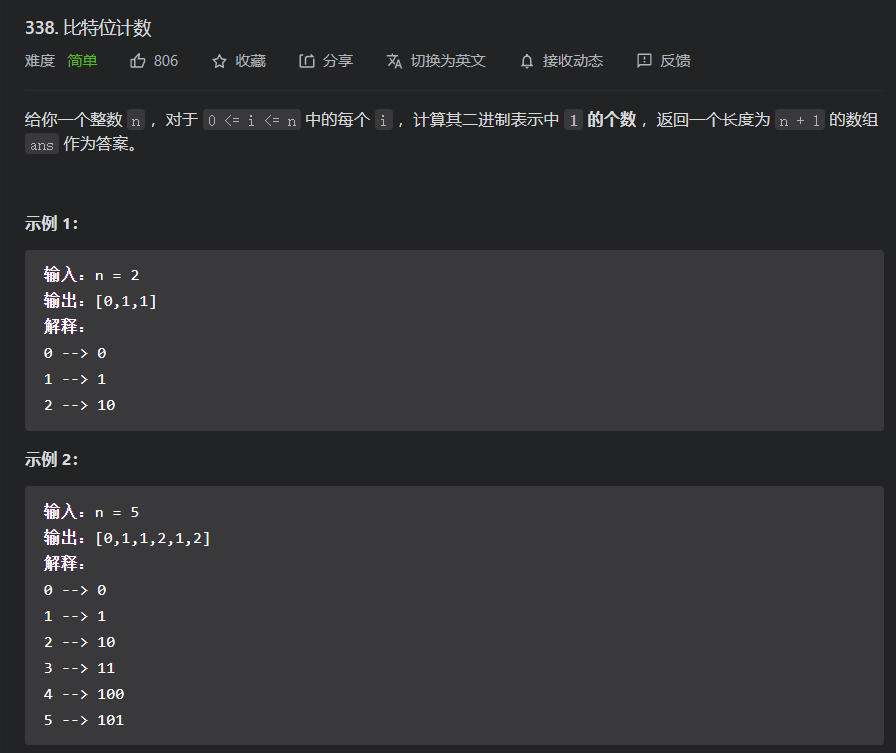
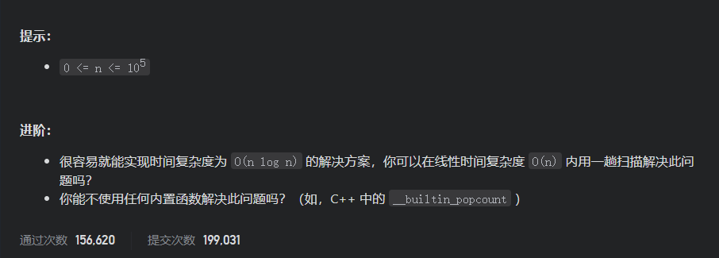
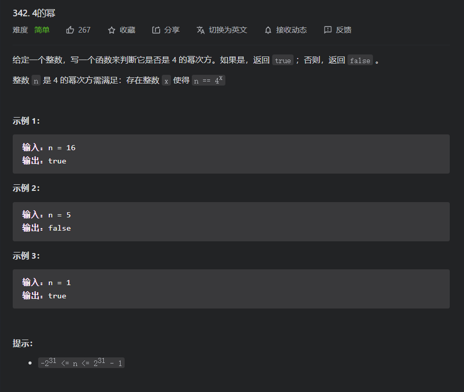

# 简单题

## 136.只出现一次的数字

题目



对于这道题我们比较直接的就是使用哈希表，即先将所有函数都加入表中，并记录出现次数，然后再重新遍历一次哈希表，看出现一个的元素是哪一个，但这样开销为O(n),但因为要维护哈希表所以实际效率会很慢，不过对于非整数类型这个是很好的解决方式，

另一种就是利用`异或`操作，因为两个相同的数进行异或结果为零，零和任何数异或，结果还是那个数，异或操作遵循交换律，所以我们可以对所有数进行异或，最后剩下的就是仅出现奇数次的元素

代码

```java
class Solution {
    public int singleNumber(int[] nums) {
        int result=0;
        for(int i=0;i<nums.length;i++){
            result^=nums[i];
        }
        return result;
    }
}
```

## 190.颠倒二进制位

题目



思路分析：

对于本题，其要求我们要颠倒其二进制表示，对于这个要求，显然我们应该向二进制操作方向靠近。

##### 方法一：循环移位

即通过掩码`1`+移位来去目标数的每一位，然后分别放入结果变量中

代码

```java
class Solution1 {
    // you need treat n as an unsigned value
    public int reverseBits(int n) {
       	//目标数的位数
        int bitSize=32;
        //做掩码
        int mask=1;
        int result=0;
        for (int i = 0; i <bitSize ; i++) {
            //将先前的数向左移动
            result=result<<1;
            //将n的指定位移动到第一位，用过和掩码与操作来实现取出
            result|=(n>>i)&mask;
        }
        return result;
    }
}

//减少空间开销，即减少匿名变量的产生
class Solution1 {
    // you need treat n as an unsigned value
    public int reverseBits(int n) {
        int bitSize=32;
        int mask=1;
        int result=0;
        for (int i = 0; i <bitSize ; i++) {
            result=result<<1;
            result|=(n>>i)&mask;
        }
        return result;
    }
}
```

##### 方法二：分治

即我们可以对二进制模式进行分组，一开始每2个一组，然后实现颠倒，接着4位一组，前两位和后两位颠倒，接着8位一组......；最后即可实现二进制的逆序，

而要实现现在颠倒也可以通过位操作来进行，即我们可以先取奇数位而偶数位补零和偶数位而奇数位补零，然后奇数先右移位，偶数向左移位，然后通过或操作进行合并

即`result=((result&0xaaaaaaaa)>>1)|((result&0x55555555)<<1);`

其中0xaaaaaaaa-->1010,1010,1010,1010,1010,1010,1010,1010,

其中0x55555555-->0101,0101,0101,0101,0101,0101,0101,0101,

依次类推完成接下来的操作

代码

```java
public class Solution {
    // you need treat n as an unsigned value
    public int reverseBits(int n) {
        int result=n;
        result=((result&0xaaaaaaaa)>>>1)|((result&0x55555555)<<1);
        result=((result&0xCCCCCCCC)>>>2)|((result&0x33333333)<<2);
        result=((result&0xF0F0F0F0)>>>4)|((result&0x0F0F0F0F)<<4);
        result=((result&0xFF00FF00)>>>8)|((result&0x00FF00FF)<<8);
        result=((result&0xFFFF0000)>>>16)|((result&0x0000FFFF)<<16);
        return result;
        
    }
}

public class Solution {
    private static final int M1 = 0x55555555; // 01010101010101010101010101010101
    private static final int M2 = 0x33333333; // 00110011001100110011001100110011
    private static final int M4 = 0x0f0f0f0f; // 00001111000011110000111100001111
    private static final int M8 = 0x00ff00ff; // 00000000111111110000000011111111

    public int reverseBits(int n) {
        //先移位，后取码以及先取码后移位-->和上面道理一样
        n = n >>> 1 & M1 | (n & M1) << 1;
        n = n >>> 2 & M2 | (n & M2) << 2;
        n = n >>> 4 & M4 | (n & M4) << 4;
        n = n >>> 8 & M8 | (n & M8) << 8;
        return n >>> 16 | n << 16;
    }
}
```

## 231.2的幂

题目



对于这道题，我们有很多的解法，其中在接下来主要讲解位运算技巧以及一些通用的解题思路

通用思路：即因为我们是要求`某个数的n次幂`,所以我们可以用循环来依次除以那个数，等到起小于n时，看其是否1,如果不是就证明为false,否则就为true;

代码

```java
class Solution {
    public boolean isPowerOfTwo(int n) {
        if(n<=0){
            return false;
        }
        int curNum=n;
        //对于2的幂而言，其结果就只能为1
        while(curNum>=2){
            //如果中途有最后一位有出现1，就直接返回false,因为此时还没小于2，即这个数的二进制表示肯定不止一个1；
            if((curNum&(2-1))==1){
                return false;
            }
            curNum>>=1;
        }
        return curNum==1;
    }
    
}
```


另外也可以为：也可以列举整数中的这些幂的所有可能，去判断，但是这些基本都是需要通过循环或递归去完成的，要先避免循环或是递归，那么就需要使用一些技巧，但这些就仅仅只能适用于整数

##### 位技巧

* 适合所有有符号或是无符号的整数:n&(n-1)可以`除去`整数的二进制表示的最后一个1；

  原因：即对于一个数A=(a,b,c.... 1,0....0)-->1表示其最后的一个1，`0...0`表示最后的1的后面的零;即A-1=(a,b,c...0,1...1);则A&(A-1)=(a,b,c...0,0,...0),这样就除去了最后一个1

* 适合所有有符号或是无符号的整数:n&(-n)可以`取出`整数的二进制表示的最后一个1；

  原因：即对于一个数A=(a,b,c.... 1,0....0)-->1表示其最后的一个1，`0...0`表示最后的1的后面的零;即-A=~A+1=(~a,~b,~c,0,1,1...1)+1=(~a,~b,~c,1,0,0...0);则A&(-A)=(0,0,0 ...1,0,...0),这样就得到了最后一个1

对对于这道题，如果一个数为2的幂，那么其就仅仅只有一个1，所以对应于上面两个技巧就是：`n&(n-1)==0`以及`n&(-n)==n`，注意这个是对于所有的整数都可以即绝对值，就是(1,0,0,0,0)也是可以过，所以就需要判断是否大于零，因为2的幂一定大于零

代码

```java
class Solution {
    public boolean isPowerOfTwo(int n) {
        return n>0&&(n&(n-1))==0;
        //return n>0&&(n&(-n)==n);
    }
}
```

## 338.比特位计数

题目



思路分析：

对于这道题而言，和前面做过的计算特定数字的二进制表示中的1的位数；我们可以直接搬抄那道题的思想，遍历整个数组，对每个数组用前面的那个算法，就可以得到结果数组了

代码

```java
class Solution {
    public int[] countBits(int n) {
        int[] result=new int[n+1];
        //遍历全部元素
        for (int i = 0; i <= n; i++) {
            result[i]=bitCount(i);
        }
        return result;
    }
    //计算二进制中1的个数
    public int bitCount(int num){
        int count=0;
        while(num!=0){
            count+=1;
            num&=(num-1);
        }
        return count;
    }
}
```

但是如果我们这样做的话，我们就没有利用到题目给的所有信息，因为如果题目所给的数组是随机的，没有顺序的，那么就用上面的方法也是比较块的，且没有浪费过多信息的，但是对于这道题，其给了我们一个很有用的信息就是其遍历的数字是连续的，也就是我们可以尝试找到数字之间的关系，从而减少计算开销，在这里我们主要是想尝试能否同已经求出的元素去推出后面的元素，也就是动态规划的思想。

##### 动态规划

其下面的三种动态规划虽然表示有所不同，但从本质上看是基本相同的，就基本就是将现有的数字转化为前面出现过的数字，并且整个数字中1的数目和要求的那个数的数目是有关系的，可以被表达出来的

* 最高优先位动态规划

  即将最高位1，去掉，得到的数就小于当前数，就其肯定在前面都有被计算过的，且其1的数目仅仅比原数少了一个1，因为得到的那个数就是通过砍去原数的最高位(一个1)得到的，所以就可以借助前面的数组来进行计算

  * 问题1：如何得到去掉最高位的数字？

    即我们在遍历的过程中都会出现仅出现一个1的二进制整数，而最靠近当前数的仅有一个1的那个数就是只有最高位的数字，然后我们用原数去减去这个数字，就得到了`去掉最高位的数字`

  代码

  ```java
  class Solution3 {
      public int[] countBits(int n) {
          int[]result=new int[n+1];
          result[0]=0;
          //最高有效位
          int highBit=0;
          for (int i = 1; i <=n ; i++) {
              //仅有一个1
              if((i&(i-1))==0){
                  highBit=i;
              }
              //递推公式
              result[i]=result[i-highBit]+1;
          }
          return result;
      }
  }
  ```

* 低位有效位

  即右移当前数组，如果该数字原始位计算，那么其1数量就比右移后的数字的1的数目多一，但如果是偶数，那么就数量一样；

  代码

  ```java
  class Solution2 {
      public int[] countBits(int n) {
          int[]result=new int[n+1];
          result[0]=0;
          for (int i = 1; i <=n ; i++) {
  //            if((i&1)==1){
  //                result[i]=result[(i>>1)]+1;
  //            }else{
  //                result[i]=result[(i>>1)];
  //            }
              //上面的两个判断的合并，因为i&(i-1)的结果恰好可以被使用
              result[i]=result[(i>>1)]+(i&1);
          }
          return result;
      }
  
  }
  ```

* 最低设置位

  即通过通过去掉当前数字的最后的1(这个就可以用上面`231.2的幂`的一个解法即`i&(i-1)`)，然后就得到一个比当前数小的数组，其就已经被求出，而其1的数目比当前数的1的数目少一个

  代码

  ```java
  class Solution {
      public int[] countBits(int n) {
          int[]result=new int[n+1];
          result[0]=0;
          for (int i = 1; i <=n ; i++) {
              result[i]=result[(i&(i-1))]+1;
          }
          return result;
      }
  }
  ```

性能pk


## 342.4的幂

题目



思路分析：

对于这道题的前面的`231.2的幂`思路有点类似，而且前面的那道题可以作为这道题的前置条件，因为一个是如果位4的幂，那么就一定为4的幂，所以就可以先判断其是否为二进制，另外对于4的幂而言，如果最右位为第1位的话，那么4的幂的二进制表示的那个1的位置就是序列的奇数位之上，而这道题的关键就是如何确定是否在奇数位

* 循环

  ```java
  class Solution1 {
      public boolean isPowerOfFour(int n) {
          if(n<=0||(n&(n-1))!=0){
              return false;
          }
          int count=0;
          while(n!=0){
              n>>>=1;
              count+=1;
          }
          return (count&1)==1;
      }
  }
  ```

* 一次操作

  ```java
  class Solution {
      public boolean isPowerOfFour(int n) {
          int mask=0x55555555;//5-->0101-->即可以将奇数位的都取出来，因为我们是将二进制判断条件作为前置条件，那么就已经可以确定其只有一个1，所有只要保证其取奇数位后其不为零，或是还是原来的数，亦或是可以是取偶数位然后其必须为零
          return n>0&&(n&(n-1))==0&&(n&mask)==n;
      }
  }
  ```

* 模3得1

  * 即对于4的幂和2的幂的差别如果是2的幂，那么就可以写成2*4^n,而4的幂4^n=(3+1)^n其取模后就可以知道其1，而2的幂取3的模就为2；因此可以通过这个条件取筛选元素出来

  代码

  ```java
  class Solution {
      public boolean isPowerOfFour(int n) {
          return n>0&&(n&(n-1))==0&&n%3==1;
      }
  }
  ```

  

