# 中等题

## 316.去除重复字母

题目


思路分析：

对于这道题我们主要需要完成的任务和难点：

* 去重
* 保证去除后的字符串的字典序最小
* 不能改变字母的相对顺序，且原字符串的所有出现的字母应该要出现在结果数组中

对于`去重`,最简单的就是通过`哈希表+字符串构造器`，其中因为字符集比较小，所以可以使用数组做符号表完成索引操作，且因为仅仅需要判断字符字符已经存在于字符串构造器中，所以可以用`位数组`减低开销

对于后两个个：如果是可以改变字符的相对顺序，那么就可以利用符号表记录 每个字符，然后以字符大小顺序输入字符串构造器中即可，但很明显这个不可靠，

所以就需要单调栈来帮助，即保证字符串的字符都是升序排列的，但是如果仅仅这样的话，那么就会丢掉一部分元素，所以为了保证，当原数组后面没有字符后，那么那个字符就一定不能出栈，否则就可以出栈，所以就需要一个符号表，记录原数组是否还有特定字符存在

但是我们还有考虑一个点，如果我们目前遍历到的字符已经在栈中出现后，就不应该再去影响栈的数据，因为目前的数据再比较后无论什么情况，都不应该加入它，因为栈中已经由一个再它之前出现，所以目前遍历到的字符，一定不可能出现在前面存在的字符之前，所以就直接不加入即可；所以就需要一个位符号表，记录栈中已经存在的数据

代码

```java
class Solution {
    public String removeDuplicateLetters(String s) {
        //结果字符串中是否由该字符串
        int[] isExit = new int['z' - 'a'];
        //原字符串中字符的剩余数量
        int[] isHave = new int['z' - 'a'];
        //结果字符串
        StringBuilder result = new StringBuilder();
        //初始化isHave数组
        for (int i = 0; i < s.length(); i++) {
            isHave[s.charAt(i) - 'a'] += 1;
        }
        for (int i = 0; i < s.length(); i++) {
            //目前字符在数组中的索引
            int curChar=s.charAt(i) - 'a';
            //判断当前元素是否存在在栈中
            if (isExit[curChar] == 0) {
                while (result.length() != 0 && result.charAt(result.length() - 1) > s.charAt(i)) {
                    //如果栈顶元素在后面没有了，就不能唐出，既然不能弹出，那么就没有必要在继续判断了
                    if (isHave[result.charAt(result.length() - 1)-'a'] == 0) {
                        break;
                    }
                    //弹出栈顶元素
                    isExit[result.charAt(result.length() - 1)-'a']=0;
                    result.deleteCharAt(result.length() - 1);
                }
                //只要栈中还没有该字符存在，就必须将该字符加入字符串中，同时修改isExit数组
                result.append(s.charAt(i));
                isExit[curChar]=1;
            }
            //无论这样该字符一定会减少一个，因为我们要保证isHave是记录剩余的数组中还有的字符的数目记录
            isHave[s.charAt(i) - 'a'] -= 1;

        }
        return result.toString();
    }
}

```

有一个小小的优化就是可以直接用字符串构造器`StringBuilder`充当单调栈，但是就无需再反转了，因为isExit数组仅仅是为了判断字符是否存在于单调栈中，所以可以用位数组即可。


## 402.移掉K位数字

题目

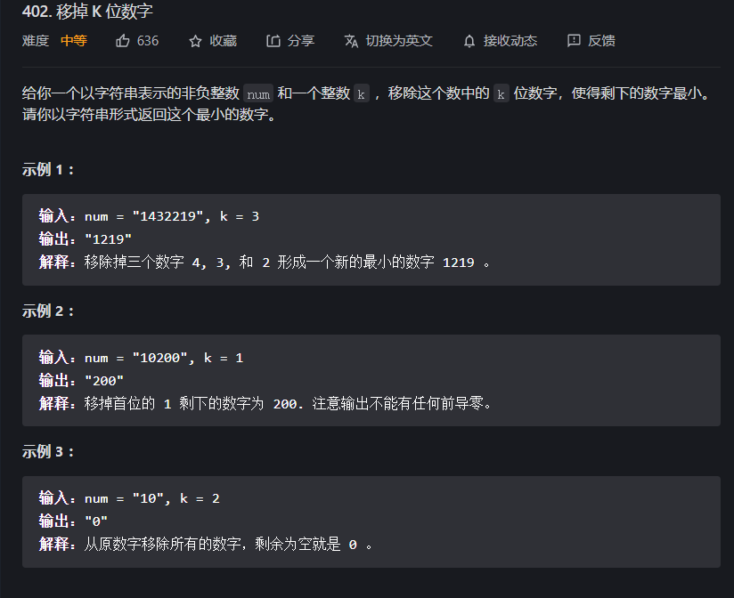

思路分析：

对于这道题因为我们是想要数最小，那么我们就要让高位的数越小越好，另外我们要记得因为这道题的关键点就是有限制单调栈的弹出次数，且需要除去前置零

代码

```java
class Solution {
    public String removeKdigits(String num, int k) {
        //如果需要减掉的数比原字符串的字符数目还多，那么就可以直接返回0
        if (num.length() <= k) {
            return "0";
        }
        //字符串构造器充当单调栈
        StringBuilder result = new StringBuilder();
        for (int i = 0; i < num.length(); i++) {
            char curChar = num.charAt(i);
            //思路和标志单调栈一样，但有一个不同的就是弹出栈堆元素有次数限制，次数只能在k范围内
            while (k > 0 && result.length() != 0 && result.charAt(result.length() - 1) > curChar) {
                result.deleteCharAt(result.length() - 1);
                k--;
            }
            result.append(curChar);
        }
        //如果到最后，次数还没有超过k，即k仍大于0，那么就证明现在的单调栈是非递减序列，就仅仅需要将后面的几位数减掉即可
        for (int i = 0; i < k && result.length() > 0; i++) {
            result.deleteCharAt(result.length() - 1);
        }
        int i = 0;
        //除去前置零
        for (i = 0; i < result.length(); i++) {
            if (result.charAt(i) != '0') {
                break;
            }
        }
        String res = result.substring(i);
        return res.length() == 0 ? "0" : res;
    }
}
```

## 456.132模式

题目

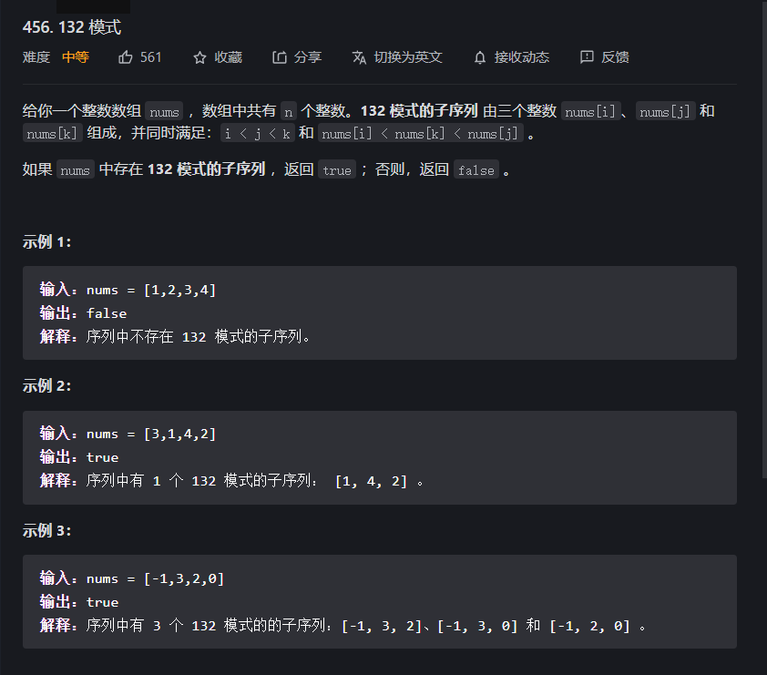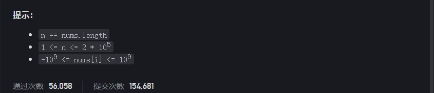

思路分析：

对于这道题，我们需要寻找三个不改变相对顺序，但满足132模式的，比较直接的想法就是三重嵌套循环暴力枚举，但因为数据量大，显然不合适，那么可以枚举其中两个值，通过优化手段找到剩下的一个,但显然数据量不允许，所以就必须是只能枚举其中一个值，然后通过优化手段，得到另外两个。

所以具体思路就有三种情况

* 枚举3
* 枚举1
* 枚举2

#### 枚举2思路

假设我们要枚举2，但枚举到nums[i]时，那么就我们就要在数组中寻找索引小于i的二元组，另外我们且保证二元组中第一个小于后面两个，第二个大于nums[i]-->第二个大于nums[i],第一个仅需要判断小于nums[i]即可

所以我们就可以在寻找最靠近当前枚举值i的大于nums[i]的索引，以及判断是否在这个索引之前是否存在小于nums[i]的值。

##### 为什么是寻找`最靠近`当前枚举值i的大于nums[i]的`索引`?

答案在下面注释中

代码

```java
class Solution {
    public boolean find132pattern(int[] nums) {
        //为了寻找离i最近的大于nums[i]的值，所以维护了一个单调栈
        //为什么是寻找最近的大于nums[i]的值？因为我们是枚举132模式中的2，所以如果当3确定后，
        // 我们就需要找到一个比3，2小的数，因为3>2所以其判决作用的角色2，
        // 所以就需要找到索引小于3的值的尽可能小的值，那么就只有当可选范围越大，其就越有可能选择到最小的，
        // 所以就仅仅需要找到最近的满足3的索引即可
        Stack<Integer>sta=new Stack<>();
        //维护一个数组，list[i]代表0~i-1的区间中的最小值
        List<Integer>list=new ArrayList<>();
        //因为我们的list数组是0~i-1的，索引其实值应该要自己初始化一下，且list[0]因为为不可能成立的数，就是Integer.MAX_VALUE
        //通用配套的就是需要初始化sta
        sta.add(0);
        list.add(Integer.MAX_VALUE);
        for (int i = 1; i < nums.length; i++) {
            //单调栈，寻找最接近i的大于nums[i]的索引
            while(!sta.empty()&&nums[sta.peek()]<=nums[i]){
                sta.pop();
            }
            //判断是否满足132模式
            if(!sta.empty()&&list.get(sta.peek())<nums[i]){
                return true;
            }
            //加入新数据
            sta.add(i);
            list.add(Math.min(list.get(list.size()-1),nums[i-1]));
        }
        return false;
    }
}
```

对于这个算法的优点就是其是顺序计算的，不需要找到所有的数据，就可以逐步求解，所有我们可以用流式计算来完成

但是虽然这个代码是O(n)的时间复杂度，但是其运行效率不高，目前猜测和数据的装箱有关

效率低的原因找到了，不是思路的原因，而是用的数据结构`Stack`的原因，因为`Stack`是继承`Vector`所以其是线程安全的，所以为了保证线程安全，就需要增大开销，可以将Stack替换为LinkedList或是自己写一个栈，开销就会大大减低，本题最后有性能对比图

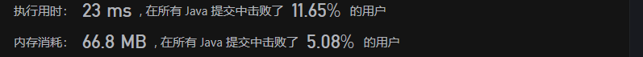

#### `枚举3`思路

对于枚举3思路，我们就需要遍历每次枚举nums[i]作为`132模式`中的`3`，所以我们就需要确定`1`和`2`,但是对于在这两个数，我们很难在一次遍历中求得，比如我们由前往后遍历，对于维护最小值`1`很简单，但是要维护小于nums[i]的最大值就比较难，而如果是由后往前遍历，那么我们想要在枚举的过程中维护最小值就比较困难，而维护小于nums[i]的最大值，就可以用单调栈来解决。

为什么利用单调栈可以解决`2`的求取和维护呢？

* 我们可以通过维护一个递减单调栈，然后每次枚举时，就将单调栈中小于枚举值的值弹出，并记录弹出的最大值，就是求得的小于枚举值的最大值，因为单调栈中，记录的是递减的序列，而抛弃的那些均是小于这里面序列的值，因为我们要求是小于枚举值的最大值，所以就那些抛弃的数据没有影响结果。

而对于说是否存在一个值，小于当前单调栈的堆顶元素，又大于被抛弃的值，又可以使得前面可以找到一个最小值使得这三个数满足`132模式`呢？

* 不可能，因为如果可能的话那么其在被抛出的那一次每枚举中，那么所有的可行解中的值，就会被维护起来，作为`2`，而当前的枚举值也会被作为`3`,但在这一次中，没有最小值可以匹配，那之后，数组的可行区间缩小，就更不可能找到满足的可行解了，所以不可能

回过头来看，我们还少了求最小值的部分，这一部分在对于枚举3这个思路来讲，就必须另起一个循环专门来计算和维护一个记录最小值的数组，就和上面`枚举2思路`代码中的list数组一样

所以是否有办法让在枚举时，顺便完成这两项工作呢？

答案就是：不能枚举3，而是通过枚举1来实现，基本思路和上面讲解的一模一样；因为`枚举3`思路而言其要想维护两边的数，其必须用两种遍历方式才可以，而`枚举1`思路就恰恰解决了这个问题，因为枚举1，需要维护后面两个数，其由后往前遍历会比较好，且两个的维护都是同一个方向即可

`枚举3`的代码就没有给出，请参考`枚举1`代码

#### 枚举1思路

如前面的描述一样，我们可以通过维护后面两个数来随时判断遍历的数是否满足模式，维护`3`很简单，越大越好，但是还有考虑`2`，且仅仅需要枚举的数小于`2`就好了，所以就仅仅需要可以充当`2`的数越大越好，那么如何维护呢？

答案为`单调栈`，用一个递减单调栈来维护，旨在寻找在i+1~len的区间内，可以充当`2`的最大值（注意：单调栈的作用在于存储可能可以充当`2`的数），那么可以通过单调栈，遇到大于堆顶的元素，就弹出，一旦弹出就证明一定可以做，然后就比较所有可以做的情况，一但有一个满足就可以结束函数

代码

```java
class Solution {
    public boolean find132pattern(int[] nums) {
        //链表充当单调栈
        LinkedList<Integer> sta = new LinkedList<>();
        int max_2 = Integer.MIN_VALUE;
        for (int i = nums.length - 1; i >= 0; i--) {
            //判断可以充当2的数是否小于枚举的数1，因为一开始遍历是2 肯定不存在，所以就初始化为最小值，就一定不会过
            if (nums[i] < max_2) {
                return true;
            }
            //弹出可以充当2的数，并维护其最大值
            //注意：无论是什么情况max_2均会越来越大，因为如果不会，那么就证明存在数小于max_2那么一定会被返回，无法遍历到这里
            //但如果加入判断就更加易读
            while (!sta.isEmpty() && sta.peekLast() < nums[i]) {
                // max_2=Math.max(max_2,sta.removeLast());
                max_2 = sta.removeLast();
            }
            //无论是小于或是等于堆顶元素，都添加进去，避免多余的判断，
            // 且到时因为相等元素的数值一样，那么到时如果其中一个弹出，另一个也必然会弹出，故不会影响结果
            sta.add(nums[i]);
            //下面就是不让相等元素加入，但会增加很多多余的计算，效率反而减低
//            if(sta.isEmpty()||sta.peekLast()>nums[i]){
//                sta.add(nums[i]);
//            }
        }
        return false;
    }
}
```

性能对比

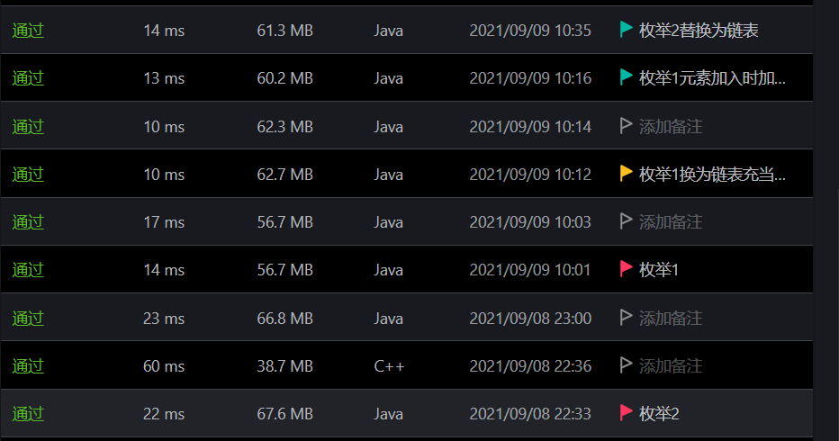

## 503.下一个更大元素||

题目

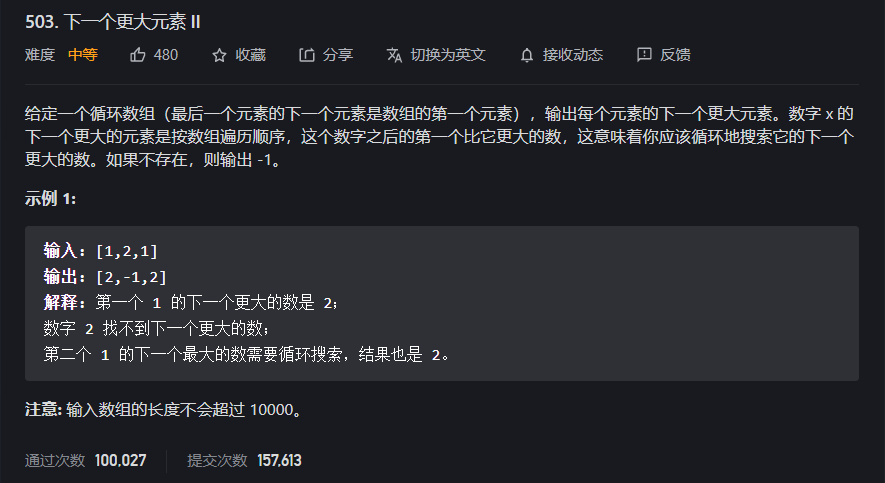

思路分析：

对于这道题，我们可以发现最简单的方法就是嵌套循环暴力寻找，那么如何优化呢？

因为我们是想要寻找最贴近nums[i]的大于i的值，那么是否存在一种数据结构可以在遍历的过程中维护数据，遇到阈值，就将所有在阈值范围内的数据带排出，写入答案呢？单调栈；而阈值就是那个大于堆顶元素的值，换个角度理解就是单调栈维护一个单调递减的序列，一定出现新的波峰（大于栈顶元素）那么就可以用波峰将小于坡谷的移出，这样就可以找到最靠近i且大于nums[i]的值了

代码

```java
class Solution {
    public int[] nextGreaterElements(int[] nums) {
        //单调栈，注意这里栈是存储下标，因为需要通过下标去寻找答案的填写位置，且下载标也可以帮助找到对于的元素
        LinkedList<Integer> sta = new LinkedList<>();
        int[] result = new int[nums.length];
        //因为可以循环所以就最多可以遍历两次列表
        for (int i = 0; i < 2 * nums.length; i++) {
            // int last = sta.peekLast();
            //为了让i可以在数中正常取值
            int index = i % nums.length;
            while (!sta.isEmpty() && nums[index] > nums[sta.peekLast()]) {
                result[sta.removeLast()] = nums[index];
            }
            //避免前面的数再次加入栈中，再次计算一下对应的更大值
            if (i < nums.length) {
                sta.addLast(i);
            }
        }
        //剩下的在栈中的数，就是没有更大数的元素，全部设置为1
        while (!sta.isEmpty()) {
            result[sta.pollLast()] = -1;
        }
        return result;
    }

}
```

小小的优化：自己用数值去模拟一个栈可以大大提升运行速度，留着练习

## 581.最短无序连续子数组

题目

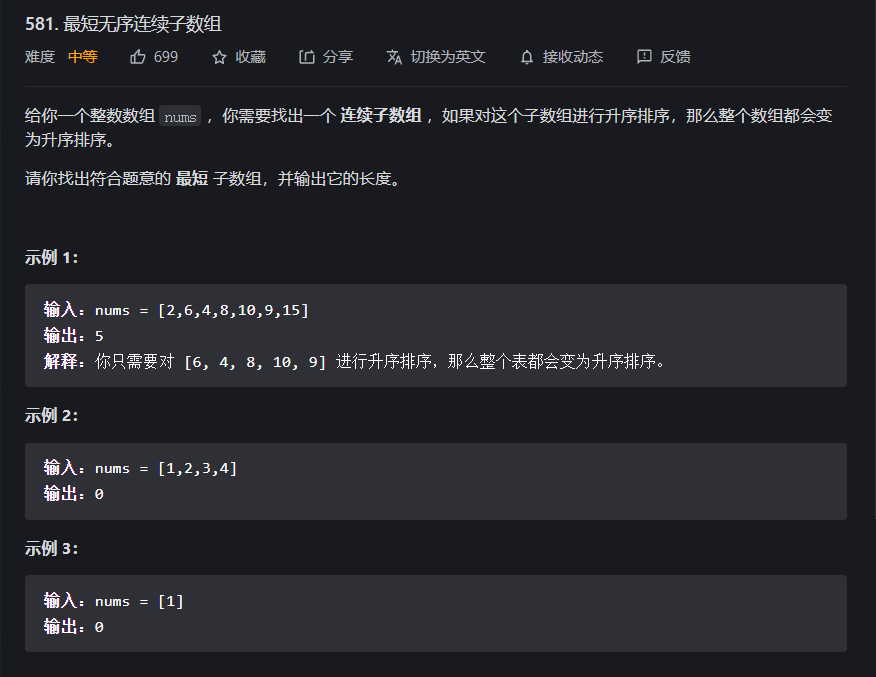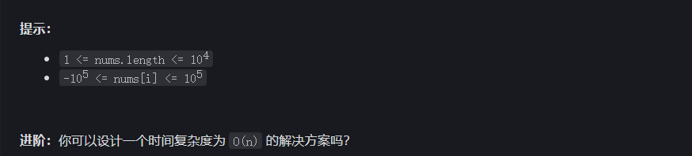

思路分析：

对于该题，比较直接的方法就是，拷贝原数组，对新数组排序，然后和原数组对比，看相同前缀和后缀的和的最大值，即对比前后分别得到最大的前缀和后缀值，但是这个的时间开销为O(nlogn)，主要开销在于排序，但是我们是想要得到开销为O(n)的算法

#### 枚举边界思路

我们将数组分为三部分，前后为最终有序状态，中间就为最短数组，那么假设left,right恰好为三个状态的边界，那么就肯定满足以下性质：

* 中间部分中的任意一个值肯定大于前面的任意一个值，或是大于等于其前面的最大值
* 中间部分中的任意一个值肯定小于后面的任意一个值，或是小于等于其后面的最小值

那么我们就可以将原数组看作两部分，前面有序，后面全部无序，然后因为我们需要维护后面的区间端的最小值，所以需要由后往前遍历，不然无法低效率的维护最小值；所以我们就由后往前遍历，依次枚举原数组，假设其是否可以作为边界，如果枚举到一个值大于min,那么就就证明此时边界一定是错的，至少也应该是在当前枚举的值中(因为此时没有办法满足第一条性质)；但如果一个值小于min，就更新min,因为如果边界还没有找到的话，那么结果的边界肯定要小于后面的任意一个值，所以我们要保证min就是遍历过的区间的最小值然后依次类推，逐步更新min和边界left,选取最后得到的left,就是边界。

而righ边界就以此类推

代码

```java
//枚举可能的right和left值
class Solution {
    public int findUnsortedSubarray(int[] nums) {
        int min=Integer.MAX_VALUE;
        int max=Integer.MIN_VALUE;
        int left=nums.length;
        int right=-1;
        for (int i = 0; i < nums.length; i++) 
            //分为两部分前面无序，后面有序，
            if(max>nums[i]){
                //更新边界
                right=i;
            }else{
                //更新和维护所遍历区间的最大值
                max=nums[i];
            }
        	//同理
        	//分为两部分前面有序，后面无序，
            if(min<nums[nums.length-i-1]){
                left=nums.length-i-1;
            }else{
                min=nums[nums.length-i-1];
            }
        }
    	//如果right<left，就证明其数组有序，所以就直接返回零
        return right<left?0:right-left+1;
    }
}
```

#### 单调栈思路

就我们要需要边界肯定能将数组分为三部分，借上面可得

* 中间部分中的任意一个值肯定大于前面的任意一个值，或是大于等于其前面的最大值
* 中间部分中的任意一个值肯定小于后面的任意一个值，或是小于等于其后面的最小值

那么我们就是保证找到一个最大的前缀，其保证每个值均小于后面的值，那么我们就可以维护一个变形的单调栈，一开始我们就压入升序的元素，一旦遇上不为升序就立即停止压入，现在所得的就是可能的最大值，所以我们就遍历剩下的元素，如果有小于栈顶元素的，就弹出栈顶元素，直到遇到一个不小于该遍历元素的数，注意：我们在这整个过程就不再压栈，压栈仅仅在一开始发生，之后就都是在弹出，直到最好栈中剩下的元素的数目就是最大的满足题意得前缀。同理，求得后辍最大值。

但是如果是仅仅只要很明显效率不高，因为要维护两个栈，空间和时间开销都不小，而返过来我们发现我们的栈和标志的栈不同，仅仅是在一开始阶段有压栈，后面就没有了，那么我们是否可以维护两个指针，分别指向两个栈的栈顶元素，而而栈的压入和弹出就可以通过指针在原数组的移动来模拟这个过程

代码

```java
//虚拟单调栈
class Solution {
    public int findUnsortedSubarray(int[] nums) {
        int left=0;
        int right=nums.length-1;
        //一开始的压栈-->前缀栈
        while(left+1<nums.length&&nums[left+1]>=nums[left]){
            left+=1;
        }
        //一开始的压栈-->后缀栈
        while(right-1>=0&&nums[right-1]<=nums[right]){
            right-=1;
        }
        //遍历后面的元素，更新栈顶
        for (int i = left+1; i <nums.length ; i++) {
            while(left>=0&&nums[left]>nums[i]){
                left--;
            }
        }
        for (int i = right-1; i >=0 ; i--) {
            while(right<nums.length&&nums[right]<nums[i]){
                right++;
            }
        }
        //注意数组完全有序的情况，且right,left均是指向前后缀的元素，计算中间元素数目时，就需要变化一下元素
        return right<=left?0:(right-1)-(left+1)+1;
    }
}
```

优化：我们发现每次都必须遍历剩下的全部元素，但是我们知道如果是后辍的元素，那我们就没有必要去为了更新left边界而去遍历，而我们的前缀也不必全部被访问到，所以就可以将两个合并，详情看如下代码 

```java
class Solution {
    int MIN = -100005, MAX = 100005;
    public int findUnsortedSubarray(int[] nums) {
        int n = nums.length;
        int i = 0, j = n - 1;
        while (i < j && nums[i] <= nums[i + 1]) i++;
        while (i < j && nums[j] >= nums[j - 1]) j--;
        //注意：l,r为两个边界
        int l = i, r = j;
        int min = nums[i], max = nums[j];
        //注意初始值是在前缀的最大值开始的，所以前面的元素就不再可能会会影响后辍边界的移动，因为最大的以及被我们考虑了
        //而结束是可能的后辍的最小值，所以其后面的值也就不可能再影响得到前缀的边界变化了，所以后面的数无序继续遍历了
        //之所以多设置一个最小值和最大值是 因为边界过线，过线就赋特殊值，否则就可以直接用nums[i]和nums[j]即可
        for (int u = l; u <= r; u++) {
            //更新前
            if (nums[u] < min) {
                while (i >= 0 && nums[i] > nums[u]) i--;
                min = i >= 0 ? nums[i] : MIN;
            }
            if (nums[u] > max) {
                while (j < n && nums[j] < nums[u]) j++;
                max = j < n ? nums[j] : MAX;
            }
        }
        return j == i ? 0 : (j - 1) - (i + 1) + 1;
    }
}
//宫水三叶题解提供的改良版代码
//作者：AC_OIer
```

性能对比


## 739.每日温度

题目

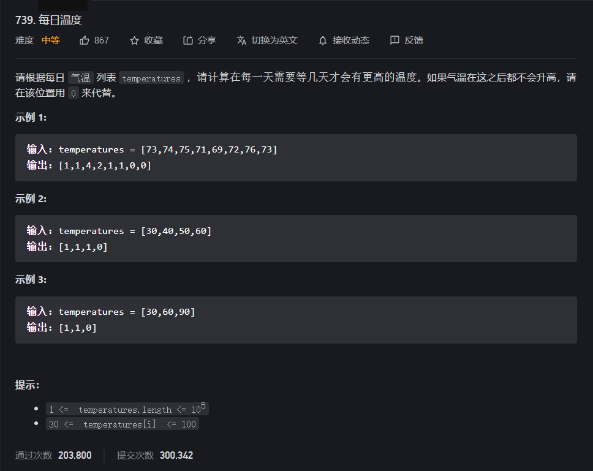

思路分析：

对于这道题思路就比较简单，和前面的`503.下一个更大元素||`的思路是一样的，用单调栈存储下标，因为下标可以用来计算答案以及显示答案的位置，另外也可以用来得到原数组对应得值，然后就用`503`题得思路就可解

在前面我们提到可以自己用数组模拟栈，开销会较小,下面即是这样

代码

```java
class Solution {
    public int[] dailyTemperatures(int[] temperatures) {
//        LinkedList<Integer>sta=new LinkedList<>();
        //用来模拟栈得数组
        int[]sta=new int[temperatures.length];
        //栈顶指针
        int peekIndex=-1;
        //结果数组
        int[]result=new int[temperatures.length];
        //标志单调栈维护
        for (int i = 0; i < temperatures.length; i++) {
            while(peekIndex>-1&&temperatures[sta[peekIndex]]<temperatures[i]){
                int index=sta[peekIndex];
                peekIndex-=1;
                result[index]=i-index;
            }
            peekIndex+=1;
            sta[peekIndex]=i;
        }
        //对没有结果得值特殊处理
        while(peekIndex>-1){
            int index=sta[peekIndex];
            peekIndex-=1;
            result[index]=0;
        }
        return result;
    }
}

```

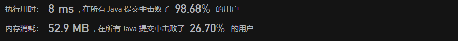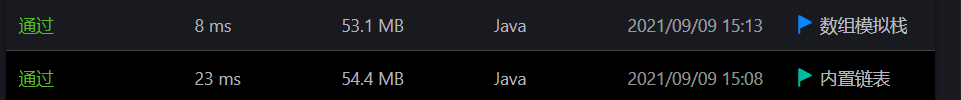

## 907.子数组的最小值之和

题目

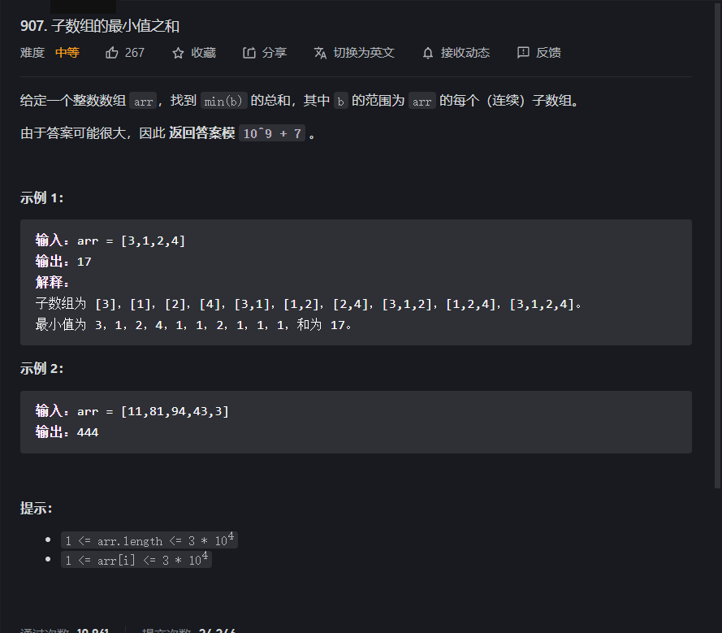

思路分析：对于这道题，我们需要求所以连续子数组的最小值之和

* 最直接的方法就是暴力枚举，三重枚举，外两重枚举连续子数组的边界，而内枚举即求得当前所选的区间的最小值，很明显如果这样解，肯定超时

那我们是否可以通过某些优化减少循环的嵌套，既然我们是需要每个区间的最小值，那么我们就可以枚举数组的值，并且假设枚举的值是当前的最小值，然后就通过向左右遍历寻找最靠经该元素的小于该最小值的边界，那么就得到两个边界，left以及right,这个区间是所有以当前值为最小值的最大连续区间然后我们怎么求得在这个区间中所有包含该最小值的连续区间的数目呢 ？

下面我们来探究一下

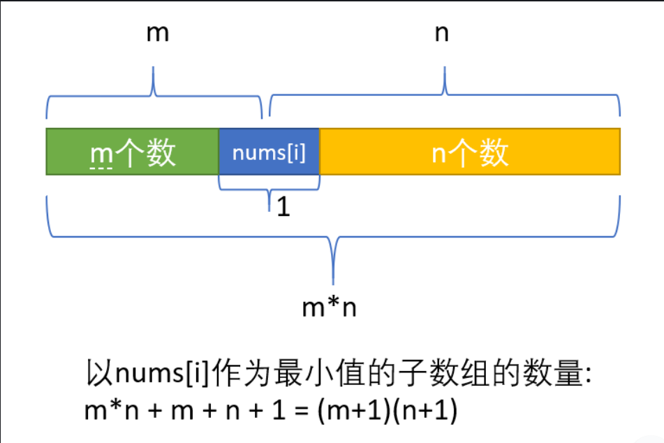

`注：图片来自Drinkwater链接：https://leetcode-cn.com/problems/sum-of-subarray-minimums/solution/dan-diao-zhan-zuo-you-liang-bian-di-yi-g-ww3n/`

其实上面配图就解释的很清楚了，而我们的两个边界和m,n的关系就是m=right-cur-1;m=cur-left-1;(不包含cur,注这里的right和下面代码的right的指向不同，这里指向的值仍是包括在区间中的，下面的不包括在区间中的)

现在我们就暂且循环的嵌套，但这个思路很明显不是最优，因为我们需要重复遍历访问很大相同的数，而不能利用前面遍历的信息，而靠考虑到我们是想要找到最靠近的小于当前遍历值的两边的值的索引，而这个就是单调栈的看家本领

所以我们就可以利用单调栈来寻找这两个最靠近的边界

如何寻找呢？

* 首先我们先考虑一下是递增栈还是递减栈？
  * 如果我们选择`递减栈`,那么我们获取大于这个值的信息，因为因为其在遇到比自己大的就排出，所以每次都仅仅只能找到最靠近的大于直接的值，
  * 而`递增栈`相反，其如果我们将当前栈顶元素作为当前最小值，那么其栈里的相邻元素，就是最靠近其且小于其的左边元素，而其遇到的可以使其弹出的就是最靠近它且小于它的右边的值，因此两个边界就都可以求得
* 正如上面在`递增栈`选择的分析中，我们可以知道利用单调栈可以得到left和right,那么以堆顶元素为最小值的连续子数组的数量就可求，那么其对结果的贡献就是`cur*(m+1)*(n+1)`,(推导见上面图片)

代码

```java
class Solution {
    public int sumSubarrayMins(int[] arr) {
        //结果
        int result=0;
        //取模的基数
        long CONSTNUM=1000000007;
        //单调栈，存储索引
        LinkedList<Integer>sta=new LinkedList<>();
        for (int i = 0; i < arr.length; i++) {
            while(!sta.isEmpty()&&arr[sta.peekLast()]>arr[i]){
                //当前最小值的索引
                int curNumIndex=sta.removeLast();
                //其相邻的数的索引，相当于上面的讲解的left,注意可能其没有相邻元素了，-1就是由索引转长度的差值
                int preIndex=sta.isEmpty()?-1:sta.peekLast();
                //相当于前面讲解的m+1;
                int left=curNumIndex-preIndex;
                //相当于前面讲解的n+1;
                int right=i-curNumIndex;
                //特别注意的就是需要转一下类型，避免还没取模，数据就丢失了
                result=(int)(((long)result+((long)left*right)*arr[curNumIndex])%CONSTNUM);
            }
            sta.addLast(i);
        }
        while(!sta.isEmpty()){
            int curNumIndex=sta.removeLast();
            int preIndex=sta.isEmpty()?-1:sta.peekLast();
            int left=curNumIndex-preIndex;
            //既然还有数据在栈中，就证明一直到最后都没有比它小的右边数，所以其i==arr.length
            int right=arr.length-curNumIndex;
            result=(int)(((long)result+((long)left*right)*arr[curNumIndex])%CONSTNUM);
        }
        return result;
    }
}

//但上面的写法有点冗余，下面有聚合版
class Solution {
    public int sumSubarrayMins(int[] arr) {
        //结果
        int result=0;
        //取模的基数
        long CONSTNUM=1000000007;
        //单调栈，存储索引
        LinkedList<Integer>sta=new LinkedList<>();
        for (int i = 0; i <= arr.length; i++) {
            //但这一句需要重复判断，所以效率反而更低
            int rightNum=i==arr.length?Integer.MIN_VALUE:arr[i];
            while(!sta.isEmpty()&&arr[sta.peekLast()]>rightNum){
                //当前最小值的索引
                int curNumIndex=sta.removeLast();
                //其相邻的数的索引，相当于上面的讲解的left,注意可能其没有相邻元素了，-1就是由索引转长度的差值
                int preIndex=sta.isEmpty()?-1:sta.peekLast();
                //相当于前面讲解的m+1;
                int left=curNumIndex-preIndex;
                //相当于前面讲解的n+1;
                int right=i-curNumIndex;
                //特别注意的就是需要转一下类型，避免还没取模，数据就丢失了
                result=(int)(((long)result+((long)left*right)*arr[curNumIndex])%CONSTNUM);
            }
            sta.addLast(i);
        }
        return result;
    }
}

```

但是上面代码很明显也不是最优的，因为其需要反复的加减多次，而我们可以通过观察得到，就是右边的弹出操作所得到的m+1，仅仅取决于栈中的元素，和无关，所以我们可以在一开始压栈的时候就预先计算，后面就可以不用继续加，而再加入结果时，就仅仅需要计算一下右边的值

代码

```java
class Solution {
    public int sumSubarrayMins(int[] arr) {
        int mod = 1000000007;
        int n = arr.length;
        int cost = 0, ans = 0;
        Stack<Integer> stack = new Stack<>();
        stack.push(-1);    // 哨兵, 方便运算
        for (int i = 0; i < n; i++) {
            while (stack.size() > 1 && arr[stack.peek()] > arr[i]) {
                int top = stack.pop();
                cost = (cost - arr[top] * (top - stack.peek())) % mod;    // 减去之前元素的贡献
            }
            cost = (cost + arr[i] * (i - stack.peek())) % mod;    // 因为当前元素的加入, 需要加上当前元素的贡献
            ans = (cost + ans) % mod;
            stack.push(i);    // 压栈
        }
        return ans;
    }
}
```

但效率不一定会比上面的高，因为其总的加减次数比上面的方法还多(加法次数相同，但多了减法)

还有小小的优化就是：加入哨兵结点，避免了空栈的判断；以及用数组模拟内置栈

性能对比

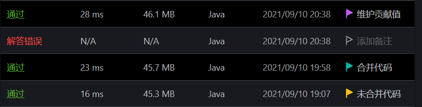


## 962.最大宽度坡

题目

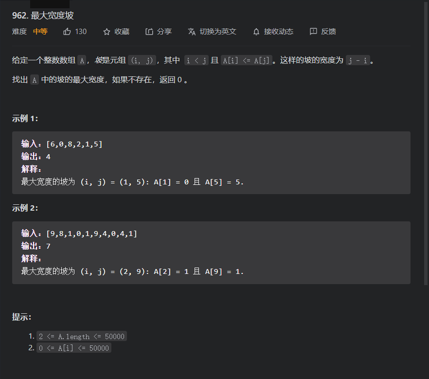

思路分析：

* 对于这道题用暴力就很简单，但既然是中等题设置，那么就不可能暴力通过，所以我们还需要观察一下数组的特征
  * 通过观察我们可以发现在同一个数组中，加入一个数的下标和值均比另一个数小，那么另一个数一定不可能算出最大的宽度，因为满足另一个数的情况，一定也满足值小的，且它的下标还越小，所以一定我们取了一个数，那么后面比它大的数，就可以直接不用考虑，而后面比它小的数需要考虑吗？需要因为如果这样的话，那么结果就是未知的，不定的，而取完第二个数就可以按上面去完第一个那样继续迭代取值，最后就可以形成一个递减栈
  * 取得递增栈后，为了快捷，我们就由后遍历数组，然后查看是否有大于等于的元素存在，如果有，就记录宽度，弹出堆顶，然后继续比较，如果不满足，就一定遍历下标，直到遍历完成或是栈为空

代码

```java
class Solution {
    public int maxWidthRamp(int[] nums) {
        int result=0;
        LinkedList<Integer>sta=new LinkedList<>();
        //初始化递减单调栈，注意其和标志的单调栈的不同之处，详情其参考上面讲解
        for (int i = 0; i < nums.length; i++) {
            if(sta.isEmpty()||nums[sta.peekLast()]>nums[i]){
                sta.addLast(i);
            }
        }
        //逆序遍历
        for (int i = nums.length-1; i >=0&&!sta.isEmpty() ; i++) {
            while(!sta.isEmpty()&&nums[sta.peekLast()]<=nums[i]){
                result=Math.max(result,i-sta.removeLast());
            }
        }
        return result;
    }
}

```

该思路就已经将复杂度开销减少到O(n)了，性能已经十分不错，下面想要在拓展一种解法效率并非很高，但值得学习

##### 排序思路

对于题目，我们是想要找到元素的最大宽度，而


## 1019.链表中的下一个更大节点

题目

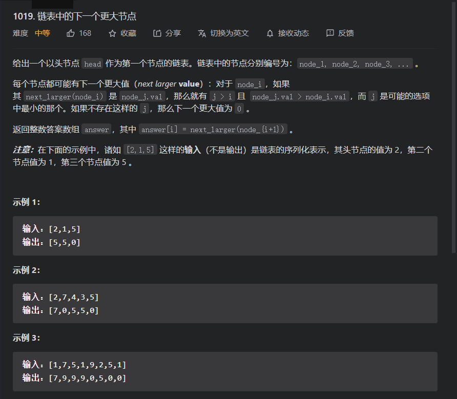

思路分析：即将链表转普通数字，再用单调栈，虽然由一些表面是仅仅进行一次遍历的，但是其内部是容器自己发生了遍历

代码

```java
class Solution {
    public int[] nextLargerNodes(ListNode head) {
        ListNode flag=head;
        int count=0;
        while(flag!=null){
            count+=1;
            flag=flag.next;
        }
        int[] nums=new int[count];
        flag=head;
        for (int i = 0; i < nums.length; i++) {
            nums[i]=flag.val;
            flag=flag.next;
        }
        LinkedList<Integer>sta=new LinkedList<>();
        int[]result=new int[count];
        for (int i = 0; i < nums.length; i++) {
            while(!sta.isEmpty()&&nums[sta.peekLast()]<nums[i]){
                result[sta.removeLast()]=nums[i];
            }
            sta.addLast(i);
        }
        while(!sta.isEmpty()){
            result[sta.removeLast()]=0;
        }
        return result;
    }
}

```


因为用了内置链表所以内存消耗比较大

