# 困难题

## 42.接雨水

题目

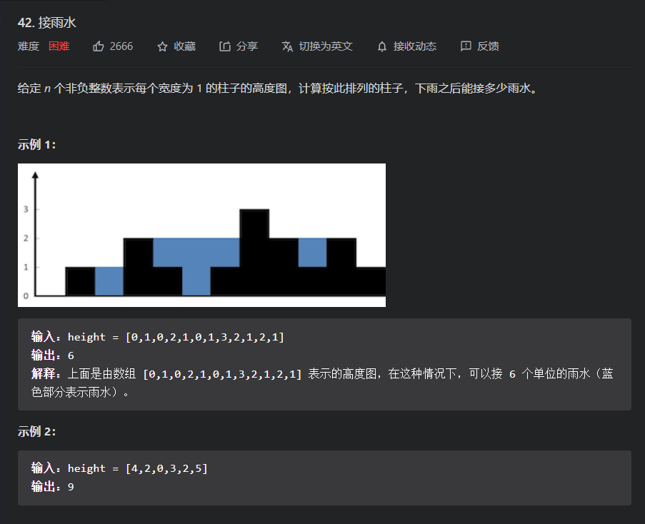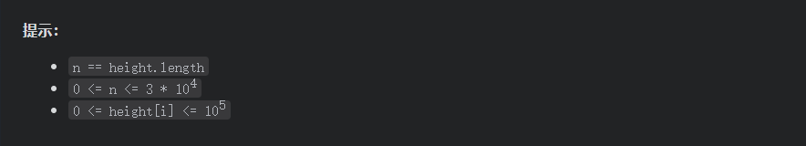

思路分析：在对于这道题中，我们是需要计算出接到的水的数量，而每个坐标能接到水的数目是由两边的墙决定的，且这个坐标最后可以接到的水的数目，就是其左端的最大值和右端最大值的较小值和当前坐标的差，因为只是它两边最高的挡板了

* 所以最简单的思路就出来了，就是维护两个数字，分别一个记录每个坐标的左端所能取得的最大值，而另一个就是记录每个元素的右端所能取得的最大值，然后通过再次遍历一下数组，记录每个元素所能接到的水

代码

```java
class Solution {
    public int trap(int[] height) {
        //记录左边最大值
        int[]leftMaxs=new int[height.length];
        //记录右边最大值
        int[]rightMaxs=new int[height.length];
        //数组预处理
        leftMaxs[0]=height[0];
        for (int i = 1; i < height.length; i++) {
            leftMaxs[i]=Math.max(leftMaxs[i-1],height[i]);
        }
        //数组预处理
        rightMaxs[height.length-1]=height[height.length-1];
        for (int i = height.length-2; i >=0 ; i--) {
            rightMaxs[i]=Math.max(rightMaxs[i+1],height[i]);
        }
        //再次遍历一下数组，记录每个元素累计的接雨数
        int result=0;
        for (int i = 1; i <height.length-1 ; i++) {
            //高度取决于两段的较小值
            result+=(Math.max(leftMaxs[i],rightMaxs[i])-height[i]);
        }
        return result;
    }
}
```

对于上面的思路我们是否可以进行优化呢？通过观察可知，我们辅助数组的每个元素都仅仅使用了一次，那么我们可不可以通过一些方法去维护两个变量来代替两个辅助数组？

* 根据上面的思路可以知道我们最后会通过一个方向去遍历数组的元素，而在遍历的同时就可以用一个变量去维护一个那一边的最大值，比如：我们由左向右，那么就可以维护左端的最大值，因为左端的全部元素都变量到了，而右端则没有办法，还是必须要一个数组，但是我们就已经减去一个数组了
* 而如果我们反过来去遍历，那么就可以用一个变量去维护右端最小值，然后减去右端数组
* 我们会发现如果我们仅仅是往一个方向去遍历，那么我们就没有办法去减去一个数组，一个一定存在一端的一些数没有遍历到，没有办法计算得到挡板
* 既然这样，我们就可以去通过将上面的两种遍历结合起来，两边一起遍历，就可以仅仅用两个最大值变量去代替数组，也就是下面的`双指针思路`

##### 双指针思路

我们用rightMax表示右边已经遍历过的元素的最大值，而leftMax就相反；而left与right表示遍历数组的左右指针,那么我们要怎么利用这几个量取代替上面的辅助数组呢？

我们将left=0,right=nums.lenght-1,然后确定两个最大值的正确维护，接着如果nums[left]>=rightMax,就证明无论nums[right]左端的最大值是多少其最大也是取决于减小板即当前的rigthMax，因为对于nums[right]而言，其右端的所有元素均已经遍历过的，最大值一定就相当于辅助数组的对应元素，所以nums[right]所可以接到的雨水就可以算出，而如果nums[right]<=leftMax就同理，注意一定以是大于等于或是小于等于，因为我们要保证每次遍历都要让指针进行更新

代码

```java
class Solution {
    public int trap(int[] height) {
        //left，right为遍历的左右指针
        //leftMax,rightMax分别为已经遍历过的左端元素，右端元素的最大值
        int left = 0;
        int right = height.length - 1;
        int leftMax = Integer.MIN_VALUE;
        int rightMax = Integer.MIN_VALUE;
        //维护结果变量
        int result = 0;
        //双指针遍历
        while (left < right) {
            //确保两个最大值变量能正确维护，如果不想放在这里，而可以在循环外先正确初始化，
            // 然后到后面判断内更新的时候在来更新这两个变量，这样虽然代码会有写冗余，
            // 但是效率会更高，因为其调用Math.max的次数为较少，因为每次我们仅仅会移动一个指针，
            // 所以我们就仅仅需要更新一个最大值即可
            leftMax = Math.max(leftMax, height[left]);
            rightMax = Math.max(rightMax, height[right]);
            //两种情况，注意leftMax>height[right]的情况一定包括在rightMax<=height[right]的情况中
            if (leftMax <= height[right]) {
                result += leftMax - height[left];
                left++;
            } else if (rightMax <= height[left]) {
                result += rightMax - height[right];
                right--;
            }
        }
        return result;
    }
}
```

就目前我们讲到的思路中，都没有提到单调栈的名字，但既然我们将这道题放在单调栈中，那么我们就应该可以用单调栈来改的

##### 单调栈

通过单调栈，我们可以知道其最靠近栈顶元素的小于或大于的元素，而我们

代码

```java
class Solution {
    public int trap(int[] height) {
        //结果变量
        int result = 0;
        //单调栈
        LinkedList<Integer> sta = new LinkedList<>();
        //其实其思路是通过每层每层的计算每层接到雨水的数目，而如何判断是否可以接收雨水，就是左右两边存在大于自己的元素。
        for (int i = 0; i < height.length; i++) {
            while (!sta.isEmpty() && height[sta.peekLast()] < height[i]) {
                int temp = sta.removeLast();
                if (sta.isEmpty()) {
                    break;
                }
                int left = sta.peekLast();
                result += (Math.min(height[left], height[i]) - height[temp]) * (i - left - 1);
            }
            sta.addLast(i);
        }
        return result;
    }
}
```

## 84.柱状图中最大的矩形

题目

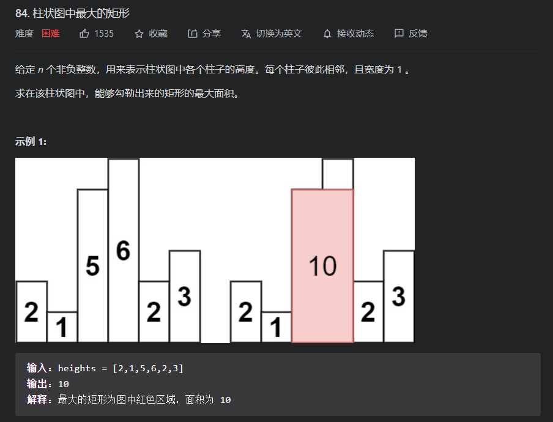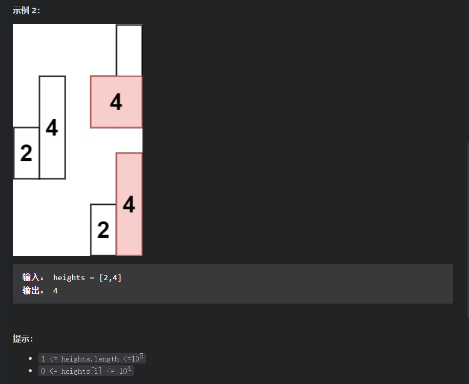

思路分析：

对于这道题，最直接的就是采用暴力的解法，因为我们知道，决定一个矩形的面积的就可以是长和宽，而直接决定高的就是那块最小的板，然后以这块板为最小值，向左右两边寻找最靠近该板的小于该板的元素的方位，那么就可以得到宽，接着就可以计算出面积来， 

代码

```java
class Solution {
    public int largestRectangleArea(int[] heights) {
        int result = 0;
        //小小优化，也就是因为这一句才不会超时，但只是因为测试集的原因，就是我的代码刚好拟合数据，所以下面的新能表才表示得非常好，如果变化一下测试集，就可能会超时
        for (int i = 0; i < heights.length; i++) {
            if (i > 0 && heights[i - 1] == heights[i]) {
                continue;
            }
            int left = i, right = i;
            while (left - 1 >= 0 && heights[left - 1] >= heights[i]) {
                left -= 1;
            }
            while (right + 1 < heights.length && heights[right + 1] >= heights[i]) {
                right += 1;
            }
            result = Math.max(result, (right - left + 1) * heights[i]);
        }
        return result;
    }
}
```

那么既然我们是通过寻找最靠近的两端的数，那么就可以利用单调栈进行优化。因为利用单调栈我们可以找到首次小于栈顶元素的两端元素的位置，接着在得出面积，具体思路和`中等题中的581.最短无序连续子数组`的思路基本一样

代码

```java
class Solution {
    public int largestRectangleArea(int[] heights) {
        int result = 0;
        LinkedList<Integer> sta = new LinkedList<>();
        for (int i = 0; i < heights.length; i++) {
            //遇到比栈顶小的，就排出，并且此时排出的元素的左右边界已经可以知道，所以就可以计算面积，并维护结果值
            while (!sta.isEmpty() && heights[sta.peekLast()] >= heights[i]) {
                int curIndex = sta.removeLast();
                int preIndex = sta.isEmpty() ? -1 : sta.peekLast();
                result = Math.max(result, ((i - 1) - (preIndex + 1) + 1) * heights[curIndex]);
            }
            sta.addLast(i);
        }
        //处理还在栈中的元素，且这些元素的右边界均是nums.length-1;
        while (!sta.isEmpty()) {
            int curIndex = sta.removeLast();
            int preIndex = sta.isEmpty() ? -1 : sta.peekLast();
            result = Math.max(result, ((heights.length - 1) - (preIndex + 1) + 1) * heights[curIndex]);
        }
        return result;
    }
}
```

对于这道题，我们可以采取设置哨兵节点的技巧，减少preIndex的边界判断，可以减少开销；以及用数组模拟单调栈

性能pk

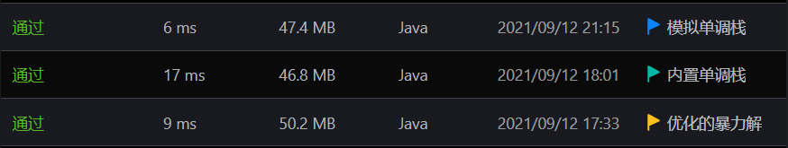

## 85.最大矩形

题目

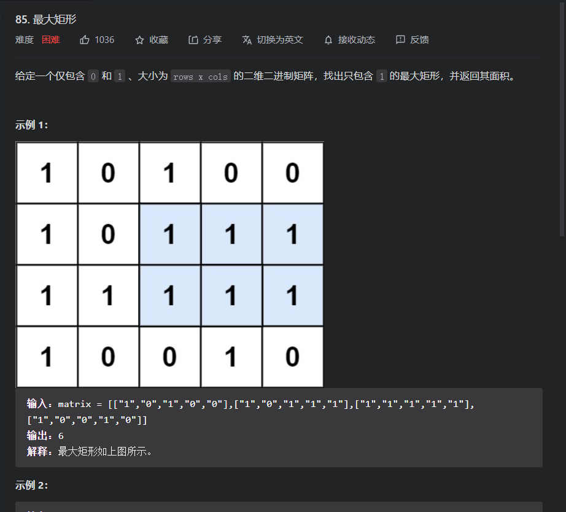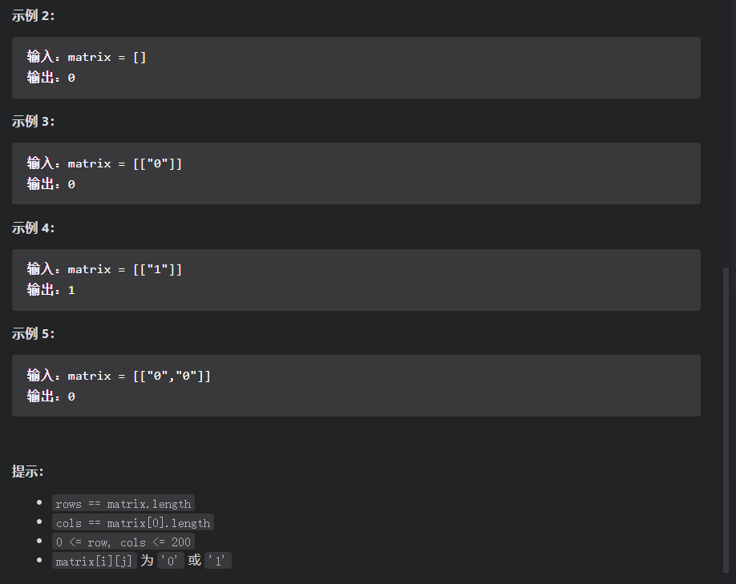

思路分析：

对于矩阵面积问题，最重要得就是确定其左上角和右上角，因为只要这两个角确定，其矩阵就唯一确定，而我们可以通过枚举来得到两个角的所有情况，然后再去判断形成的矩阵是否全为1。但是如果这样写的话，其开销为每个角有row*clos种情况，两个角就是需要嵌套选取就是情况数的平方，且还有检查矩阵的消耗，所以如果这样去暴力枚举的话，肯定会超时。所以我们就需要优化一下

通过上面观察发现我们每次决定矩阵后就经常需要遍历矩阵且会有大量的重复位置的遍历，所有为了减少重复遍历的次数，我们可以使用一个二维辅助数组

* 首先我们可以构造一个二维辅助数组去记录每一个元素的左边对应有多少个1，包括它自己，然后可以通过得到这个辅助数组再去遍历一个数，并把这个数作为矩阵的右下角，然后就去借助这个辅助数组，沿着列往上遍历，然后计算矩阵的面积

代码

```java
class Solution {
    public int maximalRectangle(char[][] matrix) {
        if(matrix.length==0){return 0;}
        int rowLen=matrix.length;
        int colLen=matrix[0].length;
        int result=0;
        int[][]helps=new int[rowLen][colLen];
        //先初始化第一列，后面就可以减少次数判断
        for (int i = 0; i < rowLen; i++) {
            if(matrix[i][0]=='0'){
                helps[i][0]=0;
            }else{
                helps[i][0]=1;
            }
        }
        //用动态规划思路构造二维辅助数组
        for (int i = 0; i <rowLen ; i++) {
            for (int j = 1; j <colLen ; j++) {
                if(matrix[i][j]=='0'){
                    helps[i][j]=0;
                }else{
                    helps[i][j]=helps[i][j-1]+1;
                }
            }
        }
        // for (int i = 0; i < helps.length; i++) {
        //     System.out.println(Arrays.toString(helps[i]));
        // }
        //遍历每个元素，并将该元素作为矩形的右下角，然后比较以该角为右下角的所有矩形情况
        for (int i = 0; i < rowLen; i++) {
            for (int j = 0; j < colLen; j++) {
                //如果存在一个为0 ，就可以跳过
                if(helps[i][j]==0){
                    continue;
                }
                int width=Integer.MAX_VALUE;
                int ans=0;
                for (int k = i; k >=0; k--) {
                    //如果存在一个为0 ，就可以跳过
                    if(helps[k][j]==0){
                        break;
                    }
                    width=Math.min(width,helps[k][j]);
                    ans=Math.max(ans,width*(i-k+1));
                }
                result=Math.max(result,ans);
            }
        }
        return result;
    }
}


```

根据上面我们可以发现在构造二维辅助数组后，沿着辅助数组的列计算可能的面积的时候，就相当于一副柱状图(一列一副)，然后选取所得的每一列的所得最大面积的最大值。

* 而求柱状图的最大面积就是上题：`84.柱状图中最大的矩形`思路，直接代入即可，只是我们需要把这个把数组换为每一列的数组，所以适用于`84.柱状图中最大的矩形`的思路就都可以在紫边进行

代码

```java
class Solution {
    public int maximalRectangle(char[][] matrix) {
        if(matrix.length==0){return 0;}
        int rowLen=matrix.length;
        int colLen=matrix[0].length;
        int result=0;
        int[][]helps=new int[rowLen][colLen];
        for (int i = 0; i < rowLen; i++) {
            if(matrix[i][0]=='0'){
                helps[i][0]=0;
            }else{
                helps[i][0]=1;
            }
        }
        for (int i = 0; i <rowLen ; i++) {
            for (int j = 1; j <colLen ; j++) {
                if(matrix[i][j]=='0'){
                    helps[i][j]=0;
                }else{
                    helps[i][j]=helps[i][j-1]+1;
                }
            }
        }
        int[]tempNums=new int[rowLen];
        for (int i = 0; i <colLen ; i++) {
            for (int j = 0; j <rowLen ; j++) {
                tempNums[j]=helps[j][i];
            }
            result=Math.max(largestRectangleArea(tempNums),result);
        }
        return result;
    }
    public int largestRectangleArea(int[] heights) {
        int result = 0;
        LinkedList<Integer> sta = new LinkedList<>();
        for (int i = 0; i < heights.length; i++) {
            //遇到比栈顶小的，就排出，并且此时排出的元素的左右边界已经可以知道，所以就可以计算面积，并维护结果值
            while (!sta.isEmpty() && heights[sta.peekLast()] >= heights[i]) {
                int curIndex = sta.removeLast();
                int preIndex = sta.isEmpty() ? -1 : sta.peekLast();
                result = Math.max(result, ((i - 1) - (preIndex + 1) + 1) * heights[curIndex]);
            }
            sta.addLast(i);
        }
        //处理还在栈中的元素，且这些元素的右边界均是nums.length-1;
        while (!sta.isEmpty()) {
            int curIndex = sta.removeLast();
            int preIndex = sta.isEmpty() ? -1 : sta.peekLast();
            result = Math.max(result, ((heights.length - 1) - (preIndex + 1) + 1) * heights[curIndex]);
        }
        return result;
    }
}
```

因为是直接用84题的函数，所有需要创建临时数组，所以开销较大，效率较低，但其提高的方法参考84题

## 321.拼接最大数

题目

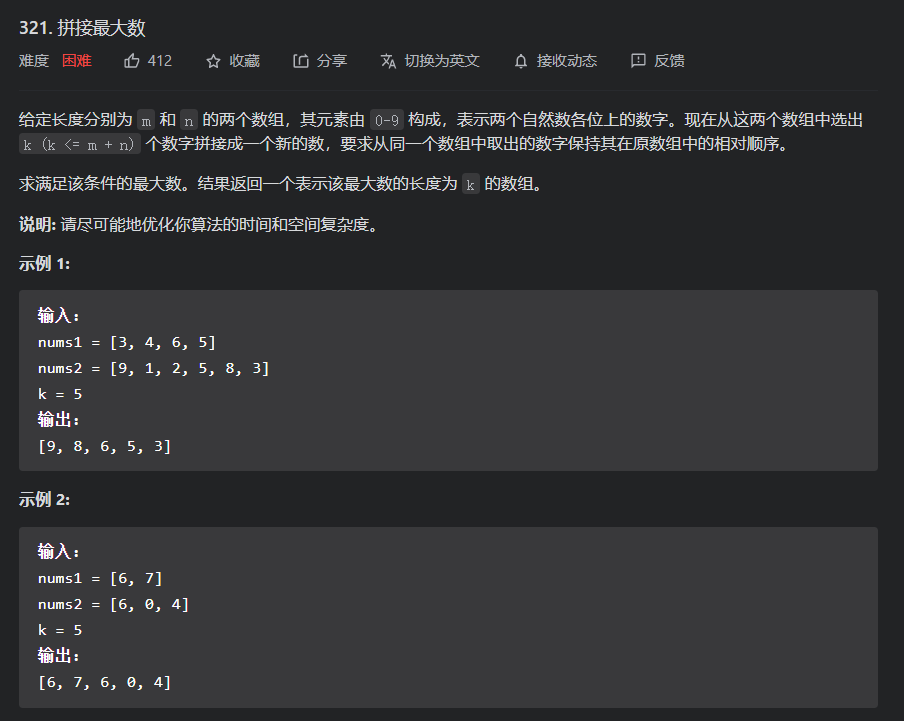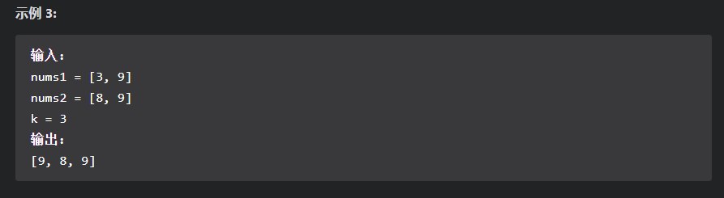

思路分析：

对于这道题：我们可以分解为几个小问题：

* 如何在一个数组中找到相对位置不变的确定数目的子序列
* 如何将两个数组关联起来，以便可以向在一个数组中一样获得最大的子序列

对于第一个问题：就是典型的单调栈问题，但因为是需要确定数目，所以我们就可以新增一个变量去维护已经剔除的数目，因为我们已经找到要形成的子序列的固定长度以及数组的长度，那么我们就知道其最后要剔除的元素的数目是等于`nums.length-k`；所以当剔除数目大于这个数的时候，就可以证明不能再剔除数目了，即剩下的元素要么不加入，要么就加入后不能弹出；另外我们还有维护单调栈的数目因为我们最后得到的子序列是有固定长度的，所以我们就可以在数目达到是就不让元素加入。具体逻辑参考下面代码以及其注释

对于第二个问题：我们就可以通过划分每个数组的子序列长度，然后遍历这些长度，然后将得到的子序列进行合并，在 通过比较结果大小以及遍历以上步骤，得到最终结果，具体逻辑见下面代码。


代码

```java
class Solution {
    public int[] maxNumber(int[] nums1, int[] nums2, int k) {
        int[] result = null;
        //注意在划分两个数组的子序列长度时，边界必须是有限制的，因为可能一个数组的长度比k小，所以另一个就不能什么都不取，且到时遍历到也可能会造成溢出，所以需要判断一下
        //start保证在nums2.length<k的情况下，nums1也一定可以提供一定的数量元素去和nums2子序列合并
        //end保证遍历时，i不会有索引越界的情况发生
        int start = Math.max(0, k - nums2.length);
        int end = Math.min(k, nums1.length);
        ;
        for (int i = start; i <= end; i++) {
            int[] subNums1 = maxSubNums(nums1, i);
            int[] subNums2 = maxSubNums(nums2, k - i);
            int[] newNums = maxMerge(subNums1, subNums2);
            // System.out.println("sub1=" + Arrays.toString(subNums1) + "sub2=" + Arrays.toString(subNums2) + "newNums=" + Arrays.toString(newNums));
            result = getMaxNums(result, newNums);
        }
        return result;
    }
    //利用单调栈去进行寻找指定长度的最大子序列
    int[] maxSubNums(int[] nums, int k) {
        //该变量为数组需要剔除的元素数量
        int removeNum = nums.length - k;
        //单调栈
        int[] sta = new int[k];
        int topPointer = -1;
        for (int i = 0; i < nums.length; i++) {
            while (topPointer != -1 && sta[topPointer] < nums[i] && removeNum > 0) {
                //一旦排出，就证明已经剔除一个
                topPointer -= 1;
                removeNum -= 1;
            }
            //如果单调栈已经达到数量上限，就不能在继续最佳，但不能现在跳出循环，
            // 因为后面还可能存在可以剔除单调栈现有元素的元素，也就是说在后面的某时刻可能都有堆顶元素被弹出，加入更大的元素
            //但是每次到这里都有一个元素可以添加，如果现在数量上限达到，
            // 就证明目前要添加的元素均小于现有在单调栈的元素，所以就直接剔除即可，剔除数量减一
            if (topPointer + 1 < k) {
                sta[++topPointer] = nums[i];
            } else {
                removeNum -= 1;
            }
        }
        return sta;
    }

    int[] maxMerge(int[] nums1, int[] nums2) {
        int p1 = 0;
        int p2 = 0;
        int[] result = new int[nums1.length + nums2.length];
        int resPointer = 0;
        while (p1 < nums1.length && p2 < nums2.length) {
            //注意在合并数组时必须非常注意，因为这个和有序数组合并不一样，当两个数组当前指针所指元素相等时，其合并为数组的优先级不一样，
            // 因为可能后面的数有一些更大的，比如[0,1,3,4]和[4,0,8,7]-->对于这两个数组的合并，
            // 有两个相同元素0，但是后面的数组的优先级会更大，因为其数组后面的元素如果先被排列，
            // 那么形成的数组会更大，所有在当数组元素相同时，就需要通过比较后面的元素来确定要先合并哪一个
            //可以利用前面的getMaxNums完成这个逻辑，具体逻辑参考该函数的具体实现
            if (getMaxNums(nums1,p1,nums2,p2)==nums1) {
                result[resPointer++] = nums1[p1++];
            } else {
                result[resPointer++] = nums2[p2++];
            }
        }
        //前面一个循环结束，就证明至少有一个数组已经被遍历好了，但还需要把剩下的合并到数组中
        //newNums代表还未完全合并的数组
        int newPointer0 = 0;
        int[] newNums = null;
        if (p1 >= nums1.length) {
            newPointer0 = p2;
            newNums = nums2;
        } else {
            newPointer0 = p1;
            newNums = nums1;
        }
        //合并
        while (newPointer0 < newNums.length) {
            result[resPointer++] = newNums[newPointer0++];
        }
        return result;
    }

    int[] getMaxNums(int[] nums1, int[] nums2) {
        return getMaxNums(nums1, 0, nums2, 0);
    }
    //注意这个函数不是通用的数组比较函数，因为其在长度不一的情况下，如果比较其代表的整数就会发生错误，
    // 如果一般如果是这种情况下的比较都会返回较长的，但这个比较特别，因为我们还有兼顾一下前面合并功能提到的逻辑
    //p1,p2分别为两个数组的开始比较的指针
    int[] getMaxNums(int[] nums1, int p1, int[] nums2, int p2) {
        //如果有一个为空，就返回另一个
        if (nums1 == null) {
            return nums2;
        } else if (nums2 == null) {
            return nums1;
        }
        //比较两个数组
        int ptr1 = p1;
        int ptr2 = p2;
        while (ptr1 < nums1.length && ptr2 < nums2.length) {
            int temp = nums1[ptr1] - nums2[ptr2];
            if (temp != 0) {
                break;
            }
            ptr1 += 1;
            ptr2 += 1;
        }
        //在数组长度一样的情况放回哪一个都一样，因为数组相等
        //在数组长度不一的情况，前面循环结束后，如果可以进入这两个判断中，
        // 那么就证明一个数组为另一个数组的子数组，我们优先选择那个更长的，即可能还未到达结尾的
        if (ptr1 == nums1.length) {
            return nums2;
        }else if(ptr2==nums2.length){
            return nums1;
        }
        //如果到这里，就证明数组有元素可以比较
        return nums1[ptr1] - nums2[ptr2] <= 0 ? nums2 : nums1;
    }
}
```

##### 性能


## 768.最多能完成排序的块||

题目

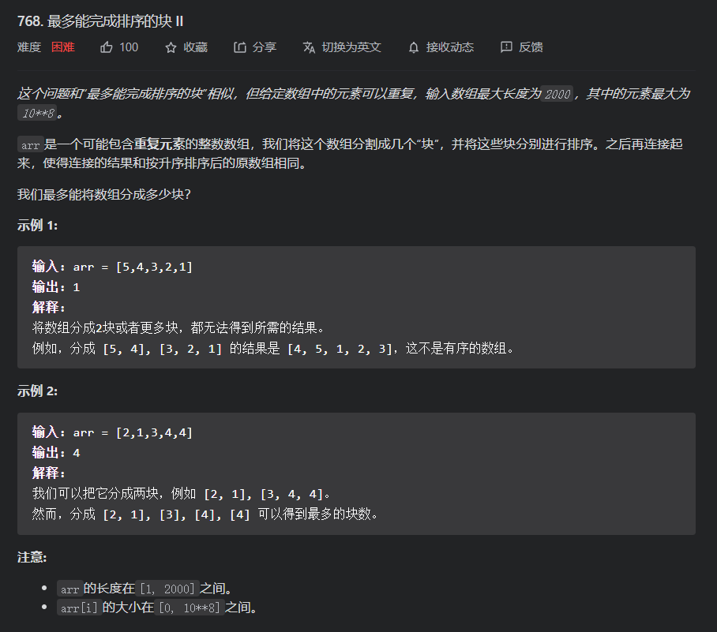

思路分析：对于这道题，我们需要去寻找可以将数组切分为块，而对这些块分别排序，就可以使得这个数组和排行序的数组是一样的，也就是说，对这些块排序后，这些块的元素就是其数组排序后的最终位置，所以我们 也可以利用这个性质去解决这个问题;

因为对于一个数组以及其排序后的结果来说，如果两者相同连续序列的和相等，就证明其可以作为`块`,即块的数目可以加一，且因为要最多的数目那么就采用贪心思想，即一旦遇到和相等序列就加一，且还有一个性质：`多个相邻块本身就可以连接成一个块`，所以也就是说我们可以求两个前缀和数组，两个数组中相等的元素数目就是块的最多数目；同时我们注意到，我们对于每个前缀和数组元素就都仅仅是使用一次，所以可以通过维护两个前缀和变量来计算块的数目

代码

```java
class Solution {
    public int maxChunksToSorted(int[] arr) {
        int[] newNums=Arrays.copyOf(arr,arr.length);
        Arrays.sort(newNums);
        int sum=0;
        int sortedSum=0;
        int result=0;
        for (int i = 0; i <arr.length ; i++) {
            sum+=arr[i];
            sortedSum+=newNums[i];
            if(sum==sortedSum){
                result+=1;
                //这句仅仅是为了避免和过大发生溢出错误
                sum=sortedSum=0;
            }
        }
        return result;
    }
}
```

对于上面的解答，我们是利用了`对这些块排序后，这些块的元素就是其数组排序后的最终位置`去构思的，但是对于这些块，我们还有一个性质，就是`后面的块中的每一个元素对于前面的块都是递增的，就都大于前面块的任何一个元素`；所以我们算出有多少个区间符合这个性质即可;

那么我们如何利用这个性质构造代码呢？

* 我们可以由左向右遍历一遍数组元素，然后通过然后构造一个辅助数组，这个辅助数组即记录其由左向右的最大值为多少,然后再由后往前遍历并维护遍历到的元素的最小值，如果当遍历到的元素其左边最大值小于右边最大值，那么其就肯定是一个块，又由于`多个相邻块本身就可以连接成一个块`,所以如果前面还有元素是符合上面这个条件`当遍历到的元素其左边最大值小于右边最大值`的，那么就就证明可以将这个块拆分为两个，依此类推最后得到最大数量

代码

```java
class Solution {
    public int maxChunksToSorted(int[] arr) {
        int[]help=new int[arr.length];
        help[0]=arr[0];
        for (int i = 1; i < arr.length; i++) {
            help[i]=Math.max(help[i-1],arr[i]);
        }
        int min=Integer.MAX_VALUE;
        int result=0;
        for (int i = arr.length-1; i >=0; i--) {
            //注意最小值的更新需要在判断之后，因为我们对左右端的定义不同所致，我们是想判断当前值是否可以作为块的边界，且其help维护的最大值是包括本身的，所以其右端的最小值在判断的时候还不能包括本身
            if(min>=help[i]){
                result+=1;
            }
            min=Math.min(min,arr[i]);
        }
        return result;
    }
}
```


* 当然我们也可以利用辅助单调栈来帮忙，其也是利用了上面的性质，但是这个单调栈是用来存储每个分块的最大值，因为我们在遍历数组的时候，我们可以顺便维护每个元素的左端最大值，但仅仅只能维护一边的，但是我们想要确定是否为块的边界就需要两端的数据(原因参考上面的思路)，所以我们如果想要仅仅遍历一遍就需要有比较好的思路来解决：我们就可以在遍历的时候，维护一个递增单调栈，因为其要求数组是升序排序的，然后遇到比堆顶元素小的，就证明前面按栈里面的分块是不对的，所以就弹出比它大的元素，直到遇到它小的值，而被它弹出的包括他的元素以及其原先代表的块都将合为一个块，且最大值为一开始的堆顶元素，接着因为`栈的意义是保存每个块的最大值`，所以就需要把新合成的块的最大值加入到栈中，继续遍历，最后栈中元素的数目就是块的最大数目

代码

```java
class Solution {
    public int maxChunksToSorted(int[] arr) {
        int[]sta=new int[arr.length];
        int topPtr=-1;
        for (int i = 0; i < arr.length; i++) {
            if(topPtr==-1||sta[topPtr]<=arr[i]){
                sta[++topPtr]=arr[i];
            }else{
                int max=sta[topPtr--];
                while(topPtr>-1&&sta[topPtr]>arr[i]){
                    topPtr-=1;
                }
                sta[++topPtr]=max;
            }
        }
        return topPtr+1;
    }
}
```

性能对比

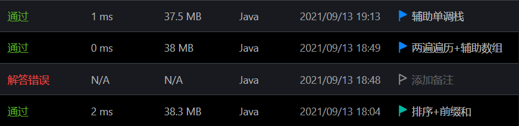


