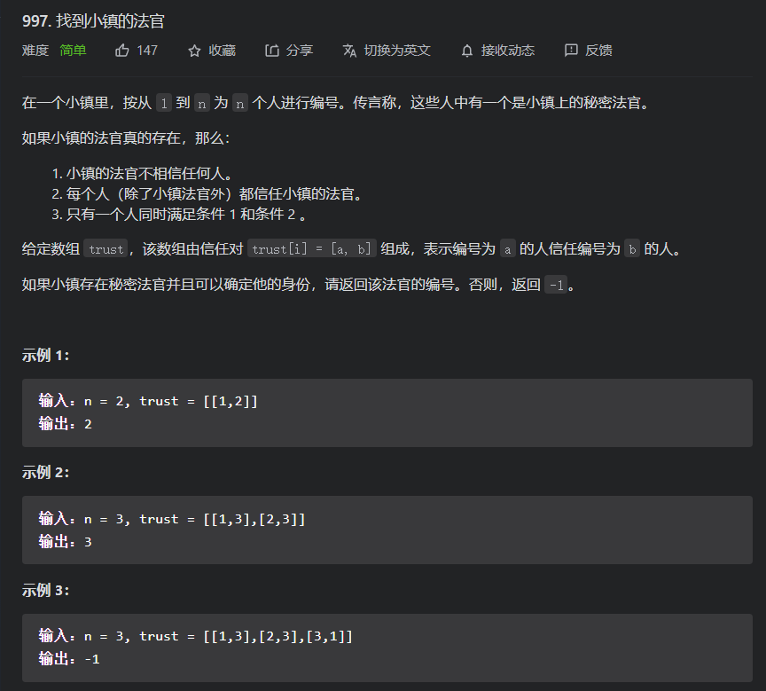
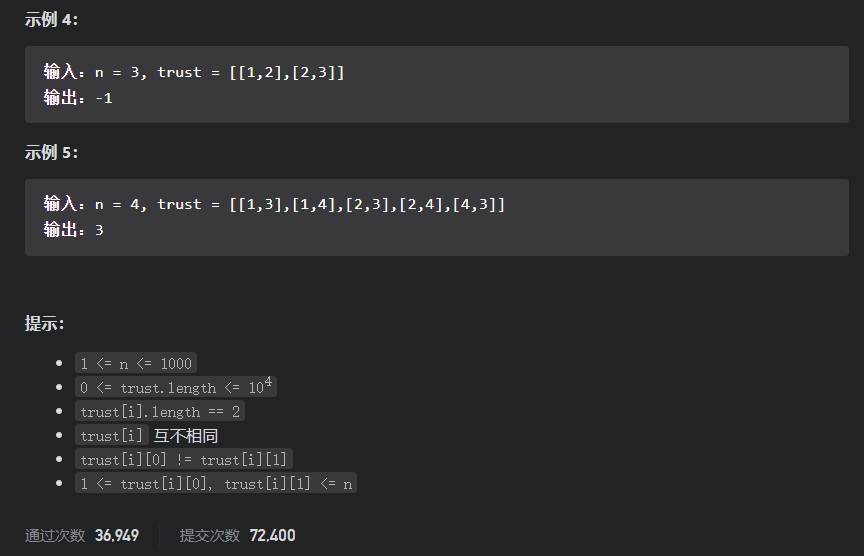

# 简单题

## 997.找到小镇的法官

题目



### 解法一：模拟

对于这道题，我们很自然的想到了图的解法，即计算每个结点的入度和出度，然后如果入度为n-1,出度为0，那么该结点就是法官；但是对于这道题专门去建图就不划算，所以可以不用建邻接表(图的存储结构)，而是记录该图的每个结点的邻接表的长度，因为我们要计算的仅仅是入度和出度，但是这样我们就还需要去建立多一个表，来记录顶点的入度，所以我们是否可以将两步结合起来呢？

一般来讲不可，但对于这道题就可，因为我们想要的结点的出度为0，所以入度-出度=入度&&入度=n-1;所以我们就仅仅需要记录入度-出度的表即可

#### 模拟写法

```java
class Solution1 {

    public int findJudge(int n, int[][] trust) {
        //如果只有一位法官
        if(n<=1&&trust.length<=0){
            return n;
}
        //键为人，值为被信任该人的人数
        HashMap<Integer, Integer> map = new HashMap<>();
        //是否有信任他人，有即加入
        HashSet<Integer> map_isTrust = new HashSet<>();
        //填表
        for (int[] ones : trust) {
            map_isTrust.add(ones[0]);
            map.put(ones[1], map.getOrDefault(ones[1], 0) + 1);
        }
        //处理
        for (Map.Entry one : map.entrySet()) {
            if ((Integer) one.getValue() >= n - 1 && !map_isTrust.contains(one.getKey())) {
                return (Integer) one.getKey();
            }
        }
        return -1;
    }
}
```

## 入度-出度写法

```java
class Solution {
    public int findJudge(int n, int[][] trust) {
        //重复可以成为法官的人选，所以为人，值为信任的人
        //下面写法和分析一致
        int[] map = new int[n + 1];
        for (int[] ones : trust) {
            map[ones[1]] += 1;
            map[ones[0]] -= 1;
        }
        for (int i = 0; i < map.length; i++) {
            if (map[i] >= n - 1) {
                return i;
            }
        }
        return -1;
    }
}
```

性能pk


