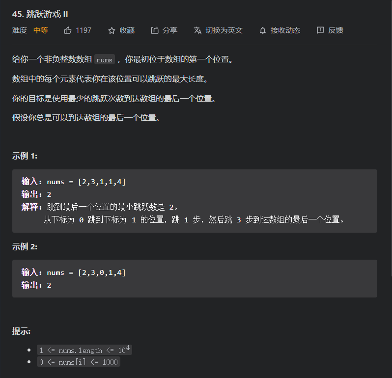
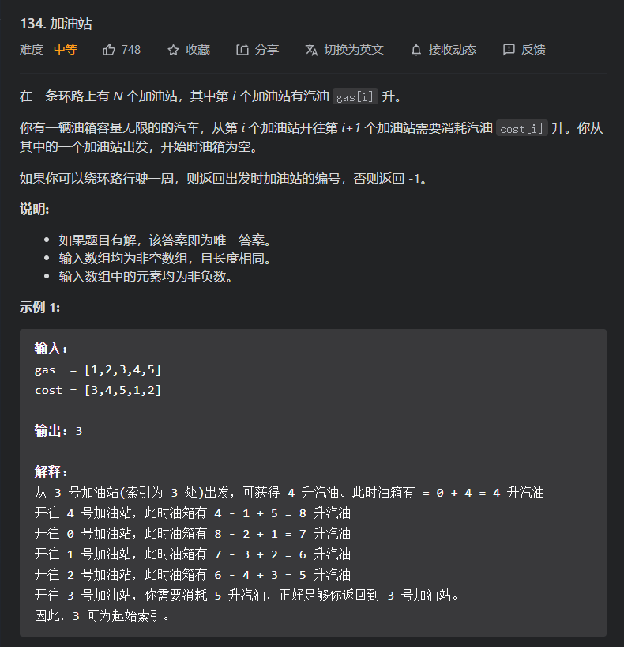
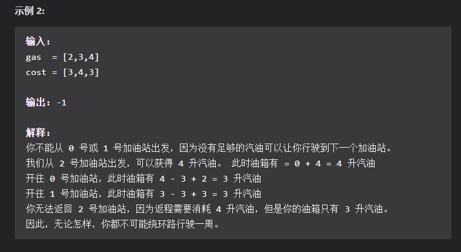
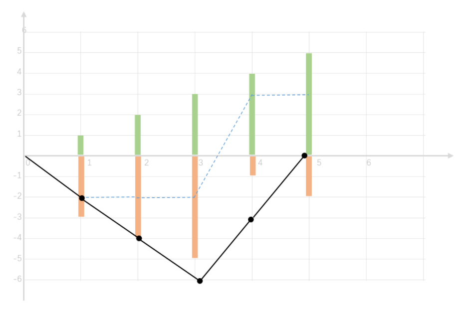
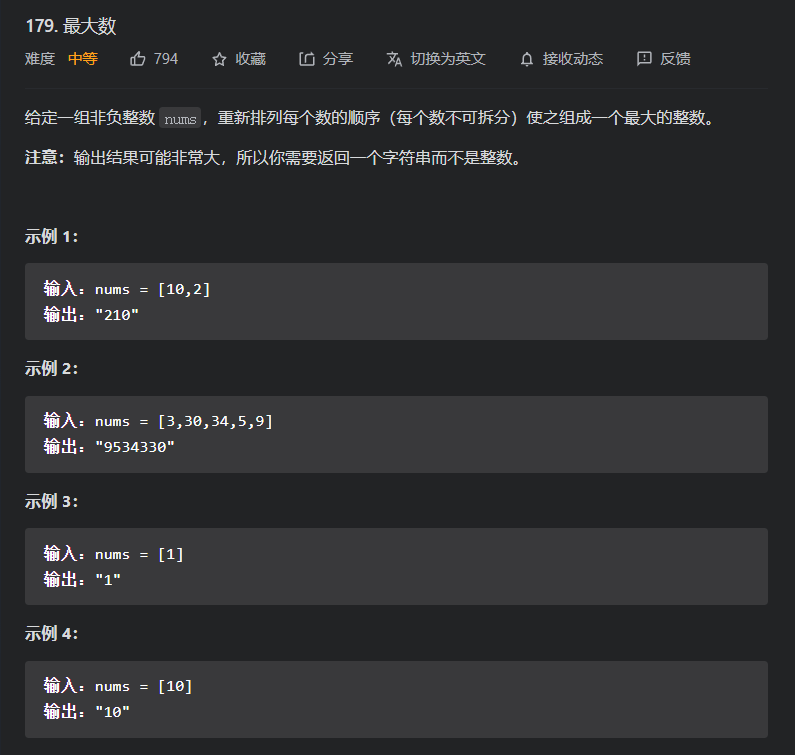
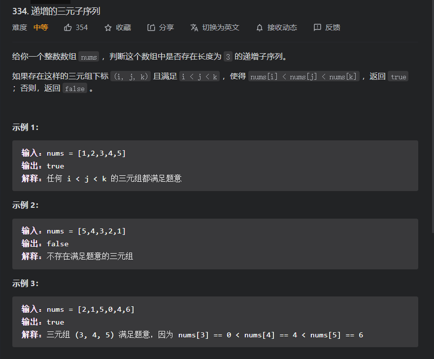
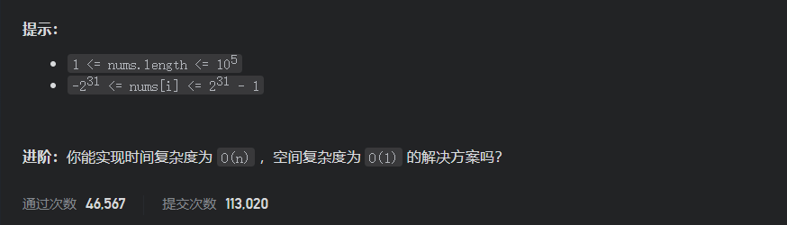
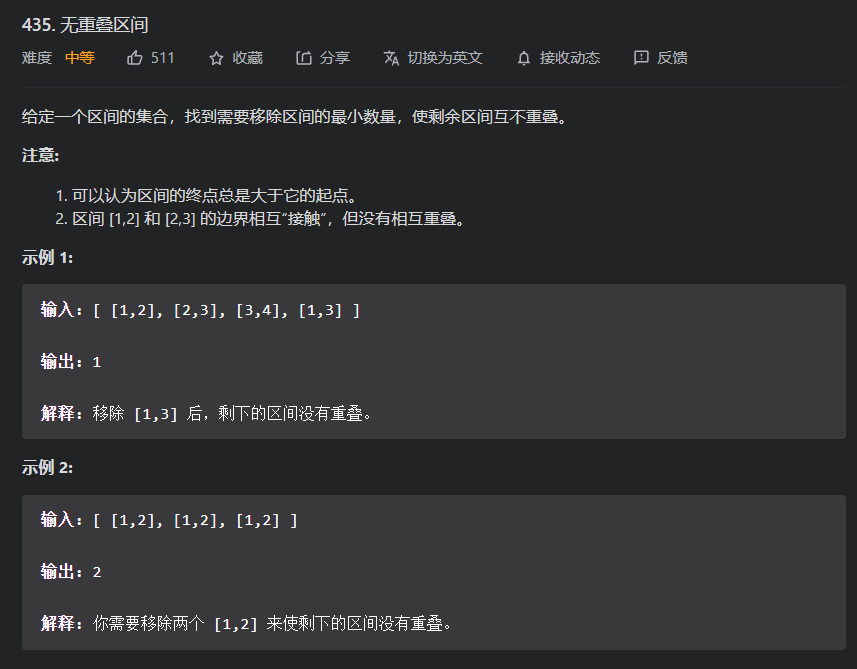
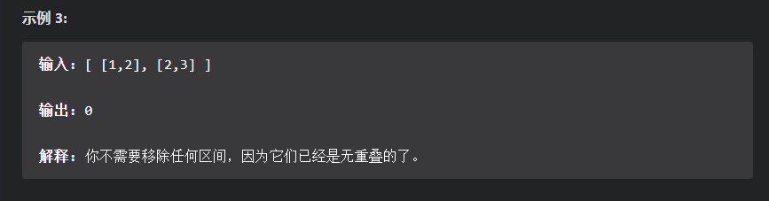

# 中等题

## 45.跳跃 游戏||

题目



方法一：贪心

对于这道题，我们需要找到最小的步数，那么我们要如何才能找到最小步数呢？

* 一个很直接的想法就是：有后往前遍历，因为我们是要到达最后一个结点的，所以我们就可以由最后的结点开始，寻找可以跳到该位置的最前的位置，作为其上一次起跳点，然后依此类推，得到其步数，但对于这个想法其每次寻找上一次起跳点都需要O(n);且我们会重复遍历很多的无效位置；且我们没有证明这个为什么就一定可以得到最短的路径

首先，我们先来看一下，这个题目约束下跳跃间的关系是什么？

* 假设我们在已经在位置i上，那么我们的起跳点就可以为i<j<=i+nums[i];假设我们这一步跳到g;那么其再下一次的起跳点就为g<=i+nums[i]<H<g+nums[g];

* 为什么g+nums[g]>i+nums[i]?

  因为我们一定能够到达最后，所以一定存在g可以使得g+nums[g]>i+nums[i];且因为我们是要保证跳的次数最少，所以如果我们选择了一个j,且j+nums[j]<i+nums[i];那么我们就需要再额外花费一步去跳离i+nums[i]，所以其就可以选择g+nums[g]最大的那个点去跳，因为那样可以保证我们的起跳点更多，且离终点更近，另外这个也可以其他点可能跳的下一次位置

* 为什么我们下一次的起跳点一定大于i+nums[i],而不是大于g?

  因为假设我们第二次的起跳点位k,且g<k<i+nums[i];那么我们就需要额外花费一次去跳离g+nums[g];因为一定可以到达最后，所以一定存在第三次起跳点z，使得z+nums[z]>g+nums[g]；但是由前面可知，我们是选用g+nums[g]最大的（i<g<i+nums[i]），所以其z+nums[z]不可能大于g+nums[g]；所以其下一次起跳的位置一定大于i+nums[i];

换句话讲，我们每次起跳，就可以废掉其所能到达的最大位置之前的所有位置，因为其下一次起跳点一定在最大位置之后

```java
class Solution {
    public int jump(int[] nums) {
        //如果长度小于2，即不用走就可以到达结尾
        if(nums.length<2){
            return 0;
        }
        //步数
        int count=0;
        //当前的起跳点范围
        int curMax=nums[0]+0;
        //下一个起跳点的范围
        int maxDiscount=curMax;
        //注意：我们的遍历范围是0~nums.length-1;因为我们最后一个的起跳点只要有包含最后那么就证明是可以到达的，就可以结束了
        for (int i = 0; i < nums.length-1; i++) {
            maxDiscount=Math.max(maxDiscount,i+nums[i]);
            //到达最大范围，就废掉前面的，继续遍历后面的
            if(i==curMax){
                count+=1;
                curMax=maxDiscount;
            }
        }
        //最后一次不会进入判断，所以需要额外增加一个
        count+=1;
        return count;
    }
}


```

## 134.加油站

题目



注意：其仅仅只能选择起始点，而过程就必须按部就班，按相邻的点去遍历即可，到时要记得数组是环形的，所以就必须在遍历到结尾时可以自动从节点出发，所以下标就需要有取模操作，以防止越界

### 方法一：贪心（局部解->全局解）

对于这道题，最简单的就是枚举每个位置，将其作为起点，然后遍历一圈，如果中间油量为负，即$\sum_i^{i+gas.length}(gas[i]-cost[i])$;

那么该位置就一定不是起点。但是很明显这个思路会有很多不合理的枚举，比如一开始就是负的，就可以直接跳到；或是因为这道题我们必须保证在行走的过程中起每个时刻的油量必须大于等于0，所以我们在由一个$gas(i)-cost(i)>0$的位置出发，到最后的$\sum_i^{i+j}(gas(i)-cost(j))<0$的位置，我们就证明了这个起点不可以，且再由这个我们可以推出$[i,j)$中的位置均不可能成为起点
$$
证明:因为我们需要保证我们行走过程每个时段的油量均不小于0， \\
所以既然我们可以遍历到j，就证明了遍历中途\sum_i^{i+k}(gas(i)-cost(i))>0成立; \\
假设\{z,k=z+1\}\in[i,j]，且gas[k]-cost[k]>=0, \\
那么\sum_i^{i+z}(gas(i)-cost(i))>=0恒成立\\
所以理论上k可以作为起点，其实我们在以i为起点的前提下，我们遍历到k的油量为\\
(gas[k]-cost[k])+\sum_i^{i+k}(gas(i)-cost(i))>=(gas[k]-cost[k])\\
所以假设我们从k起点可以安全遍历一遍，那么由i起点也一定可以遍历一遍，且剩余的油量更多\\
但如果连起点i都无法遍历一圈，那么起点k就更不可以了；所以就可以直接排除[i,j]的位置；

$$
所以我们就可以在枚举起点时，通过上面的两个`舍弃策略`，来假设枚举起点的次数

```java
class Solution {
    public int canCompleteCircuit(int[] gas, int[] cost) {
        //油量
        int sum = 0;
        for (int i = 0; i < gas.length; i++) {
            //如果一开始可获得油量就为负，那么一定不是起点(第一个策略)
            if (gas[i] - cost[i] >= 0) {
                int j = 0;
                //遍历一圈
                for (j = 0; j < gas.length; j++) {
                    sum += (gas[(i + j) % gas.length] - cost[(i + j) % cost.length]);
                    //中途如果有小于0，就一定不是正确起点
                    if (sum < 0) {
                        break;
                    }
                }
                //如果有遍历一圈就是正确起点，如果没有，就直接舍弃[i,i+j]位置;
                if (j >= gas.length) {
                    return i;
                } else {
                    i = i + j;
                    sum = 0;
                }
            }
        }
        //没有位置可以作为起点，就无解
        return -1;
    }
}
```

### 方法二：整体思想解题



假设我们由起点的前一个开始，即前一个油量0，可获取油量也为0；然后不然第一个位置就是我们这道题所说的起点，起步入后，我们仅关注其可获取油量（有正有负）。如果我们由-1位置开始，那么步入的结点就是第0个下标位置，其遍历一圈到最后就如上图黑线一样。但如果我们改变起点呢？`其折线的形状不会发生改变，因为形状取决于相邻位置可获得油量的差距，所以形状不会变化，但是因为由不同点出发，而出发的那个点油量为0，所以我们的折线图就会沿y轴上下移动，所以我们在有解的前提下，仅仅需要保证最低点为0即可，那么我们所求的起点就是该最低点的下一个点`，但是我们如何判断是否有解：我们可获得的油量大于等于消耗的油量；

```java
class Solution {
    public int canCompleteCircuit(int[] gas, int[] cost) {
        //最低点以及对应下标
        int minNum = gas[0] - cost[0];
        int minIndex = 0;
        //有0开始遍历，每个位置的剩余油量（有正有负）
        int sum = 0;
        for (int i = 0; i < gas.length; i++) {
            int temp = (gas[i] - cost[i]);
            sum += temp;
            //找最低点
            if (minNum >= sum) {
                minIndex = i;
                minNum = sum;
            }
        }
        //如果sum<0则消耗>获得，则无解
        if (sum < 0) {
            return -1;
        }
        //有解时，返回最低点的下一个点，但为了避免minIndex+1越界，所以有取模操作
        return (minIndex + 1) % gas.length;
    }
}
```


## 179.最大数

题目



### 方法一：按结果排序

对于这道题，我们主要的难点就是没有办法将整数拆分开，所以我们的主要难点就是：如何在没有拆分开整数的前提下，决定两个数的前后关系。

想法：

* 是否可以像比较字符串那样：高位优先，同数降位；但是我们需要解决数位数不一的问题
  $$
  假设x=21;y=213;那么最优排列就是213,21;\\
  假设x=21;211;那么最优序列就是21,211;\\
  假设x=21;2113;那么最优序列就是21,2113;\\
  所以我们会发现如果像字符串那样比较，在长度不一的情况下要决定前后关系就很困难；\\
  且我们还需要我们的比较是具有传递性的，但是连两数的规则都难以言明，就明显不是正确的比较方法\\
  $$

* 是否可以按照排列结果排序：就对两个数分别进行排列,而因为这个两个数，所以排列的结果只有两个，所以比较这个结果来决定前后次序

  对于这个我们就不需要证明两者的比较结果，因为我们就是根据结果进行排序的，而我们需要在进行证明的就是：完备性（即容易两个数都可以进行该比较，且决定唯一顺序）；传递性（即a<=b,b<=c-->a<=c）;这两个是数组可以进行排列的基础；
  $$
  \large\boldsymbol{证明:传递性a<=b,b<=c;}\\
  设s(x)为大于x的最小的10的幂(注意:必须大于,且s(0)=10)
  所以a和b排列的结果为\\
  a,b=
  \begin{cases}
  a*s(b)+b & \text{a优先b}\\
  b*s(a)+a & \text{b优先a}
  \end{cases}\\
  因为我们是根据结果排序的，所以:\\
  a<=b\implies a*s(b)+b<=b*s(a)+a\implies a*(s(b)-1)<=b*(s(a)-1); \large\boldsymbol{等式1}\\
  b<=c\implies b*s(c)+c<=c*s(b)+b\implies b*(s(c)-1)<=c*(s(b)-1);\large\boldsymbol{等式2}\\
  两个式子相乘:\\
  \boldsymbol{a*b<=b*c\implies a*b*(s(b)-1)*(s(c)-1)<=b*c*(s(a)-1)*(s(b)-1);}\large\boldsymbol{等式3}\\
  其中两边有相同项：b和(s(b)-1);而由s(x)>=10,所以(s(x)-1)>=9恒成立\\
  对于b其不为负，所以需要分类讨论\\
  b=
  \begin{cases}
  由等式1得a<=0即a=0且由等式2得c>=0所以a<=c
  &\text{if b=0,a<=b,b<=c;}\\\\\\
  由等式3得a*(s(c)-1)<=c*(s(a)-1)\implies \\a*s(c)+c<=c*s(a)+a\implies{a<=c}
  &\text{if b}\ne\text{0,a<=b,b<=c;}\\
  \end{cases}
  \\\\
  证得:\large\boldsymbol{传递性a<=b,b<=c;}\\
  $$
  
* 由上面可以知道该比较符合完备性和传递性，所以可以唯一确定排序结果

* 接着进行该排序后连接起来得字符串是否就是最优字符串？

  假设排序后序列不是最优序列，那么就一定存在两个数，其交换后会使得序列变大；但是因为我们是按结果排序得，所以这个情况和`已经排列好`这个前提矛盾；所以排列后就为最优序列

容易理解的代码

```java
//
class Solution {
    public String largestNumber(int[] nums) {
        //先将nums转换为字符串数组
        String[]Nums=new String[nums.length];
        for (int i = 0; i < nums.length; i++) {
            Nums[i]=""+nums[i];
        }
        //通过比较器定义得比较方法进行比较
        //比较器为：形象的进行结果比较
        Arrays.sort(Nums,(n1,n2)->{
            String x=n1+n2,y=n2+n1;
            return -x.compareTo(y);
        });
        //如果判断成立，那么就证明：数组全为0，那么就仅仅只能返回一个0
        if(Nums[0].equals("0")){
            return "0";
        }
        //连接字符串
        StringBuilder sb=new StringBuilder();
        for (int i = 0; i < Nums.length; i++) {
            sb.append(Nums[i]);
        }
        return sb.toString();
    }
}
```

效率较快的代码

```java
class Solution {
    public String largestNumber(int[] nums) {
        //对数组进行装箱，以便后面进行比较器的排序
        Integer[]Nums=new Integer[nums.length];
        for (int i = 0; i < nums.length; i++) {
            Nums[i]=nums[i];
        }
        //比较器的思路和题解的证明一样
        Arrays.sort(Nums,(n1,n2)->{
            long x=10,y=10;
            while(x<=n1){
                x*=10;
            }
            while(y<=n2){
                y*=10;
            }
            return (int)(-(y*n1+n2-(x*n2+n1)));
        });
        if(Nums[0]==0){
            return "0";
        }
        //连接起来
        StringBuilder sb=new StringBuilder();
        for (int i = 0; i < Nums.length; i++) {
            sb.append(Nums[i]);
        }
        return sb.toString();
    }
}

```

### 性能pk


## 334.递增的三元子序列

题目



### 方法一：1或2或3枚举

#### 枚举2

对于这道题最简单的办法就是 暴力枚举；但是这道题的数据量而言$O(n^3)$的开销旧太大了；但是我们可以由暴力枚举逐步优化；

首先我们分析一下：暴力枚举为什么开销那么大？

* 因为对于暴力枚举而言，其最后面部分的数据被若干次重复枚举；所以其可以有很多不必要的开销。

其次我们针对这道题的特殊性：递增序列，既然是递增序列，那么如果我们第一层循环枚举1或是3位置的话，那么就需要维护2和3或1和2；但是要同时枚举这两个变量会比较麻烦，因为其维护的两个位置会相互影响，且会受到后面数据的影响；
$$
比如:small=3,mid=5;此时cur=4,那么我们是否可以直接更新small？\\
如果直接更新mid是否还有用?\\
答：如果我们需要明确的mid和samll值的话，那么这个思路就不合适；\\因为你会发现在不同情况下其能不能直接更新是不确定的；\\当然对于这道题还是可以解的，这个等后面枚举1或3的时候会再次提及；
$$
既然枚举1或3比较困难，那么我们就可以尝试枚举2；对于这个我们会明显感觉比较简单，因为我们仅仅需要维护左边的最小值已经右边的最大值；当然如果这样我们是不可以扫一遍就可以顺便维护最大值和最小值，因为我们在遍历的时候仅仅只能维护一个最值；比如：由左向右遍历就可以维护左边的最小值，但无法维护右边的最大值；

所以为了避免开销的数量级发生变化，那么我们就可以对数组进行预处理，用一个单调栈或是一个数组，记录其每个位置右端的最大值，后面就再扫一次以便可以判断

```java
class Solution1 {
    public boolean increasingTriplet(int[] nums) {
        //记录最大值的数组
        int[]maxNum=new int[nums.length];
        //注意我们的最大值数组:maxNum[i]表示：i+1~size内的最大值，但不包括i;
        maxNum[nums.length-1]=Integer.MAX_VALUE;
        //最大值数组预处理；
        int maxOne=nums[nums.length-1];
        for (int i = nums.length-2; i >=0 ; i--) {
            maxNum[i]=maxOne;
            maxOne=Math.max(maxOne,nums[i]);
        }
        //再次遍历(反方向)并维护最小值
        int minOne=nums[0];
        for (int i = 1; i < nums.length; i++) {
            if(nums[i]>minOne&&nums[i]<maxNum[i]){
                return true;
            }
            minOne=Math.min(minOne,nums[i]);
        }
        return false;
    }
}
```

但是对于这个明显无法满足其题目空间复杂度O(n)的要求，所以是否还有其他的特点，而且递增序列这个特性是否还有其他的引用？

#### 枚举1或3

我们再次回想一下我们刚才再枚举2的举例中提到的两个问题：

* 那么我们是否可以直接更新small？

* 如果直接更新mid是否还有用?

  其实这两个问题如果拆开答的话，就都是否定，但是如果是合并一起答得话，在这道题下就是可以的。

  假设我们直接更新了small,那么很明显mid已经不是序列和值均大于small的元素值了；但是这里会隐含一个事实：如果mid有值，那么就证明其前面一定存在一个序列和值比其小的元素，虽然无法得知具体是哪个元素，但是我们可以确定一次存在这个元素；既然这样我们在下面的几种情况下就可以采取相应的确定操作：
  $$
  \begin{cases}
  return &true &\text{cur>mid}\\
  mid=cur&&\text{cur>small\&\&cur<=mid}\\
  small=cur&& \text{cur<=small}\\
  \end{cases}
  $$

  ```java
  class Solution {
      public boolean increasingTriplet(int[] nums) {
          if(nums.length<3){
              return false;
          }
          //该初始化就可以让前面2个元素的遍历可以和后面元素的遍历统一
          //整体思路和上面诉说一样，这里不做注解
          int min=Integer.MAX_VALUE,mid=Integer.MAX_VALUE;
          for (int i = 0; i < nums.length; i++) {
              if(nums[i]>mid){
                  return true;
              }else{
                  if(nums[i]<=min){
                      min=nums[i];
                  }else{
                      mid=nums[i];
                  }
              }
          }
          return false;
      }
  }
  ```

  性能pk

  

## 435.无重叠区间

题目



### 方法一：贪心（局部最优推全局最优）

对于这道题，我们需要移除区间的最少数量，也等价于寻找不重复区间的最大数量；既然要寻找不重复区间的最大数量，所以我们就需要对数组进行排序，以便来决定其代表区间在所给区间集中的位置；但是有一个难点：`我们要如何进行排序?`

* 如何排序？

  * 仅根据左端排序

    因为其仅根据左端排序，那么我们就最大那些区间的左端部分是较大的，而对右端一无所知，仅知道右端比左端大，而因为我们要尽量多的不重复区间，所以我们就可以尽量选择左端较大的，以便有更多的地方给剩下的区间，所以我们就需要由右向左遍历；最右的那个可以直接被选择，因为其左端最大，且右端对结果不影响；然后就可以向前遍历，维护当前所选区间的最左区间的左端点；然后先前遍历寻找右端小于这个端点且左端点尽可能大的区间；就可以得到最大的不重叠区间数。

  * 仅根据右端排序

    其思想和上面一样;不过这种排列是由前向后遍历

```java
class Solution1 {
    public int eraseOverlapIntervals(int[][] intervals) {
        if(intervals.length==0){
            return 0;
        }
        //根据右端点排序
        Arrays.sort(intervals,(n1,n2)->{
            return n1[1]-n2[1];
        });
        //不重叠区间最大数目
        int result=1;
        //当前所选区间的最左端点
        int right=intervals[0][1];
        for (int i = 1; i < intervals.length; i++) {
            //遇到合适区间，就可以更新变量
            if(intervals[i][0]>=right){
                result+=1;
                right=intervals[i][1];
            }
        }
        return intervals.length-result;
    }
}
```

拓展：

如果我们根据左端点排序，那么我们还能由左向右开始遍历吗？

* 
