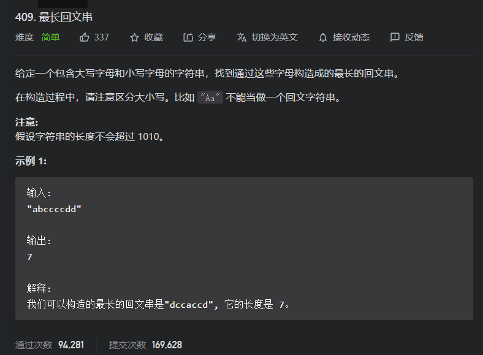
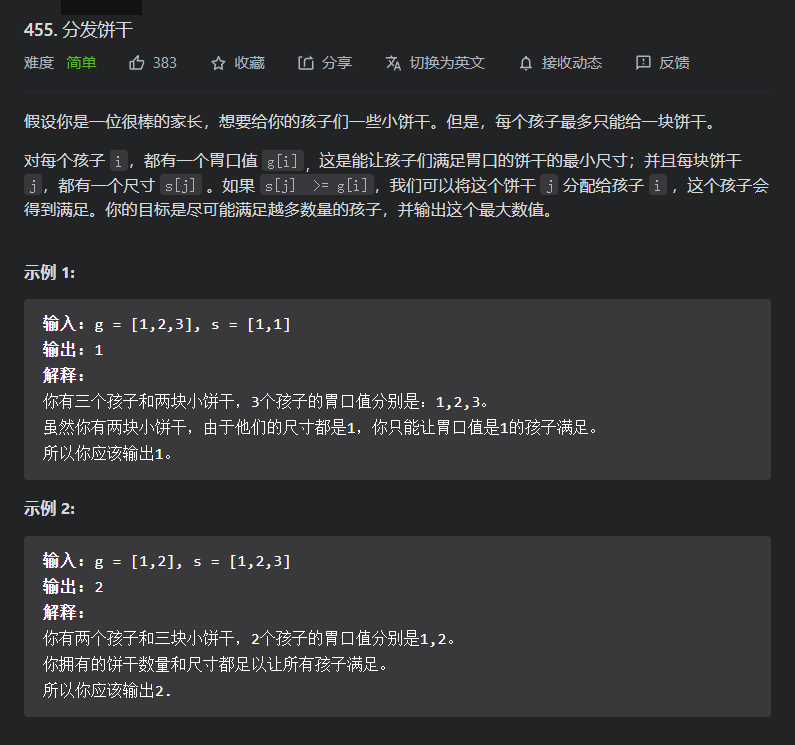
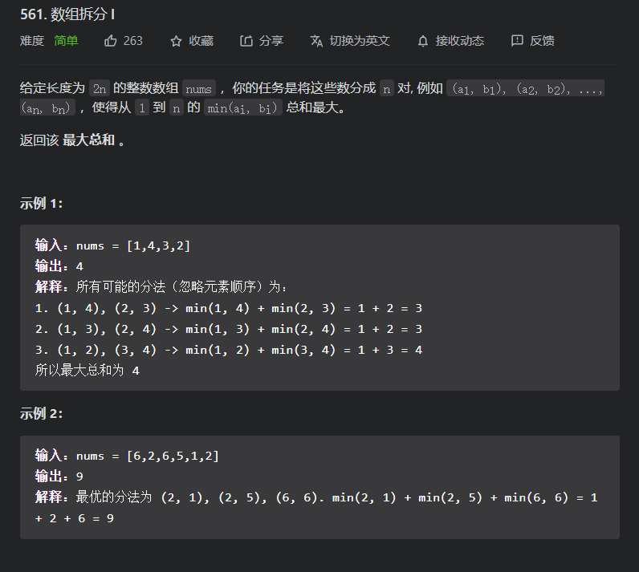
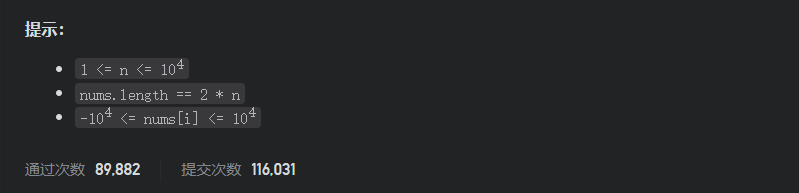

# 简单题

## 409.最长回文串

题目



方法一：贪心

对于这道题我们不需要知道其最长的回文串是哪个，且我们是可以随意排列的，所以我们就仅仅需要找到回文串的共性即可，且这个共性是在数量上的共性：其两边的字符必须重复出现，而奇数就仅仅出现在最中间；

因此，如果我们某个字符数目为偶数即可以直接加入结果，但如果为奇数，那么就必须减去，到最后再加上一；

```java
class Solution {
    public int longestPalindrome(String s) {
        int[]ascii=new int['z'+1];//数组模拟哈希表
        int res=0;//结果变量
        boolean  isMid=false;//是否有奇数个数的字符
        //数据预处理
        for (int i = 0; i < s.length(); i++) {
            ascii[s.charAt(i)]+=1;
        }
        //变量数组
        for (int i = 0; i <ascii.length ; i++) {
            if(ascii[i]%2!=0){
                isMid=true;
                res+=ascii[i]-1;
            }else{
                res+=ascii[i];
            }
        }
        if(isMid){
            res+=1;
        }
        return res;
    }
}

//改进版
class Solution {
    public int longestPalindrome(String s) {
      int[] cnt = new int[58];
      for (char c : s.toCharArray()) {
         cnt[c - 'A'] += 1;
      }

      int ans = 0;
      for (int x: cnt) {
        // 字符出现的次数最多用偶数次。
        ans += x - (x & 1);
      }
      // 如果最终的长度小于原字符串的长度，说明里面某个字符出现了奇数次，那么那个字符可以放在回文串的中间，所以额外再加一。
      return ans < s.length() ? ans + 1 : ans;  
    }
}
```

## 455.分发饼干

题目



方法一：贪心思想+排序+双指针

对于这道题，我们需要找到一种分发饼干的策略，然可以得到满足的孩子越多；

* 小胃口优先策略

  即：先让小胃口的孩子挑选饼干，且其挑选的饼干是大于其胃口的最小饼干；因为这样的饼干可以满足小胃口的孩子，但不一定能满足大胃口的；即使可以，那么其数目也不会发生变化，因为 一个饼干仅仅能满足一个孩子；但如果没有饼干符合小胃口的，那么后面的大胃口就更不能满足了；

* 大饼干优先策略

  即：优先将大饼干发送给小于其的最大胃口的孩子；如果某饼干能满足小胃口但却不一定能满足大胃口，所以我们就将大的饼干优先给大胃口的，让小胃口的人数尽可能多；以便使得小的饼干也可以满足孩子

小胃口策略

```java
class Solution {
    public int findContentChildren(int[] g, int[] s) {
        //排序，以便确定哪些为大胃口，哪些为小的
        Arrays.sort(g);
        Arrays.sort(s);
        int gPtr=0;//胃口指针
        int sPtr=0;//饼干指针
        int res=0;//结果变量
        while(gPtr<g.length&&sPtr<s.length){
            //如果可以满足，就....
            if(g[gPtr]<=s[sPtr]){
                res+=1;
                gPtr+=1;
            }
            //饼干要么被分发，要么不能被分发；不然被分发的饼干虽然可以分发给前面小胃口的孩子，但那些孩子一定已经有了饼干，不然这个饼干就不会出现在这里
            sPtr+=1;
        }
        return res;
    }
}
```

## 561.数组拆分|

题目



方法一：贪心

因为我们是想被拆分的数组的最小值的和最大，那么就要保证数组的大值到最后能够被得到；所以我们就可以贪心的然两个相聚最小的两个数分为一组，以便让大数可以得到保留;但如果想下面那样让大数去和很小的数组一起，那么另一个大数也会被分到和一个小数在一起，所以我们就要将两个相邻的数分在一起

比如：[1,2,3,4,5,6]-->(5,6)-->(4,6),(3,5)

```java
class Solution {
    public int arrayPairSum(int[] nums) {
        //排序以便，确定那些数比较接近和大小情况
        Arrays.sort(nums);
        int result=0;
        //每相邻两个为一组
        for (int i = nums.length-1; i >=nums.length/2 ; i++) {
            result+=nums[i];
        }
        return result;
    }
}
```

