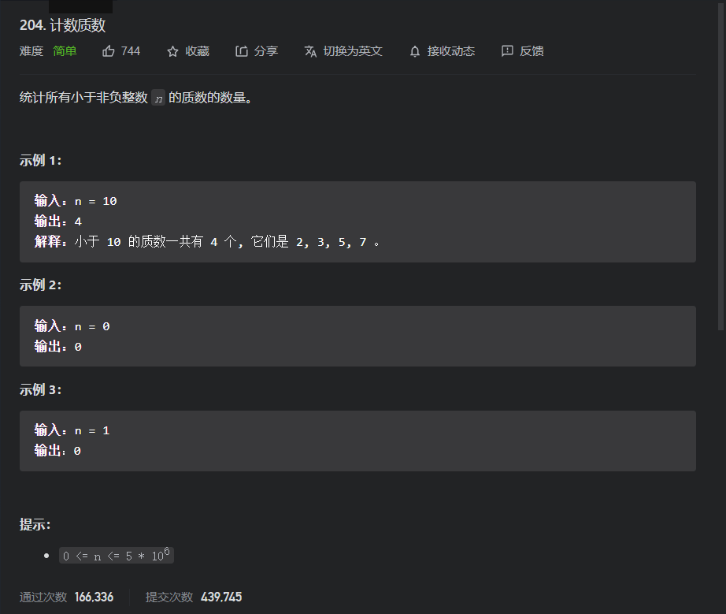

# 简单题

## 204.计数质数

题目



思路分析：

对于这道题,其最直接的办法，就是在由2到n-1遍历时遇到每个数就判断一下它是否为质数，而单独判断这个数是否为质数，就需要遍历所有小于它的数，看是否有可以被其整除的(当然有一个小小的优化，就是在如果该数为合数，那么他的两个因子(一个比大一个小，也有可能一样大，是临界状态)，就应该都小于它，那么我们就仅仅需要遍历那一部分小的即可，因为如果小的部分没有那么大的部分也没有，所以就仅仅需要遍历0-(根号n)即可)。

但是对于这道题所给的数据范围，很明显是不可能可以过的，所以我们就需要优化一下算法。对于这道题而言其实我们发现，其完全独立于连续数而且重复遍历数组，所以是否有一些算法可以利用连续数字的性质呢？

#### 埃氏筛

基本原理：即如果一个数为质数，那么其的所有倍数就都一定不是质数，所以我们可以创建一个辅助数组记录被排除的数字(即一定不可能为质数的数字)排除的方式，就是将当前遍历到的质数的所有倍数排除掉，而当遍历到那个数时，如果其还没被排除就证明其为一个正数(原因如下)

* 算法正确性

  因为一个合数的因子一定在其前面，而我们的排除法即是将所有小于它的数的所有倍数都排除，如果该数为合数，就一定为某个小于它的数的倍数，就一定会被排除掉，但如果到现在还没排除，则证明其没有大于1且不等于本身的因子，就一定为质数

* 注意：我们开始算法时必须以第一个质数为初始值开始遍历，一遍可以进行第一轮排除，不然如果从4开始排除就会出错

代码

```java
class Solution2 {
    public int countPrimes(int n) {
        //如果不是质数就true,否则为false,因为java对于boolean默认为false
        boolean[] NonPrimes=new boolean[n+1];
        int count=0;
        for (int i = 2; i < n; i++) {
            if(!NonPrimes[i]){
                count+=1;
                //确保下面循环的初始值不会溢出
                if((long)i*i>=n){
                    continue;
                }
                //排除法
                //这里我加了一个小小的优化：即初始值从i*i开始，
                //原因即是前面的2*i,3*i,而的在前面遍历到时就都有计算排除过了，而那些合数倍即是包含在那些质数倍中，所以其前面的(i-1)*i都是已经被筛选过的，就后面的那些不一定会筛选过
                for (int j = i*i; j < n; j+=i) {
                    NonPrimes[j]=true;
                }
            }
        }
        return count;
    }
}
```

##### 优化：

* 上面代码就已经有提到过一个小小的优化

* 还有我们可以发现就是如果是偶数，那么就一定不是质数，所以我们的遍历范围直接就可以确定为奇数，而在排除时，因为`偶数*奇数==奇数，奇数*奇数==奇数`，所以在排除时的遍历中我们就仅仅需要遍历奇数的范围

  ```java
  class Solution {
      public int countPrimes(int n) {
          if(n<3){
              return 0;
          }
          boolean[]nonPrimes=new boolean[n];
          int count=1;
          //必须由奇数质数开始
          for (int i = 3; i < n; i+=2) {
              if(!nonPrimes[i]){
                  count+=1;
                  //虽然是以i为初始值，但是已经有暗含第一个优化了
                  for (int j = i; (long)j*i <n ; j+=2) {
                      nonPrimes[j*i]=true;
                  }
              }
          }
          return count;
      }
  }
  ```

#### 线性筛(欧拉筛)

对于前面，我们会发现一个需要优化的问题，就是其 对于排除的数我们会重复去遍历到，所以我们可以利用`任何一个合数都可以由若干个质数唯一相乘表示`，所以我们在现在就不是去排除倍数了，而是去